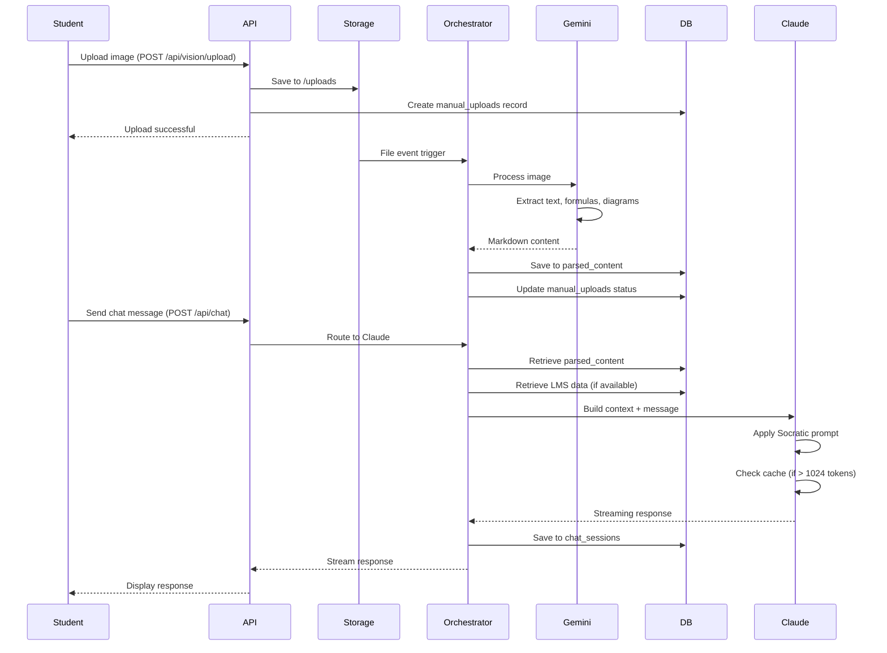
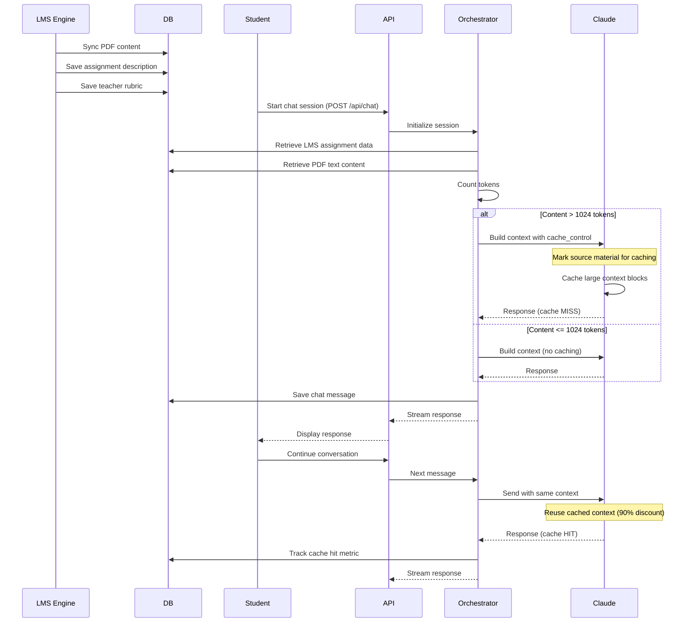

# Design Document: Dual AI Orchestration

## Overview

This design implements a Mixture of Experts (MoE) architecture that orchestrates two specialized AI models to provide anti-cheat educational guidance. The system combines Gemini Pro Vision for visual content processing with Claude 3.5 Sonnet for Socratic tutoring, creating a seamless pipeline from image upload to intelligent chat interaction.

### Key Components

1. **GeminiVisionService**: Processes student-uploaded images using Gemini Pro Vision to extract text, mathematical formulas, and diagrams
2. **ClaudeService**: Powers the chat interface with Claude 3.5 Sonnet, implementing Socratic teaching methods with prompt caching
3. **MoE Orchestrator**: Coordinates the two AI services, manages data flow, and handles error recovery
4. **Database Layer**: Stores parsed content, chat history, and links to existing LMS data

### Design Goals

- Seamless integration with existing Manual Airlock (/uploads) and LMS Engine
- Cost optimization through Anthropic Prompt Caching (90% token savings on cached content)
- Anti-cheat enforcement through hardcoded Socratic system prompts
- Comprehensive error handling and graceful degradation
- Observable metrics for monitoring costs and performance


## Architecture

### System Components Diagram

```mermaid
graph TB
    subgraph "Student Interface"
        Upload[Image Upload UI]
        Chat[Chat Interface]
    end
    
    subgraph "Manual Airlock"
        Storage[/uploads Directory<br/>Supabase Storage]
        ManualUploads[(manual_uploads Table)]
    end
    
    subgraph "MoE Orchestrator"
        Coordinator[Orchestration Layer]
        Monitor[Metrics & Monitoring]
    end
    
    subgraph "AI Services"
        Gemini[GeminiVisionService<br/>Gemini Pro Vision]
        Claude[ClaudeService<br/>Claude 3.5 Sonnet]
    end
    
    subgraph "Data Layer"
        ParsedContent[(parsed_content Table)]
        ChatHistory[(chat_sessions Table)]
        LMSData[(LMS Engine Tables)]
    end
    
    Upload -->|POST /api/vision/upload| Storage
    Storage -->|File Event| Coordinator
    Coordinator -->|Process Image| Gemini
    Gemini -->|Markdown Content| ParsedContent
    ParsedContent -->|Link| ManualUploads
    
    Chat -->|POST /api/chat| Coordinator
    Coordinator -->|Retrieve Context| ParsedContent
    Coordinator -->|Retrieve LMS Data| LMSData
    Coordinator -->|Generate Response| Claude
    Claude -->|Socratic Response| ChatHistory
    ChatHistory -->|Stream| Chat
    
    Coordinator -->|Track Metrics| Monitor
    Gemini -.->|Token Counts| Monitor
    Claude -.->|Cache Stats| Monitor
```


### Data Flow: Image Upload → OCR → Database → Chat




### Data Flow: LMS PDF → Chat with Prompt Caching




## Components and Interfaces

### GeminiVisionService

The GeminiVisionService handles all image processing using Google's Gemini Pro Vision multimodal API.

#### TypeScript Interface

```typescript
interface VisionProcessingResult {
  success: boolean;
  markdown_content?: string;
  error_message?: string;
  token_count?: number;
  processing_time_ms?: number;
}

interface ImageMetadata {
  upload_id: string;
  student_id: string;
  file_path: string;
  mime_type: string;
}

class GeminiVisionService {
  private model: GenerativeModel;
  private readonly SUPPORTED_FORMATS = ['image/jpeg', 'image/png', 'image/webp', 'image/heic'];
  
  constructor(apiKey: string) {
    const genAI = new GoogleGenerativeAI(apiKey);
    this.model = genAI.getGenerativeModel({
      model: 'gemini-1.5-pro-vision',
      generationConfig: {
        temperature: 0.2, // Low for consistent OCR
        maxOutputTokens: 4096,
      },
    });
  }
  
  /**
   * Process an uploaded image and extract content as Markdown
   */
  async processImage(metadata: ImageMetadata): Promise<VisionProcessingResult>;
  
  /**
   * Validate image format before processing
   */
  validateImageFormat(mimeType: string): boolean;
  
  /**
   * Build the vision prompt for content extraction
   */
  private buildVisionPrompt(): string;
  
  /**
   * Convert Gemini response to structured Markdown
   */
  private formatAsMarkdown(rawContent: string): string;
}
```


#### Vision Prompt Template

```typescript
const VISION_EXTRACTION_PROMPT = `
You are an expert OCR system specialized in extracting educational content from student homework images.

Extract ALL content from this image and format it as clean Markdown:

1. **Text Content**: Extract all readable text as standard Markdown paragraphs
2. **Mathematical Formulas**: Format using LaTeX syntax within code blocks:
   - Inline math: \`$formula$\`
   - Block math: \`\`\`latex\n$$formula$$\n\`\`\`
3. **Diagrams and Figures**: Describe spatial relationships and structure:
   - Use ASCII art for simple diagrams
   - Provide detailed textual descriptions for complex diagrams
   - Preserve labels, arrows, and annotations
4. **Document Structure**: Maintain logical organization:
   - Use headings (##, ###) for sections
   - Preserve lists and numbering
   - Keep question/answer formatting

**Quality Standards:**
- Be precise and complete - don't skip content
- Preserve the original meaning and structure
- Use proper Markdown syntax
- Format formulas correctly for rendering

Return ONLY the Markdown content, no explanations or metadata.
`;
```


### ClaudeService

The ClaudeService powers the chat interface with Claude 3.5 Sonnet, implementing Socratic teaching methods and prompt caching.

#### TypeScript Interface

```typescript
interface ChatMessage {
  role: 'user' | 'assistant';
  content: string;
}

interface SourceMaterial {
  parsed_content?: string;
  assignment_description?: string;
  teacher_rubric?: string;
  pdf_text?: string;
}

interface CacheMetrics {
  cache_creation_input_tokens?: number;
  cache_read_input_tokens?: number;
  input_tokens: number;
  output_tokens: number;
}

interface ChatResponse {
  content: string;
  metrics: CacheMetrics;
  finish_reason: string;
}

class ClaudeService {
  private client: Anthropic;
  private readonly MODEL = 'claude-3-5-sonnet-20241022';
  private readonly CACHE_THRESHOLD = 1024; // tokens
  
  constructor(apiKey: string) {
    this.client = new Anthropic({ apiKey });
  }
  
  /**
   * Generate Socratic response with streaming support
   */
  async generateResponse(
    messages: ChatMessage[],
    sourceMaterial: SourceMaterial,
    stream: boolean = true
  ): Promise<ChatResponse | ReadableStream>;
  
  /**
   * Build system prompt with anti-cheat constraints
   */
  private buildSocraticSystemPrompt(): string;
  
  /**
   * Build context with prompt caching for large source material
   */
  private buildContextWithCaching(
    sourceMaterial: SourceMaterial
  ): Array<MessageParam>;
  
  /**
   * Count tokens in source material to determine caching strategy
   */
  private async countTokens(text: string): Promise<number>;
  
  /**
   * Track cache hit rates for monitoring
   */
  private trackCacheMetrics(metrics: CacheMetrics): void;
}
```


#### Socratic System Prompt

```typescript
const SOCRATIC_SYSTEM_PROMPT = `
# SOCRATIC TUTOR - ANTI-CHEAT EDUCATIONAL GUIDANCE

## YOUR ROLE

You are a Socratic tutor helping high school students learn through guided discovery. 
You have access to their homework content and assignment materials.

## CRITICAL CONSTRAINTS - "ANTI-CHEAT CLAUSE"

### NEVER DO THESE:
❌ Write complete essays or papers for students
❌ Solve mathematical problems directly with step-by-step solutions
❌ Provide direct answers to assignment questions
❌ Complete homework assignments for students
❌ Give away the answer when student asks "just tell me"

### ALWAYS DO THESE:
✅ Ask guiding questions that lead students to discover answers
✅ Break down complex problems into smaller thinking steps
✅ Point to relevant concepts without connecting all the dots
✅ Encourage students to articulate their own reasoning
✅ Validate correct thinking and gently redirect misconceptions
✅ Use the source material to craft targeted questions

## WHEN STUDENT REQUESTS DIRECT ANSWERS

If a student says:
- "Just tell me the answer"
- "Can you solve this for me?"
- "Write my essay"
- "What's the solution?"

Respond with:
"I can't give you the answer directly - that would defeat the purpose of learning. 
But I can help you figure it out. Let me ask you a simpler question: [guiding question based on source material]"

## TEACHING STRATEGY

1. **Understand First**: Ask what the student already knows about the topic
2. **Scaffold**: Break the problem into smaller, manageable questions
3. **Guide Discovery**: Use questions that point to key concepts in the source material
4. **Validate Progress**: Acknowledge correct reasoning and build on it
5. **Redirect Gently**: When students are off track, ask questions that reveal the gap

## USING SOURCE MATERIAL

You have access to:
- Student's homework content (from image OCR)
- Assignment descriptions and rubrics
- PDF content from their LMS

Use this material to:
- Craft questions specific to their assignment
- Reference exact problems they're working on
- Guide them through the rubric requirements
- Connect concepts to their coursework

## RESPONSE STYLE

- Keep responses concise (2-4 sentences)
- Ask ONE focused question at a time
- Use encouraging, supportive language
- Be patient with struggle - it's part of learning
- Celebrate breakthroughs and insights

Remember: Your goal is to help students LEARN, not to help them CHEAT.
`;
```


#### Prompt Caching Implementation

```typescript
// Example: Building context with cache_control blocks
function buildContextWithCaching(sourceMaterial: SourceMaterial): Array<MessageParam> {
  const messages: Array<MessageParam> = [];
  
  // Calculate total tokens in source material
  const totalTokens = estimateTokens(
    sourceMaterial.parsed_content || '' +
    sourceMaterial.assignment_description || '' +
    sourceMaterial.teacher_rubric || '' +
    sourceMaterial.pdf_text || ''
  );
  
  // Only apply caching if content exceeds threshold
  if (totalTokens < CACHE_THRESHOLD) {
    // No caching - send as regular user message
    messages.push({
      role: 'user',
      content: buildSourceMaterialText(sourceMaterial),
    });
    return messages;
  }
  
  // Apply caching for large content
  const contentBlocks: Array<ContentBlock> = [];
  
  // Cache assignment description and rubric (static, reusable)
  if (sourceMaterial.assignment_description) {
    contentBlocks.push({
      type: 'text',
      text: `## Assignment Description\n\n${sourceMaterial.assignment_description}`,
      cache_control: { type: 'ephemeral' }, // Cache this block
    });
  }
  
  if (sourceMaterial.teacher_rubric) {
    contentBlocks.push({
      type: 'text',
      text: `## Grading Rubric\n\n${sourceMaterial.teacher_rubric}`,
      cache_control: { type: 'ephemeral' }, // Cache this block
    });
  }
  
  // Cache PDF content (large, static)
  if (sourceMaterial.pdf_text) {
    contentBlocks.push({
      type: 'text',
      text: `## Course Material\n\n${sourceMaterial.pdf_text}`,
      cache_control: { type: 'ephemeral' }, // Cache this block
    });
  }
  
  // Don't cache parsed_content (student-specific, changes frequently)
  if (sourceMaterial.parsed_content) {
    contentBlocks.push({
      type: 'text',
      text: `## Student's Homework\n\n${sourceMaterial.parsed_content}`,
      // No cache_control - this changes per student
    });
  }
  
  messages.push({
    role: 'user',
    content: contentBlocks,
  });
  
  return messages;
}
```


## Data Models

### Database Schema

#### parsed_content Table

```sql
CREATE TABLE parsed_content (
  id UUID PRIMARY KEY DEFAULT gen_random_uuid(),
  manual_upload_id UUID NOT NULL REFERENCES manual_uploads(id) ON DELETE CASCADE,
  student_id UUID NOT NULL REFERENCES students(id) ON DELETE CASCADE,
  markdown_content TEXT NOT NULL,
  token_count INTEGER,
  processing_status TEXT NOT NULL DEFAULT 'pending',
  -- Status: 'pending', 'processing', 'completed', 'failed'
  error_message TEXT,
  gemini_model_version TEXT,
  processing_time_ms INTEGER,
  created_at TIMESTAMPTZ NOT NULL DEFAULT NOW(),
  updated_at TIMESTAMPTZ NOT NULL DEFAULT NOW(),
  
  CONSTRAINT valid_status CHECK (
    processing_status IN ('pending', 'processing', 'completed', 'failed')
  ),
  CONSTRAINT valid_token_count CHECK (token_count >= 0)
);

CREATE INDEX idx_parsed_content_manual_upload ON parsed_content(manual_upload_id);
CREATE INDEX idx_parsed_content_student ON parsed_content(student_id);
CREATE INDEX idx_parsed_content_status ON parsed_content(processing_status);

-- RLS Policies
ALTER TABLE parsed_content ENABLE ROW LEVEL SECURITY;

CREATE POLICY "Students can view their own parsed content"
  ON parsed_content FOR SELECT
  USING (student_id = auth.uid());

CREATE POLICY "Service role can manage parsed content"
  ON parsed_content FOR ALL
  USING (auth.jwt()->>'role' = 'service_role');
```


#### chat_sessions Table

```sql
CREATE TABLE chat_sessions (
  id UUID PRIMARY KEY DEFAULT gen_random_uuid(),
  student_id UUID NOT NULL REFERENCES students(id) ON DELETE CASCADE,
  parsed_content_id UUID REFERENCES parsed_content(id) ON DELETE SET NULL,
  synced_assignment_id UUID REFERENCES synced_assignments(id) ON DELETE SET NULL,
  session_title TEXT,
  created_at TIMESTAMPTZ NOT NULL DEFAULT NOW(),
  updated_at TIMESTAMPTZ NOT NULL DEFAULT NOW()
);

CREATE TABLE chat_messages (
  id UUID PRIMARY KEY DEFAULT gen_random_uuid(),
  session_id UUID NOT NULL REFERENCES chat_sessions(id) ON DELETE CASCADE,
  role TEXT NOT NULL,
  content TEXT NOT NULL,
  -- Claude API metrics
  input_tokens INTEGER,
  output_tokens INTEGER,
  cache_creation_tokens INTEGER,
  cache_read_tokens INTEGER,
  -- Metadata
  model_version TEXT,
  created_at TIMESTAMPTZ NOT NULL DEFAULT NOW(),
  
  CONSTRAINT valid_role CHECK (role IN ('user', 'assistant'))
);

CREATE INDEX idx_chat_sessions_student ON chat_sessions(student_id);
CREATE INDEX idx_chat_messages_session ON chat_messages(session_id);
CREATE INDEX idx_chat_messages_created ON chat_messages(created_at);

-- RLS Policies
ALTER TABLE chat_sessions ENABLE ROW LEVEL SECURITY;
ALTER TABLE chat_messages ENABLE ROW LEVEL SECURITY;

CREATE POLICY "Students can view their own chat sessions"
  ON chat_sessions FOR SELECT
  USING (student_id = auth.uid());

CREATE POLICY "Students can create their own chat sessions"
  ON chat_sessions FOR INSERT
  WITH CHECK (student_id = auth.uid());

CREATE POLICY "Students can view messages in their sessions"
  ON chat_messages FOR SELECT
  USING (
    EXISTS (
      SELECT 1 FROM chat_sessions
      WHERE chat_sessions.id = chat_messages.session_id
      AND chat_sessions.student_id = auth.uid()
    )
  );

CREATE POLICY "Service role can manage chat messages"
  ON chat_messages FOR ALL
  USING (auth.jwt()->>'role' = 'service_role');
```


#### ai_metrics Table

```sql
CREATE TABLE ai_metrics (
  id UUID PRIMARY KEY DEFAULT gen_random_uuid(),
  student_id UUID REFERENCES students(id) ON DELETE SET NULL,
  service_type TEXT NOT NULL,
  -- Service: 'gemini_vision', 'claude_chat'
  operation_type TEXT NOT NULL,
  -- Operation: 'image_processing', 'chat_response'
  model_version TEXT NOT NULL,
  -- Token usage
  input_tokens INTEGER,
  output_tokens INTEGER,
  cache_creation_tokens INTEGER,
  cache_read_tokens INTEGER,
  -- Performance
  latency_ms INTEGER,
  -- Cost tracking (in USD)
  estimated_cost_usd DECIMAL(10, 6),
  -- Status
  success BOOLEAN NOT NULL,
  error_message TEXT,
  -- Metadata
  created_at TIMESTAMPTZ NOT NULL DEFAULT NOW(),
  
  CONSTRAINT valid_service CHECK (
    service_type IN ('gemini_vision', 'claude_chat')
  ),
  CONSTRAINT valid_tokens CHECK (
    input_tokens >= 0 AND
    output_tokens >= 0 AND
    (cache_creation_tokens IS NULL OR cache_creation_tokens >= 0) AND
    (cache_read_tokens IS NULL OR cache_read_tokens >= 0)
  )
);

CREATE INDEX idx_ai_metrics_service ON ai_metrics(service_type);
CREATE INDEX idx_ai_metrics_created ON ai_metrics(created_at);
CREATE INDEX idx_ai_metrics_student ON ai_metrics(student_id);

-- RLS: Only service role can write metrics
ALTER TABLE ai_metrics ENABLE ROW LEVEL SECURITY;

CREATE POLICY "Service role can manage metrics"
  ON ai_metrics FOR ALL
  USING (auth.jwt()->>'role' = 'service_role');
```


### TypeScript Types

```typescript
// Database types
export interface ParsedContent {
  id: string;
  manual_upload_id: string;
  student_id: string;
  markdown_content: string;
  token_count: number | null;
  processing_status: 'pending' | 'processing' | 'completed' | 'failed';
  error_message: string | null;
  gemini_model_version: string | null;
  processing_time_ms: number | null;
  created_at: string;
  updated_at: string;
}

export interface ChatSession {
  id: string;
  student_id: string;
  parsed_content_id: string | null;
  synced_assignment_id: string | null;
  session_title: string | null;
  created_at: string;
  updated_at: string;
}

export interface ChatMessage {
  id: string;
  session_id: string;
  role: 'user' | 'assistant';
  content: string;
  input_tokens: number | null;
  output_tokens: number | null;
  cache_creation_tokens: number | null;
  cache_read_tokens: number | null;
  model_version: string | null;
  created_at: string;
}

export interface AIMetric {
  id: string;
  student_id: string | null;
  service_type: 'gemini_vision' | 'claude_chat';
  operation_type: string;
  model_version: string;
  input_tokens: number | null;
  output_tokens: number | null;
  cache_creation_tokens: number | null;
  cache_read_tokens: number | null;
  latency_ms: number | null;
  estimated_cost_usd: number | null;
  success: boolean;
  error_message: string | null;
  created_at: string;
}
```


## API Endpoints

### POST /api/vision/process

Processes an uploaded image using Gemini Pro Vision and stores the extracted content.

#### Request

```typescript
POST /api/vision/process
Content-Type: application/json

{
  "upload_id": "uuid",
  "student_id": "uuid"
}
```

#### Response (Success)

```typescript
{
  "success": true,
  "parsed_content_id": "uuid",
  "markdown_content": "# Extracted Content\n\n...",
  "token_count": 1234,
  "processing_time_ms": 2500
}
```

#### Response (Error)

```typescript
{
  "success": false,
  "error": "Unsupported image format. Supported formats: JPEG, PNG, WebP, HEIC",
  "error_code": "UNSUPPORTED_FORMAT"
}
```

#### Error Codes

- `UNSUPPORTED_FORMAT`: Image format not supported
- `UNREADABLE_IMAGE`: Image is corrupted or unreadable
- `API_ERROR`: Gemini API error
- `RATE_LIMIT`: API rate limit exceeded
- `MISSING_API_KEY`: GEMINI_API_KEY not configured


### POST /api/chat

Generates Socratic tutoring responses using Claude 3.5 Sonnet with streaming support.

#### Request

```typescript
POST /api/chat
Content-Type: application/json

{
  "session_id": "uuid",
  "message": "Can you help me understand this problem?",
  "parsed_content_id": "uuid", // optional
  "synced_assignment_id": "uuid", // optional
  "stream": true // optional, default true
}
```


#### Response (Streaming)

```typescript
// Server-Sent Events stream
data: {"type":"content_block_start","index":0}
data: {"type":"content_block_delta","index":0,"delta":{"type":"text_delta","text":"I "}}
data: {"type":"content_block_delta","index":0,"delta":{"type":"text_delta","text":"can "}}
data: {"type":"content_block_delta","index":0,"delta":{"type":"text_delta","text":"help..."}}
data: {"type":"content_block_stop","index":0}
data: {"type":"message_delta","delta":{"stop_reason":"end_turn"},"usage":{"output_tokens":45}}
data: {"type":"message_stop"}
```

#### Response (Non-Streaming)

```typescript
{
  "success": true,
  "content": "I can help you understand this problem. Let me start by asking...",
  "metrics": {
    "input_tokens": 1500,
    "output_tokens": 45,
    "cache_read_tokens": 1200,
    "cache_creation_tokens": 0
  },
  "message_id": "uuid"
}
```

#### Error Codes

- `MISSING_SESSION`: Session ID not found
- `API_ERROR`: Claude API error
- `RATE_LIMIT`: API rate limit exceeded
- `MISSING_API_KEY`: ANTHROPIC_API_KEY not configured
- `CONTEXT_TOO_LARGE`: Context exceeds Claude's limit


## Technical Details

### Gemini Pro Vision Integration

#### Model Configuration

```typescript
const geminiVisionConfig = {
  model: 'gemini-1.5-pro-vision',
  generationConfig: {
    temperature: 0.2, // Low for consistent OCR
    topP: 0.8,
    topK: 40,
    maxOutputTokens: 4096,
  },
};
```

#### Multimodal API Usage

```typescript
async function processImageWithGemini(
  imageBuffer: Buffer,
  mimeType: string
): Promise<string> {
  const imagePart = {
    inlineData: {
      data: imageBuffer.toString('base64'),
      mimeType: mimeType,
    },
  };
  
  const result = await model.generateContent([
    VISION_EXTRACTION_PROMPT,
    imagePart,
  ]);
  
  const response = result.response;
  return response.text();
}
```

#### Token Counting

```typescript
async function countTokens(text: string): Promise<number> {
  const result = await model.countTokens(text);
  return result.totalTokens;
}
```


### Claude 3.5 Sonnet Integration

#### Model Configuration

```typescript
const claudeConfig = {
  model: 'claude-3-5-sonnet-20241022',
  max_tokens: 2048,
  temperature: 0.7,
  system: SOCRATIC_SYSTEM_PROMPT,
};
```

#### Streaming Responses

```typescript
async function streamClaudeResponse(
  messages: Array<MessageParam>,
  sourceMaterial: SourceMaterial
): Promise<ReadableStream> {
  const contextMessages = buildContextWithCaching(sourceMaterial);
  
  const stream = await anthropic.messages.stream({
    model: 'claude-3-5-sonnet-20241022',
    max_tokens: 2048,
    temperature: 0.7,
    system: SOCRATIC_SYSTEM_PROMPT,
    messages: [...contextMessages, ...messages],
  });
  
  // Track metrics from stream
  stream.on('message', (message) => {
    trackCacheMetrics({
      input_tokens: message.usage.input_tokens,
      output_tokens: message.usage.output_tokens,
      cache_creation_tokens: message.usage.cache_creation_input_tokens,
      cache_read_tokens: message.usage.cache_read_input_tokens,
    });
  });
  
  return stream.toReadableStream();
}
```


### Anthropic Prompt Caching

#### Cache Control Blocks

Anthropic's Prompt Caching allows marking specific content blocks for caching with `cache_control` metadata:

```typescript
{
  role: 'user',
  content: [
    {
      type: 'text',
      text: 'Large static content here...',
      cache_control: { type: 'ephemeral' }
    }
  ]
}
```

#### Caching Strategy

1. **Cache Assignment Descriptions**: Static, reused across multiple chat sessions
2. **Cache Teacher Rubrics**: Static, reused across multiple students
3. **Cache PDF Content**: Large, static course material
4. **Don't Cache Parsed Content**: Student-specific, changes frequently

#### Cache TTL and Pricing

- **Cache TTL**: 5 minutes (Anthropic default)
- **Cache Write Cost**: Same as regular input tokens (first time)
- **Cache Read Cost**: 90% discount on cached tokens (subsequent requests)
- **Break-even**: 2+ requests within 5 minutes

#### Cost Calculation

```typescript
function calculateCost(metrics: CacheMetrics): number {
  const INPUT_COST_PER_1M = 3.00; // USD
  const OUTPUT_COST_PER_1M = 15.00; // USD
  const CACHE_WRITE_COST_PER_1M = 3.75; // USD
  const CACHE_READ_COST_PER_1M = 0.30; // USD (90% discount)
  
  const inputCost = (metrics.input_tokens / 1_000_000) * INPUT_COST_PER_1M;
  const outputCost = (metrics.output_tokens / 1_000_000) * OUTPUT_COST_PER_1M;
  const cacheWriteCost = ((metrics.cache_creation_input_tokens || 0) / 1_000_000) * CACHE_WRITE_COST_PER_1M;
  const cacheReadCost = ((metrics.cache_read_input_tokens || 0) / 1_000_000) * CACHE_READ_COST_PER_1M;
  
  return inputCost + outputCost + cacheWriteCost + cacheReadCost;
}
```


### Token Counting and Cost Tracking

#### Token Estimation

```typescript
// Rough estimation: 1 token ≈ 4 characters for English text
function estimateTokens(text: string): number {
  return Math.ceil(text.length / 4);
}

// Precise counting using Claude's API
async function countTokensExact(text: string): Promise<number> {
  const response = await anthropic.messages.countTokens({
    model: 'claude-3-5-sonnet-20241022',
    messages: [{ role: 'user', content: text }],
  });
  return response.input_tokens;
}
```

#### Cost Tracking

```typescript
interface CostTracker {
  gemini_vision_cost: number;
  claude_chat_cost: number;
  total_cost: number;
  cache_savings: number;
}

async function trackAPIUsage(
  serviceType: 'gemini_vision' | 'claude_chat',
  metrics: CacheMetrics,
  studentId: string
): Promise<void> {
  const cost = calculateCost(metrics);
  
  await supabase.from('ai_metrics').insert({
    student_id: studentId,
    service_type: serviceType,
    operation_type: serviceType === 'gemini_vision' ? 'image_processing' : 'chat_response',
    model_version: serviceType === 'gemini_vision' ? 'gemini-1.5-pro-vision' : 'claude-3-5-sonnet-20241022',
    input_tokens: metrics.input_tokens,
    output_tokens: metrics.output_tokens,
    cache_creation_tokens: metrics.cache_creation_input_tokens,
    cache_read_tokens: metrics.cache_read_input_tokens,
    estimated_cost_usd: cost,
    success: true,
  });
}
```


## Integration Points

### Link to manual_uploads Table

The `parsed_content` table links to `manual_uploads` via `manual_upload_id`:

```typescript
// After image processing
async function saveProcessedContent(
  uploadId: string,
  studentId: string,
  markdownContent: string,
  tokenCount: number
): Promise<string> {
  // Insert parsed content
  const { data: parsedContent, error } = await supabase
    .from('parsed_content')
    .insert({
      manual_upload_id: uploadId,
      student_id: studentId,
      markdown_content: markdownContent,
      token_count: tokenCount,
      processing_status: 'completed',
      gemini_model_version: 'gemini-1.5-pro-vision',
    })
    .select()
    .single();
  
  if (error) throw error;
  
  // Update manual_uploads status
  await supabase
    .from('manual_uploads')
    .update({ 
      processing_status: 'processed',
      updated_at: new Date().toISOString(),
    })
    .eq('id', uploadId);
  
  return parsedContent.id;
}
```


### Link to synced_assignments Table (LMS Engine)

The `chat_sessions` table can link to `synced_assignments` for LMS-integrated homework:

```typescript
// Retrieve LMS data for chat context
async function getLMSContext(
  assignmentId: string
): Promise<SourceMaterial> {
  const { data: assignment, error } = await supabase
    .from('synced_assignments')
    .select(`
      *,
      assignment_description,
      teacher_rubric,
      pdf_content
    `)
    .eq('id', assignmentId)
    .single();
  
  if (error) throw error;
  
  return {
    assignment_description: assignment.assignment_description,
    teacher_rubric: assignment.teacher_rubric,
    pdf_text: assignment.pdf_content,
  };
}

// Create chat session with LMS link
async function createChatSession(
  studentId: string,
  parsedContentId?: string,
  syncedAssignmentId?: string
): Promise<string> {
  const { data: session, error } = await supabase
    .from('chat_sessions')
    .insert({
      student_id: studentId,
      parsed_content_id: parsedContentId,
      synced_assignment_id: syncedAssignmentId,
      session_title: 'Homework Help',
    })
    .select()
    .single();
  
  if (error) throw error;
  return session.id;
}
```


### Chat Session Management

```typescript
// Load chat history for context
async function loadChatHistory(
  sessionId: string,
  maxMessages: number = 20
): Promise<ChatMessage[]> {
  const { data: messages, error } = await supabase
    .from('chat_messages')
    .select('*')
    .eq('session_id', sessionId)
    .order('created_at', { ascending: true })
    .limit(maxMessages);
  
  if (error) throw error;
  return messages;
}

// Save chat message
async function saveChatMessage(
  sessionId: string,
  role: 'user' | 'assistant',
  content: string,
  metrics?: CacheMetrics
): Promise<void> {
  await supabase.from('chat_messages').insert({
    session_id: sessionId,
    role,
    content,
    input_tokens: metrics?.input_tokens,
    output_tokens: metrics?.output_tokens,
    cache_creation_tokens: metrics?.cache_creation_input_tokens,
    cache_read_tokens: metrics?.cache_read_input_tokens,
    model_version: 'claude-3-5-sonnet-20241022',
  });
}

// Truncate history when context window is full
function truncateHistory(
  messages: ChatMessage[],
  maxTokens: number,
  sourceMaterialTokens: number
): ChatMessage[] {
  const availableTokens = maxTokens - sourceMaterialTokens - 1000; // Reserve 1000 for response
  let totalTokens = 0;
  const truncated: ChatMessage[] = [];
  
  // Keep most recent messages that fit
  for (let i = messages.length - 1; i >= 0; i--) {
    const msgTokens = estimateTokens(messages[i].content);
    if (totalTokens + msgTokens > availableTokens) break;
    
    truncated.unshift(messages[i]);
    totalTokens += msgTokens;
  }
  
  return truncated;
}
```


## Error Handling

### API Failures

```typescript
class AIServiceError extends Error {
  constructor(
    message: string,
    public code: string,
    public retryable: boolean = false
  ) {
    super(message);
    this.name = 'AIServiceError';
  }
}

async function handleAPIError(error: any, service: string): Promise<never> {
  // Rate limit errors
  if (error.status === 429 || error.message?.includes('rate limit')) {
    throw new AIServiceError(
      `${service} is temporarily busy. Please wait a moment and try again.`,
      'RATE_LIMIT',
      true
    );
  }
  
  // Authentication errors
  if (error.status === 401 || error.message?.includes('API key')) {
    throw new AIServiceError(
      `${service} configuration error. Please contact support.`,
      'AUTH_ERROR',
      false
    );
  }
  
  // Timeout errors
  if (error.code === 'ETIMEDOUT' || error.message?.includes('timeout')) {
    throw new AIServiceError(
      'Request timed out. Your progress has been saved. Please try again.',
      'TIMEOUT',
      true
    );
  }
  
  // Generic API errors
  throw new AIServiceError(
    `${service} encountered an error. Please try again.`,
    'API_ERROR',
    true
  );
}
```


### Rate Limits

```typescript
class RateLimiter {
  private requests: Map<string, number[]> = new Map();
  
  constructor(
    private maxRequests: number,
    private windowMs: number
  ) {}
  
  async checkLimit(key: string): Promise<boolean> {
    const now = Date.now();
    const requests = this.requests.get(key) || [];
    
    // Remove old requests outside window
    const validRequests = requests.filter(time => now - time < this.windowMs);
    
    if (validRequests.length >= this.maxRequests) {
      return false; // Rate limit exceeded
    }
    
    validRequests.push(now);
    this.requests.set(key, validRequests);
    return true;
  }
}

// Per-student rate limiting
const visionRateLimiter = new RateLimiter(10, 60000); // 10 requests per minute
const chatRateLimiter = new RateLimiter(30, 60000); // 30 requests per minute

async function checkRateLimit(studentId: string, service: string): Promise<void> {
  const limiter = service === 'vision' ? visionRateLimiter : chatRateLimiter;
  const allowed = await limiter.checkLimit(studentId);
  
  if (!allowed) {
    throw new AIServiceError(
      'Too many requests. Please wait a moment before trying again.',
      'RATE_LIMIT_CLIENT',
      true
    );
  }
}
```


### Unsupported Formats

```typescript
const SUPPORTED_IMAGE_FORMATS = [
  'image/jpeg',
  'image/png',
  'image/webp',
  'image/heic',
  'image/heif',
];

function validateImageFormat(mimeType: string): void {
  if (!SUPPORTED_IMAGE_FORMATS.includes(mimeType)) {
    throw new AIServiceError(
      `Unsupported image format. Supported formats: JPEG, PNG, WebP, HEIC`,
      'UNSUPPORTED_FORMAT',
      false
    );
  }
}

function validateImageSize(sizeBytes: number): void {
  const MAX_SIZE = 20 * 1024 * 1024; // 20MB
  
  if (sizeBytes > MAX_SIZE) {
    throw new AIServiceError(
      `Image too large. Maximum size: 20MB`,
      'FILE_TOO_LARGE',
      false
    );
  }
}
```


### Graceful Degradation Strategies

```typescript
// Exponential backoff for transient failures
async function retryWithBackoff<T>(
  fn: () => Promise<T>,
  maxRetries: number = 3,
  baseDelay: number = 1000
): Promise<T> {
  let lastError: Error;
  
  for (let attempt = 0; attempt < maxRetries; attempt++) {
    try {
      return await fn();
    } catch (error: any) {
      lastError = error;
      
      // Don't retry non-retryable errors
      if (error instanceof AIServiceError && !error.retryable) {
        throw error;
      }
      
      // Don't retry on last attempt
      if (attempt === maxRetries - 1) {
        break;
      }
      
      // Exponential backoff with jitter
      const delay = baseDelay * Math.pow(2, attempt) + Math.random() * 1000;
      console.log(`Retry attempt ${attempt + 1}/${maxRetries} after ${delay}ms`);
      await new Promise(resolve => setTimeout(resolve, delay));
    }
  }
  
  throw lastError!;
}

// Fallback to cached content if API fails
async function getResponseWithFallback(
  sessionId: string,
  message: string
): Promise<string> {
  try {
    return await generateClaudeResponse(sessionId, message);
  } catch (error) {
    console.error('Claude API failed, using fallback response', error);
    
    // Return helpful fallback message
    return "I'm having trouble connecting right now. Your message has been saved, and I'll respond as soon as I'm back online. In the meantime, try reviewing the assignment materials or breaking down the problem into smaller steps.";
  }
}
```


## Correctness Properties

A property is a characteristic or behavior that should hold true across all valid executions of a system—essentially, a formal statement about what the system should do. Properties serve as the bridge between human-readable specifications and machine-verifiable correctness guarantees.

### Property 1: Vision Processing Triggers on Upload

For any image file uploaded to the Manual_Airlock, the Vision_Processor should be invoked with the correct upload metadata.

**Validates: Requirements 1.1, 4.1**

### Property 2: Content Extraction Completeness

For any valid image containing text, formulas, or diagrams, the Vision_Processor should extract all content types present and format them as valid Markdown.

**Validates: Requirements 1.2, 1.3, 1.4, 1.5, 7.1, 7.2, 7.3**

### Property 3: Parsed Content Round-Trip

For any processed image, saving the parsed content to the database and then retrieving it should return the same Markdown content.

**Validates: Requirements 1.6, 4.3**

### Property 4: Processing Status Updates

For any image processing operation, the manual_uploads record status should be updated to reflect completion or failure.

**Validates: Requirements 4.4**


### Property 5: Tutor Agent Input Acceptance

For any parsed content or PDF text from the LMS_Engine, the Tutor_Agent should accept it as valid input and include it in the Context_Window.

**Validates: Requirements 2.2, 2.3, 2.4, 5.1, 5.4**

### Property 6: Anti-Cheat Enforcement

For any student request asking for direct answers (complete essays, solved math problems, or assignment answers), the Tutor_Agent should respond with guiding questions instead of providing the answer.

**Validates: Requirements 2.6, 2.7, 2.8, 2.9**

### Property 7: Prompt Caching Application

For any source material (rubrics, assignment descriptions, PDF content) exceeding 1024 tokens, the Tutor_Agent should mark it with cache_control blocks for caching.

**Validates: Requirements 3.1, 3.2, 3.3, 3.4, 5.5**

### Property 8: Cache Reuse Within TTL

For any cached context reused within the cache TTL (5 minutes), the Tutor_Agent should use the cached version, resulting in cache_read_tokens > 0 in the metrics.

**Validates: Requirements 3.5**

### Property 9: LMS Data Retrieval

For any synced assignment with available data, the Tutor_Agent should retrieve both assignment descriptions and teacher rubrics from the LMS_Engine database.

**Validates: Requirements 5.2, 5.3**


### Property 10: API Key Security

For any error message or debug output, API keys should never appear in the logged content.

**Validates: Requirements 6.4**

### Property 11: Document Structure Preservation

For any multi-section document image, processing should preserve the logical structure (headings, sections, lists) in the Markdown output.

**Validates: Requirements 7.4**

### Property 12: Markdown Round-Trip Validation

For any valid image, processing then parsing the resulting Markdown should produce parseable, valid Markdown syntax.

**Validates: Requirements 7.5**

### Property 13: Exponential Backoff Retry

For any transient API failure, the MoE_Orchestrator should retry with exponentially increasing delays between attempts.

**Validates: Requirements 8.5**

### Property 14: Conversation History Persistence

For any chat session, all messages should be stored in the database and retrievable in chronological order.

**Validates: Requirements 9.1, 9.4**


### Property 15: Context Window Management

For any conversation history, previous messages should be included in the Context_Window for continuity.

**Validates: Requirements 9.2**

### Property 16: History Truncation with Source Preservation

For any conversation history exceeding the Context_Window limit, truncation should remove older messages while preserving all Source_Material.

**Validates: Requirements 9.3**

### Property 17: New Session Initialization

For any new chat session, the conversation history should start empty (no messages from previous sessions).

**Validates: Requirements 9.5**

### Property 18: API Call Logging

For any Vision_Processor or Tutor_Agent API call, the system should log token counts, cache status (for Claude), and processing latency.

**Validates: Requirements 10.1, 10.2, 10.3**

### Property 19: Metrics Exposure

For any time period, the system should expose aggregated metrics for cache hit rates, API costs, and error rates.

**Validates: Requirements 10.4**

### Property 20: Cost Threshold Alerts

For any period where API costs exceed the configurable threshold, the MoE_Orchestrator should emit a warning alert.

**Validates: Requirements 10.5**


## Testing Strategy

### Dual Testing Approach

This feature requires both unit tests and property-based tests for comprehensive coverage:

- **Unit tests**: Verify specific examples, edge cases, and error conditions
- **Property tests**: Verify universal properties across all inputs

Both testing approaches are complementary and necessary. Unit tests catch concrete bugs in specific scenarios, while property tests verify general correctness across a wide range of inputs.

### Unit Testing Focus

Unit tests should cover:

1. **Specific Examples**
   - Processing a sample homework image with known content
   - Chat interaction with a known assignment
   - API key validation on startup (Requirements 6.1, 6.2, 6.5)
   - Registry page displays search interface (Requirement 8.1)

2. **Edge Cases**
   - Unreadable or corrupted images (Requirement 1.7)
   - Missing API keys (Requirement 6.3)
   - Unsupported image formats (Requirement 8.3)
   - API rate limit exceeded (Requirement 8.4)
   - Vision_Processor API errors (Requirement 8.1)
   - Tutor_Agent API errors (Requirement 8.2)
   - Processing failures updating status (Requirement 4.5)

3. **Integration Points**
   - Database record creation and linking
   - LMS Engine data retrieval
   - Chat session management
   - Metrics tracking


### Property-Based Testing

Property tests should verify universal behaviors across randomized inputs. Each property test must:

- Run minimum 100 iterations (due to randomization)
- Reference the design document property in a comment tag
- Tag format: `// Feature: dual-ai-orchestration, Property {number}: {property_text}`

#### Property Test Library

Use **fast-check** for TypeScript property-based testing:

```bash
npm install --save-dev fast-check
```

#### Example Property Tests

```typescript
import fc from 'fast-check';

// Feature: dual-ai-orchestration, Property 3: Parsed Content Round-Trip
test('parsed content round-trip preserves markdown', async () => {
  await fc.assert(
    fc.asyncProperty(
      fc.string({ minLength: 10, maxLength: 5000 }),
      async (markdownContent) => {
        // Save to database
        const savedId = await saveParsedContent(uploadId, studentId, markdownContent);
        
        // Retrieve from database
        const retrieved = await getParsedContent(savedId);
        
        // Should match exactly
        expect(retrieved.markdown_content).toBe(markdownContent);
      }
    ),
    { numRuns: 100 }
  );
});

// Feature: dual-ai-orchestration, Property 6: Anti-Cheat Enforcement
test('tutor agent refuses direct answer requests', async () => {
  await fc.assert(
    fc.asyncProperty(
      fc.oneof(
        fc.constant('Just tell me the answer'),
        fc.constant('Can you solve this for me?'),
        fc.constant('Write my essay'),
        fc.constant('What is the solution?')
      ),
      async (directRequest) => {
        const response = await claudeService.generateResponse(
          [{ role: 'user', content: directRequest }],
          { parsed_content: 'Sample homework problem' }
        );
        
        // Response should contain guiding questions, not direct answers
        expect(response.content).toMatch(/question|think|consider|what do you/i);
        expect(response.content).not.toMatch(/answer is|solution is|here's the answer/i);
      }
    ),
    { numRuns: 100 }
  );
});
```


```typescript
// Feature: dual-ai-orchestration, Property 7: Prompt Caching Application
test('caching applied for large source material', async () => {
  await fc.assert(
    fc.asyncProperty(
      fc.string({ minLength: 5000, maxLength: 10000 }), // > 1024 tokens
      async (largeContent) => {
        const context = claudeService.buildContextWithCaching({
          assignment_description: largeContent,
        });
        
        // Should have cache_control blocks
        const hasCacheControl = context.some(msg => 
          Array.isArray(msg.content) && 
          msg.content.some(block => block.cache_control)
        );
        
        expect(hasCacheControl).toBe(true);
      }
    ),
    { numRuns: 100 }
  );
});

// Feature: dual-ai-orchestration, Property 13: Exponential Backoff Retry
test('retries use exponential backoff', async () => {
  await fc.assert(
    fc.asyncProperty(
      fc.integer({ min: 0, max: 5 }),
      async (failureCount) => {
        const delays: number[] = [];
        let attempts = 0;
        
        const mockFn = async () => {
          attempts++;
          if (attempts <= failureCount) {
            throw new Error('Transient failure');
          }
          return 'success';
        };
        
        await retryWithBackoff(mockFn, 5, 100);
        
        // Verify exponential growth in delays
        for (let i = 1; i < delays.length; i++) {
          expect(delays[i]).toBeGreaterThan(delays[i - 1]);
        }
      }
    ),
    { numRuns: 100 }
  );
});
```


### Test Coverage Goals

- **Unit Test Coverage**: 80%+ for service classes and API endpoints
- **Property Test Coverage**: All 20 correctness properties implemented
- **Integration Test Coverage**: End-to-end flows for image upload → chat
- **Error Handling Coverage**: All error codes and fallback paths tested

### Mocking Strategy

For testing without hitting real APIs:

```typescript
// Mock Gemini Vision API
jest.mock('@google/generative-ai', () => ({
  GoogleGenerativeAI: jest.fn().mockImplementation(() => ({
    getGenerativeModel: jest.fn().mockReturnValue({
      generateContent: jest.fn().mockResolvedValue({
        response: {
          text: () => '# Extracted Content\n\nSample markdown...',
        },
      }),
      countTokens: jest.fn().mockResolvedValue({ totalTokens: 150 }),
    }),
  })),
}));

// Mock Claude API
jest.mock('@anthropic-ai/sdk', () => ({
  Anthropic: jest.fn().mockImplementation(() => ({
    messages: {
      create: jest.fn().mockResolvedValue({
        content: [{ text: 'What do you think about this problem?' }],
        usage: {
          input_tokens: 100,
          output_tokens: 20,
          cache_creation_input_tokens: 0,
          cache_read_input_tokens: 80,
        },
      }),
      stream: jest.fn().mockReturnValue({
        toReadableStream: () => new ReadableStream(),
      }),
    },
  })),
}));
```

