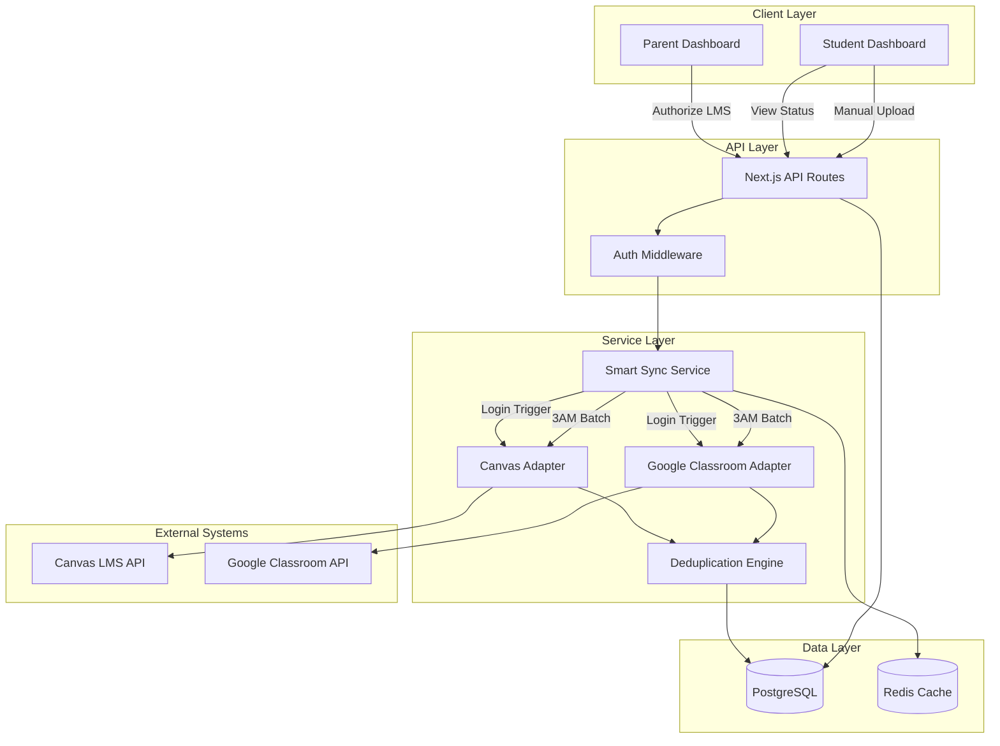

# Design Document: LMS Autonomy Engine

## Overview

The LMS Autonomy Engine transforms ForgeStudy from a manual AI tool into an autonomous studying platform by establishing direct connectivity with Learning Management Systems (Canvas and Google Classroom). This design implements a Dual-Intake Architecture that maintains the manual Airlock as a permanent, first-class feature while enabling automated assignment synchronization for students whose schools allow API access.

### Core Design Principles

1. **Dual-Intake Architecture**: Both automated LMS sync and manual file uploads are first-class citizens, not fallback mechanisms
2. **Smart Sync Strategy**: On-demand sync at student login + single 3:00 AM batch sync (NOT continuous 15-minute polling)
3. **Read-Only Bloodline**: Strict read-only API scopes prevent any write operations to LMS systems
4. **Graceful Degradation**: Automatic fallback to manual mode when firewalls block API access
5. **COPPA Compliance**: Parent authorization required for all LMS connections
6. **Firewall Survival**: System remains fully functional even when LMS APIs are completely blocked

### Technical Spike Decision: Path B (Direct Integration)

Based on the approved technical spike, we're implementing:
- **Canvas**: Personal Access Tokens (PATs) with read-only scopes
- **Google Classroom**: OAuth in Test Mode with manual user whitelisting
- **Rationale**: Fastest path to MVP, avoids third-party API provider costs, sufficient for Beta Cohort

### Key Constraints

**Guardrail 1: Smart Sync Strategy**
- Sync triggered on student login (on-demand)
- One batch sync at 3:00 AM daily for all connected students
- NO continuous 15-minute polling
- Reduces API calls by ~95% compared to polling approach

**Guardrail 2: Read-Only Bloodline**
- Canvas PAT scopes: `url:GET|/api/v1/courses` and `url:GET|/api/v1/assignments` only
- Google OAuth scopes: `classroom.courses.readonly` and `classroom.coursework.me.readonly` ONLY
- Never request write permissions
- Never submit assignments or alter grades

## Architecture

### System Components



### Data Flow

**Parent Authorization Flow:**
1. Parent navigates to Integration Panel in Parent Dashboard
2. Parent selects Canvas or Google Classroom
3. System displays COPPA-compliant authorization text
4. Parent confirms authorization
5. For Canvas: Parent enters PAT token
6. For Google Classroom: OAuth flow redirects to Google consent screen
7. System validates credentials and stores encrypted tokens
8. System creates LMS connection record with status "active"

**Smart Sync Flow (Login-Triggered):**
1. Student logs into Student Dashboard
2. System checks for active LMS connections
3. If connections exist, trigger immediate sync for that student
4. Smart Sync Service calls appropriate adapters (Canvas/Google Classroom)
5. Adapters fetch assignments and attachments
6. Deduplication Engine processes assignments
7. System updates sync timestamp and status
8. Student Dashboard displays updated status indicator

**Smart Sync Flow (3AM Batch):**
1. Cron job triggers at 3:00 AM daily
2. System queries all students with active LMS connections
3. For each student, Smart Sync Service calls appropriate adapters
4. Parallel processing with rate limiting to respect API quotas
5. Deduplication Engine processes all assignments
6. System updates sync timestamps and statuses
7. Failed syncs logged for parent notification

**Manual Upload Flow (Unchanged):**
1. Student drags/drops files to Airlock interface
2. System uploads files to storage
3. Deduplication Engine checks for matching synced assignments
4. If match found, merge metadata; otherwise create new assignment
5. Assignment appears in student's study queue

## Components and Interfaces

### Database Schema

#### Table: `lms_connections`
```sql
CREATE TABLE lms_connections (
    id UUID PRIMARY KEY DEFAULT gen_random_uuid(),
    student_id UUID NOT NULL REFERENCES students(id) ON DELETE CASCADE,
    parent_id UUID NOT NULL REFERENCES parents(id),
    provider VARCHAR(50) NOT NULL CHECK (provider IN ('canvas', 'google_classroom')),
    status VARCHAR(20) NOT NULL CHECK (status IN ('active', 'failed', 'blocked', 'disconnected')),
    encrypted_token TEXT NOT NULL, -- Encrypted PAT or OAuth refresh token
    token_expires_at TIMESTAMP, -- NULL for Canvas PATs, set for Google OAuth
    last_sync_at TIMESTAMP,
    last_sync_status VARCHAR(20) CHECK (last_sync_status IN ('success', 'auth_error', 'network_error', 'firewall_blocked')),
    failure_count INTEGER DEFAULT 0,
    metadata JSONB, -- Provider-specific data (e.g., Canvas instance URL)
    authorized_at TIMESTAMP NOT NULL DEFAULT NOW(),
    authorized_by UUID NOT NULL REFERENCES parents(id),
    created_at TIMESTAMP NOT NULL DEFAULT NOW(),
    updated_at TIMESTAMP NOT NULL DEFAULT NOW(),
    UNIQUE(student_id, provider)
);

CREATE INDEX idx_lms_connections_student ON lms_connections(student_id);
CREATE INDEX idx_lms_connections_status ON lms_connections(status);
CREATE INDEX idx_lms_connections_sync ON lms_connections(last_sync_at) WHERE status = 'active';
```

#### Table: `synced_assignments`
```sql
CREATE TABLE synced_assignments (
    id UUID PRIMARY KEY DEFAULT gen_random_uuid(),
    student_id UUID NOT NULL REFERENCES students(id) ON DELETE CASCADE,
    lms_connection_id UUID NOT NULL REFERENCES lms_connections(id) ON DELETE CASCADE,
    lms_assignment_id VARCHAR(255) NOT NULL, -- External LMS assignment ID
    title TEXT NOT NULL,
    description TEXT,
    due_date TIMESTAMP,
    course_name VARCHAR(255),
    course_id VARCHAR(255),
    attachment_urls JSONB, -- Array of attachment URLs from LMS
    downloaded_files JSONB, -- Array of file paths in our storage
    sync_status VARCHAR(20) NOT NULL CHECK (sync_status IN ('pending', 'downloaded', 'failed')),
    manual_upload_id UUID REFERENCES manual_uploads(id), -- Link to manual upload if merged
    is_merged BOOLEAN DEFAULT FALSE,
    first_synced_at TIMESTAMP NOT NULL DEFAULT NOW(),
    last_synced_at TIMESTAMP NOT NULL DEFAULT NOW(),
    created_at TIMESTAMP NOT NULL DEFAULT NOW(),
    updated_at TIMESTAMP NOT NULL DEFAULT NOW(),
    UNIQUE(lms_connection_id, lms_assignment_id)
);

CREATE INDEX idx_synced_assignments_student ON synced_assignments(student_id);
CREATE INDEX idx_synced_assignments_lms ON synced_assignments(lms_connection_id);
CREATE INDEX idx_synced_assignments_due_date ON synced_assignments(due_date);
CREATE INDEX idx_synced_assignments_merged ON synced_assignments(is_merged);
```

#### Table: `manual_uploads`
```sql
CREATE TABLE manual_uploads (
    id UUID PRIMARY KEY DEFAULT gen_random_uuid(),
    student_id UUID NOT NULL REFERENCES students(id) ON DELETE CASCADE,
    file_path TEXT NOT NULL,
    original_filename VARCHAR(255) NOT NULL,
    file_size INTEGER NOT NULL,
    mime_type VARCHAR(100),
    title TEXT, -- Extracted or user-provided
    due_date TIMESTAMP, -- User-provided
    synced_assignment_id UUID REFERENCES synced_assignments(id), -- Link if merged
    is_merged BOOLEAN DEFAULT FALSE,
    uploaded_at TIMESTAMP NOT NULL DEFAULT NOW(),
    created_at TIMESTAMP NOT NULL DEFAULT NOW(),
    updated_at TIMESTAMP NOT NULL DEFAULT NOW()
);

CREATE INDEX idx_manual_uploads_student ON manual_uploads(student_id);
CREATE INDEX idx_manual_uploads_merged ON manual_uploads(is_merged);
```

#### Table: `sync_logs`
```sql
CREATE TABLE sync_logs (
    id UUID PRIMARY KEY DEFAULT gen_random_uuid(),
    lms_connection_id UUID NOT NULL REFERENCES lms_connections(id) ON DELETE CASCADE,
    sync_trigger VARCHAR(50) NOT NULL CHECK (sync_trigger IN ('login', 'batch_3am', 'manual_retry')),
    sync_status VARCHAR(20) NOT NULL CHECK (sync_status IN ('success', 'auth_error', 'network_error', 'firewall_blocked')),
    assignments_found INTEGER DEFAULT 0,
    assignments_downloaded INTEGER DEFAULT 0,
    error_message TEXT,
    sync_duration_ms INTEGER,
    synced_at TIMESTAMP NOT NULL DEFAULT NOW()
);

CREATE INDEX idx_sync_logs_connection ON sync_logs(lms_connection_id);
CREATE INDEX idx_sync_logs_timestamp ON sync_logs(synced_at);
```

#### Table: `parent_notifications`
```sql
CREATE TABLE parent_notifications (
    id UUID PRIMARY KEY DEFAULT gen_random_uuid(),
    parent_id UUID NOT NULL REFERENCES parents(id) ON DELETE CASCADE,
    student_id UUID REFERENCES students(id) ON DELETE CASCADE,
    notification_type VARCHAR(50) NOT NULL CHECK (notification_type IN (
        'lms_connected', 'lms_auth_failed', 'lms_firewall_blocked', 
        'lms_restored', 'lms_disconnected'
    )),
    title VARCHAR(255) NOT NULL,
    message TEXT NOT NULL,
    is_read BOOLEAN DEFAULT FALSE,
    metadata JSONB, -- Additional context (e.g., provider name, error details)
    created_at TIMESTAMP NOT NULL DEFAULT NOW()
);

CREATE INDEX idx_parent_notifications_parent ON parent_notifications(parent_id);
CREATE INDEX idx_parent_notifications_read ON parent_notifications(is_read);
```

### API Endpoints

#### Parent Dashboard - LMS Management

**POST /api/parent/lms/connect**
```typescript
// Request
{
  studentId: string;
  provider: 'canvas' | 'google_classroom';
  token?: string; // For Canvas PAT
  canvasInstanceUrl?: string; // For Canvas
  // For Google Classroom, OAuth handled separately
}

// Response
{
  success: boolean;
  connectionId: string;
  status: 'active' | 'failed';
  message: string;
}
```

**DELETE /api/parent/lms/disconnect**
```typescript
// Request
{
  connectionId: string;
}

// Response
{
  success: boolean;
  message: string;
}
```

**GET /api/parent/lms/status/:studentId**
```typescript
// Response
{
  connections: Array<{
    id: string;
    provider: 'canvas' | 'google_classroom';
    status: 'active' | 'failed' | 'blocked' | 'disconnected';
    lastSyncAt: string | null;
    lastSyncStatus: string | null;
    authorizedAt: string;
  }>;
}
```

#### Student Dashboard - Sync Status

**GET /api/student/sync-status**
```typescript
// Response
{
  connections: Array<{
    provider: 'canvas' | 'google_classroom';
    status: 'active' | 'failed' | 'blocked' | 'disconnected';
    lastSyncAt: string | null;
    minutesSinceSync: number | null;
    newAssignmentsCount: number;
    message: string; // User-friendly status message
  }>;
  manualUploadEnabled: boolean; // Always true
}
```

#### Smart Sync Service

**POST /api/internal/sync/trigger**
```typescript
// Request (Internal only, called on student login)
{
  studentId: string;
  trigger: 'login' | 'batch_3am' | 'manual_retry';
}

// Response
{
  success: boolean;
  syncResults: Array<{
    provider: string;
    status: 'success' | 'auth_error' | 'network_error' | 'firewall_blocked';
    assignmentsFound: number;
    assignmentsDownloaded: number;
    errorMessage?: string;
  }>;
}
```

### React Components

#### Integration Panel (Parent Dashboard)

**Component: `IntegrationPanel.tsx`**
```typescript
interface IntegrationPanelProps {
  studentId: string;
  studentName: string;
}

// Features:
// - Glassmorphic card with backdrop-blur-md
// - Canvas connection section with PAT input
// - Google Classroom connection section with OAuth button
// - COPPA authorization checkbox and text
// - Connection status indicators with timestamps
// - Disconnect buttons for active connections
// - Responsive mobile layout
```

#### Status Indicator (Student Dashboard)

**Component: `SyncStatusIndicator.tsx`**
```typescript
interface SyncStatusIndicatorProps {
  connections: Array<{
    provider: 'canvas' | 'google_classroom';
    status: 'active' | 'failed' | 'blocked' | 'disconnected';
    lastSyncAt: string | null;
    minutesSinceSync: number | null;
    newAssignmentsCount: number;
  }>;
}

// Features:
// - Color-coded status badges (🟢 success, 🔴 failed, 🟡 blocked)
// - Time since last sync
// - New assignments count
// - Fallback message when no LMS connected
// - Glassmorphic styling
```

#### Dual-Intake Upload Interface (Student Dashboard)

**Component: `DualIntakeAirlock.tsx`**
```typescript
interface DualIntakeAirlockProps {
  studentId: string;
  syncStatus: SyncStatus;
}

// Features:
// - SyncStatusIndicator at top
// - Existing drag-and-drop upload zone
// - Explanatory text: "School blocked the connection? Or have a physical handout? Drop your PDFs and photos here."
// - Upload progress indicators
// - Recent uploads list
// - Merged assignment indicators
```

### Service Layer

#### Smart Sync Service

**Class: `SmartSyncService`**
```typescript
class SmartSyncService {
  // Triggered on student login
  async syncOnLogin(studentId: string): Promise<SyncResult>;
  
  // Triggered by cron at 3:00 AM
  async batchSyncAll(): Promise<BatchSyncResult>;
  
  // Retry failed connections
  async retryFailedConnection(connectionId: string): Promise<SyncResult>;
  
  // Check if firewall is blocking
  private async detectFirewallBlock(error: Error): Promise<boolean>;
  
  // Update connection status
  private async updateConnectionStatus(
    connectionId: string, 
    status: ConnectionStatus
  ): Promise<void>;
}
```

#### Canvas Adapter

**Class: `CanvasAdapter`**
```typescript
class CanvasAdapter {
  // Fetch assignments for a student
  async fetchAssignments(
    token: string, 
    instanceUrl: string
  ): Promise<Assignment[]>;
  
  // Download PDF attachments
  async downloadAttachment(
    token: string, 
    attachmentUrl: string
  ): Promise<Buffer>;
  
  // Validate PAT token
  async validateToken(
    token: string, 
    instanceUrl: string
  ): Promise<boolean>;
  
  // Get courses for student
  async getCourses(
    token: string, 
    instanceUrl: string
  ): Promise<Course[]>;
}
```

#### Google Classroom Adapter

**Class: `GoogleClassroomAdapter`**
```typescript
class GoogleClassroomAdapter {
  // Fetch coursework for a student
  async fetchCoursework(
    refreshToken: string
  ): Promise<Coursework[]>;
  
  // Download attachments from Google Drive
  async downloadDriveAttachment(
    refreshToken: string, 
    fileId: string
  ): Promise<Buffer>;
  
  // Refresh OAuth token
  async refreshAccessToken(
    refreshToken: string
  ): Promise<string>;
  
  // Get courses for student
  async getCourses(
    refreshToken: string
  ): Promise<Course[]>;
}
```

#### Deduplication Engine

**Class: `DeduplicationEngine`**
```typescript
class DeduplicationEngine {
  // Check if synced assignment matches manual upload
  async findMatchingUpload(
    assignment: SyncedAssignment
  ): Promise<ManualUpload | null>;
  
  // Merge synced assignment with manual upload
  async mergeAssignments(
    syncedId: string, 
    manualId: string
  ): Promise<MergedAssignment>;
  
  // Generate fuzzy match score
  private calculateMatchScore(
    title1: string, 
    title2: string, 
    dueDate1: Date | null, 
    dueDate2: Date | null
  ): number;
  
  // Check for duplicate synced assignments across providers
  async detectCrossProviderDuplicates(
    studentId: string
  ): Promise<DuplicateGroup[]>;
}
```

## Data Models

### TypeScript Interfaces

```typescript
interface LMSConnection {
  id: string;
  studentId: string;
  parentId: string;
  provider: 'canvas' | 'google_classroom';
  status: 'active' | 'failed' | 'blocked' | 'disconnected';
  encryptedToken: string;
  tokenExpiresAt: Date | null;
  lastSyncAt: Date | null;
  lastSyncStatus: 'success' | 'auth_error' | 'network_error' | 'firewall_blocked' | null;
  failureCount: number;
  metadata: {
    canvasInstanceUrl?: string;
    googleEmail?: string;
  };
  authorizedAt: Date;
  authorizedBy: string;
  createdAt: Date;
  updatedAt: Date;
}

interface SyncedAssignment {
  id: string;
  studentId: string;
  lmsConnectionId: string;
  lmsAssignmentId: string;
  title: string;
  description: string | null;
  dueDate: Date | null;
  courseName: string | null;
  courseId: string | null;
  attachmentUrls: string[];
  downloadedFiles: string[];
  syncStatus: 'pending' | 'downloaded' | 'failed';
  manualUploadId: string | null;
  isMerged: boolean;
  firstSyncedAt: Date;
  lastSyncedAt: Date;
  createdAt: Date;
  updatedAt: Date;
}

interface ManualUpload {
  id: string;
  studentId: string;
  filePath: string;
  originalFilename: string;
  fileSize: number;
  mimeType: string | null;
  title: string | null;
  dueDate: Date | null;
  syncedAssignmentId: string | null;
  isMerged: boolean;
  uploadedAt: Date;
  createdAt: Date;
  updatedAt: Date;
}

interface SyncLog {
  id: string;
  lmsConnectionId: string;
  syncTrigger: 'login' | 'batch_3am' | 'manual_retry';
  syncStatus: 'success' | 'auth_error' | 'network_error' | 'firewall_blocked';
  assignmentsFound: number;
  assignmentsDownloaded: number;
  errorMessage: string | null;
  syncDurationMs: number | null;
  syncedAt: Date;
}

interface ParentNotification {
  id: string;
  parentId: string;
  studentId: string | null;
  notificationType: 'lms_connected' | 'lms_auth_failed' | 'lms_firewall_blocked' | 'lms_restored' | 'lms_disconnected';
  title: string;
  message: string;
  isRead: boolean;
  metadata: Record<string, any>;
  createdAt: Date;
}

interface Assignment {
  id: string;
  title: string;
  description: string | null;
  dueDate: Date | null;
  courseName: string;
  courseId: string;
  attachments: Attachment[];
}

interface Attachment {
  id: string;
  filename: string;
  url: string;
  mimeType: string;
  size: number;
}

interface SyncResult {
  success: boolean;
  provider: string;
  status: 'success' | 'auth_error' | 'network_error' | 'firewall_blocked';
  assignmentsFound: number;
  assignmentsDownloaded: number;
  errorMessage?: string;
  syncDurationMs: number;
}
```

### Redis Cache Schema

```typescript
// Cache sync status for quick retrieval
interface CachedSyncStatus {
  studentId: string;
  connections: Array<{
    provider: string;
    status: string;
    lastSyncAt: string | null;
    newAssignmentsCount: number;
  }>;
  cachedAt: number;
}

// Key pattern: `sync:status:${studentId}`
// TTL: 5 minutes
```


## Correctness Properties

*A property is a characteristic or behavior that should hold true across all valid executions of a system—essentially, a formal statement about what the system should do. Properties serve as the bridge between human-readable specifications and machine-verifiable correctness guarantees.*

### Property Reflection

After analyzing all acceptance criteria, I identified the following redundancies and consolidations:

**Redundancy Group 1: Sync Timestamp Storage**
- Properties 3.6 and 4.6 both test that timestamps are stored after successful syncs
- These can be combined into a single property that applies to all LMS providers

**Redundancy Group 2: Metadata Preservation**
- Properties 3.7 and 4.7 both test that assignment metadata is preserved
- These can be combined into a single property that applies to all LMS providers

**Redundancy Group 3: Assignment Retrieval**
- Properties 3.1 and 4.1 both test that assignments are retrieved when authorized
- These can be combined into a single property that applies to all LMS providers

**Redundancy Group 4: Attachment Download**
- Properties 3.2 and 4.2 both test that attachments are downloaded for new assignments
- These can be combined into a single property that applies to all LMS providers

**Redundancy Group 5: Parent Notifications**
- Properties 9.1, 9.2, 9.3, and 9.4 all test that notifications are sent for specific events
- These can be combined into a single property about notification generation for all sync events

After consolidation, we have 23 unique properties to test.

### Property 1: Parent Confirmation Required for LMS Connection

*For any* LMS connection attempt (Canvas or Google Classroom), the system should prevent connection establishment unless explicit parent confirmation has been provided.

**Validates: Requirements 2.5**

### Property 2: Connection Status Display After Successful Connection

*For any* successfully established LMS connection, the Integration Panel should display the connection status with a timestamp indicating when the connection was authorized.

**Validates: Requirements 2.8**

### Property 3: Disconnect Functionality for Active Connections

*For any* active LMS connection, the Integration Panel should provide a functional disconnect action that successfully terminates the connection when invoked by a parent.

**Validates: Requirements 2.9**

### Property 4: Assignment Retrieval for Authorized Connections

*For any* authorized LMS connection (Canvas or Google Classroom), the Assignment Sync Service should retrieve active assignments/coursework from the respective API when a sync is triggered.

**Validates: Requirements 3.1, 4.1**

### Property 5: Attachment Download for New Assignments

*For any* new assignment/coursework detected with PDF or file attachments, the Assignment Sync Service should download all associated attachments to local storage.

**Validates: Requirements 3.2, 4.2**

### Property 6: Sync Timestamp Storage

*For any* successful sync operation (Canvas or Google Classroom), the system should store a timestamp recording when the sync completed successfully.

**Validates: Requirements 3.6, 4.6**

### Property 7: Assignment Metadata Preservation

*For any* assignment/coursework retrieved from an LMS API, the system should preserve all metadata fields including title, due date, and description in the database.

**Validates: Requirements 3.7, 4.7**

### Property 8: Failed Connection Status Display

*For any* LMS connection that has failed (authentication error, network error, or firewall block), the Status Indicator should display an appropriate failure message indicating the connection issue.

**Validates: Requirements 5.4**

### Property 9: Manual Upload Availability Regardless of LMS Status

*For any* LMS connection status (active, failed, blocked, or no connection), the Student Dashboard should accept and process manual file uploads successfully.

**Validates: Requirements 5.8**

### Property 10: Student Authorization Prevention

*For any* student user attempting to authorize an LMS connection directly, the system should prevent the authorization and require parent authentication.

**Validates: Requirements 6.1**

### Property 11: Parent Dashboard Authorization Origin

*For any* LMS connection authorization that is successfully created, the authorization must have originated from the Parent Dashboard interface (not Student Dashboard or API).

**Validates: Requirements 6.2**

### Property 12: COPPA Enforcement for Minors

*For any* student under 13 years old, the system should enforce parent authorization requirements for all LMS connection attempts, preventing any connection without parent approval.

**Validates: Requirements 6.3**

### Property 13: Authorization Audit Logging

*For any* parent LMS authorization action (connect or disconnect), the system should create an audit log entry containing the timestamp, parent identifier, student identifier, and action type.

**Validates: Requirements 6.4**

### Property 14: Parent Notification on Manual Mode Switch

*For any* automatic switch to manual upload mode (due to firewall blocking or repeated failures), the system should send a notification to the parent explaining the fallback.

**Validates: Requirements 7.2**

### Property 15: Manual Upload Functionality During LMS Block

*For any* student whose LMS connection is blocked by a firewall, the manual upload interface should remain fully functional and process uploads successfully.

**Validates: Requirements 7.3**

### Property 16: Connection Retry Attempts

*For any* LMS connection in a failed or blocked state, the system should periodically attempt to reconnect to detect when restrictions are lifted.

**Validates: Requirements 7.4**

### Property 17: Unique Identifier Generation for Synced Assignments

*For any* assignment retrieved via LMS sync, the system should generate a unique identifier based on the LMS assignment ID and connection ID to prevent duplicates.

**Validates: Requirements 8.1**

### Property 18: Matching Attempt for Manual Uploads

*For any* file manually uploaded by a student, the system should attempt to match it against existing synced assignments using title and due date similarity.

**Validates: Requirements 8.2**

### Property 19: Assignment Merging on Match

*For any* manual upload that matches an existing synced assignment (based on title and due date similarity above threshold), the system should merge them into a single assignment entry.

**Validates: Requirements 8.3**

### Property 20: Data Preservation During Merge

*For any* merge operation between a synced assignment and manual upload, the system should preserve both the synced metadata (title, due date, description, course) and the manually uploaded file path.

**Validates: Requirements 8.4**

### Property 21: Visual Indicator for Merged Assignments

*For any* assignment that has been merged from both synced and manual sources, the system should display a visual indicator (such as a badge or icon) showing the dual-source nature.

**Validates: Requirements 8.5**

### Property 22: Parent Notification for Sync Events

*For any* significant sync event (connection established, authentication failed, firewall blocked, or connection restored), the system should send a notification to the parent with appropriate context and guidance.

**Validates: Requirements 9.1, 9.2, 9.3, 9.4**

### Property 23: Token Encryption for Stored Credentials

*For any* LMS connection credential (Canvas PAT or Google OAuth refresh token), the system should encrypt the token before storing it in the database and decrypt it only when needed for API calls.

**Validates: Security requirement (implicit in design)**

## Error Handling

### Authentication Errors

**Canvas PAT Authentication Failure:**
- Detect: HTTP 401 response from Canvas API
- Action: Mark connection status as 'failed' with lastSyncStatus 'auth_error'
- Increment failureCount
- Send parent notification with message: "Canvas connection failed. Please check your Personal Access Token and try reconnecting."
- Do not retry automatically (requires parent intervention)

**Google Classroom OAuth Token Expiration:**
- Detect: HTTP 401 response from Google Classroom API
- Action: Attempt to refresh access token using refresh token
- If refresh fails: Mark connection status as 'failed' with lastSyncStatus 'auth_error'
- Send parent notification with message: "Google Classroom connection expired. Please reconnect your account."
- Do not retry automatically (requires parent re-authorization)

### Network and Firewall Errors

**Network Timeout:**
- Detect: Request timeout (>30 seconds) or ECONNREFUSED error
- Action: Log error to sync_logs with status 'network_error'
- Increment failureCount
- Retry with exponential backoff: 1min, 5min, 15min, 1hour
- If failureCount reaches 5: Mark as 'blocked' and notify parent

**Firewall Block Detection:**
- Detect: Consistent network errors across multiple retry attempts (failureCount >= 5)
- Action: Mark connection status as 'blocked' with lastSyncStatus 'firewall_blocked'
- Send parent notification: "Your school's firewall is blocking LMS access. ForgeStudy has switched to manual upload mode. You can still upload files directly."
- Continue periodic retry attempts (every 6 hours) to detect when block is lifted

**CORS or SSL Certificate Errors:**
- Detect: CORS policy errors or SSL certificate validation failures
- Action: Log detailed error to sync_logs
- Mark connection as 'failed'
- Send parent notification with technical details and support contact

### Data Processing Errors

**Attachment Download Failure:**
- Detect: HTTP error when downloading attachment or file write error
- Action: Mark assignment syncStatus as 'failed'
- Log error with assignment ID and attachment URL
- Continue processing other assignments
- Retry failed attachments on next sync

**Invalid Assignment Data:**
- Detect: Missing required fields (title, assignment ID) or malformed data
- Action: Log warning with raw API response
- Skip assignment (do not create database record)
- Continue processing other assignments
- Include count of skipped assignments in sync log

**Database Write Failure:**
- Detect: PostgreSQL constraint violation or connection error
- Action: Rollback transaction
- Log error with full context
- Mark sync as failed
- Retry entire sync operation on next trigger

### Rate Limiting

**Canvas API Rate Limit:**
- Detect: HTTP 429 response
- Action: Extract Retry-After header
- Wait specified duration before retrying
- If no header: Wait 60 seconds
- Log rate limit event
- Do not mark connection as failed

**Google Classroom API Quota Exceeded:**
- Detect: HTTP 429 response with quota error
- Action: Pause syncs for this connection for 1 hour
- Log quota exceeded event
- Send parent notification if quota consistently exceeded
- Consider reducing sync frequency for this student

### Graceful Degradation Strategy

**Fallback Hierarchy:**
1. Primary: Automated LMS sync (login-triggered + 3AM batch)
2. Fallback: Manual upload mode (always available)
3. Recovery: Periodic retry attempts to restore LMS sync

**State Transitions:**
- active → failed: Authentication error (requires parent action)
- active → blocked: Firewall detected (automatic fallback, periodic retry)
- failed → active: Parent reconnects successfully
- blocked → active: Retry succeeds after firewall lifted

**User Communication:**
- All error states clearly communicated via Status Indicator
- Parent notifications include actionable guidance
- Student Dashboard always shows manual upload as viable option
- No error state prevents core functionality (manual upload)

## Testing Strategy

### Dual Testing Approach

This feature requires both unit testing and property-based testing to ensure comprehensive coverage:

**Unit Tests** focus on:
- Specific examples of UI component rendering
- Integration points between services and adapters
- Edge cases like authentication failures and firewall blocks
- Error handling for specific error types
- Database constraint validation

**Property-Based Tests** focus on:
- Universal properties that hold for all inputs
- Comprehensive input coverage through randomization
- Data integrity across operations
- Business rule enforcement across all scenarios

Both testing approaches are complementary and necessary. Unit tests catch concrete bugs in specific scenarios, while property tests verify general correctness across the input space.

### Property-Based Testing Configuration

**Library Selection:**
- **TypeScript/JavaScript**: Use `fast-check` library for property-based testing
- **Database Tests**: Use `fast-check` with test database transactions

**Test Configuration:**
- Each property test MUST run minimum 100 iterations
- Each test MUST include a comment tag referencing the design property
- Tag format: `// Feature: lms-autonomy-engine, Property {number}: {property_text}`

**Example Property Test Structure:**
```typescript
import fc from 'fast-check';

// Feature: lms-autonomy-engine, Property 7: Assignment Metadata Preservation
test('For any assignment retrieved from LMS API, metadata should be preserved', async () => {
  await fc.assert(
    fc.asyncProperty(
      arbitraryAssignment(), // Generator for random assignments
      async (assignment) => {
        const saved = await syncService.saveAssignment(assignment);
        expect(saved.title).toBe(assignment.title);
        expect(saved.dueDate).toEqual(assignment.dueDate);
        expect(saved.description).toBe(assignment.description);
      }
    ),
    { numRuns: 100 }
  );
});
```

### Unit Testing Strategy

**Component Tests (React Testing Library):**
- IntegrationPanel: Test rendering, connection flows, disconnect actions
- SyncStatusIndicator: Test status display for all connection states
- DualIntakeAirlock: Test upload functionality, status integration

**Service Tests (Jest):**
- SmartSyncService: Test login-triggered sync, batch sync, retry logic
- CanvasAdapter: Test API calls, token validation, error handling
- GoogleClassroomAdapter: Test OAuth flow, API calls, token refresh
- DeduplicationEngine: Test matching algorithm, merge logic

**API Route Tests (Next.js):**
- /api/parent/lms/connect: Test authorization flow, validation
- /api/parent/lms/disconnect: Test disconnection, cleanup
- /api/student/sync-status: Test status retrieval, caching

**Database Tests (PostgreSQL):**
- Schema validation
- Constraint enforcement (unique connections per student/provider)
- Cascade deletion behavior
- Index performance

**Integration Tests:**
- End-to-end parent authorization flow
- End-to-end sync flow (mocked LMS APIs)
- Deduplication across sync and manual upload
- Firewall detection and fallback

### Edge Cases to Test

1. **Empty Assignment List**: LMS returns no assignments
2. **Assignment Without Attachments**: Assignment has no files to download
3. **Duplicate Assignment IDs**: Same assignment appears in multiple courses
4. **Very Long Assignment Titles**: Title exceeds expected length
5. **Missing Due Dates**: Assignment has no due date
6. **Past Due Assignments**: Assignment due date is in the past
7. **Concurrent Syncs**: Multiple sync triggers occur simultaneously
8. **Token Expiration During Sync**: OAuth token expires mid-operation
9. **Partial Download Failure**: Some attachments download, others fail
10. **Database Connection Loss**: Database becomes unavailable during sync

### Test Data Generators (for Property-Based Tests)

```typescript
// Arbitrary generators for fast-check
const arbitraryAssignment = () => fc.record({
  id: fc.uuid(),
  title: fc.string({ minLength: 1, maxLength: 255 }),
  description: fc.option(fc.string({ maxLength: 5000 })),
  dueDate: fc.option(fc.date()),
  courseName: fc.string({ minLength: 1, maxLength: 255 }),
  courseId: fc.string({ minLength: 1, maxLength: 100 }),
  attachments: fc.array(arbitraryAttachment(), { maxLength: 10 })
});

const arbitraryAttachment = () => fc.record({
  id: fc.uuid(),
  filename: fc.string({ minLength: 1, maxLength: 255 }),
  url: fc.webUrl(),
  mimeType: fc.constantFrom('application/pdf', 'image/jpeg', 'image/png'),
  size: fc.integer({ min: 1, max: 10000000 })
});

const arbitraryLMSConnection = () => fc.record({
  studentId: fc.uuid(),
  parentId: fc.uuid(),
  provider: fc.constantFrom('canvas', 'google_classroom'),
  status: fc.constantFrom('active', 'failed', 'blocked', 'disconnected')
});

const arbitraryManualUpload = () => fc.record({
  studentId: fc.uuid(),
  originalFilename: fc.string({ minLength: 1, maxLength: 255 }),
  title: fc.option(fc.string({ minLength: 1, maxLength: 255 })),
  dueDate: fc.option(fc.date()),
  fileSize: fc.integer({ min: 1, max: 10000000 })
});
```

### Continuous Integration

**Pre-commit Hooks:**
- Run unit tests for changed files
- Run linting and type checking

**CI Pipeline (GitHub Actions):**
1. Run all unit tests
2. Run all property-based tests (100 iterations each)
3. Run integration tests with test database
4. Generate coverage report (target: >80% coverage)
5. Run E2E tests with Playwright

**Performance Benchmarks:**
- Sync operation should complete in <5 seconds for 50 assignments
- Deduplication matching should complete in <100ms per upload
- Status indicator should render in <50ms

### Manual Testing Checklist

**Beta Cohort Testing:**
- [ ] Parent can connect Canvas with valid PAT
- [ ] Parent can connect Google Classroom via OAuth
- [ ] Student sees correct sync status after connection
- [ ] Assignments sync on student login
- [ ] Assignments sync during 3AM batch
- [ ] Manual upload works when LMS connected
- [ ] Manual upload works when LMS blocked
- [ ] Duplicate assignments are merged correctly
- [ ] Parent receives notifications for all sync events
- [ ] Firewall block is detected and handled gracefully
- [ ] Connection can be disconnected by parent
- [ ] UI is responsive on mobile devices
- [ ] Dark Space UI styling is consistent

