# Design Document: Logic Loom (Synthesis Engine)

## Overview

The Logic Loom is a cognitive synthesis engine designed for high school students (Grades 9-12) that transforms passive concept mastery into active intellectual synthesis. Students visually select 2-4 mastered concepts from their Galaxy UI, then engage in Socratic dialogue with Gemini 3.1 Ultra to discover original connections between ideas. The system refuses to provide answers, instead forcing students to articulate the connective tissue themselves through strategic questioning. Each successful micro-connection is crystallized into an essay outline, with the final synthesis cryptographically verified as proof of original thought.

This feature addresses the critical gap between knowledge acquisition and higher-order thinking by creating positive cognitive friction—students must actively construct meaning rather than passively receive it. The system leverages neurochemical design principles (eustress, dopamine micro-dosing, crystallization rewards) to make the challenging work of synthesis feel engaging rather than overwhelming.

## Architecture

### System Components

```mermaid
graph TB
    subgraph "Client Layer"
        Galaxy[ConceptGalaxy Component]
        Loom[Loom Workspace]
        Outline[Essay Outline Board]
        Chat[Socratic Chat Interface]
    end
    
    subgraph "API Layer"
        SparAPI[/api/loom/spar]
        InitAPI[/api/loom/init]
        ExportAPI[/api/loom/export]
    end
    
    subgraph "AI Layer"
        GeminiUltra[Gemini 3.1 Ultra]
        SocraticEngine[Socratic Constraint System]
        ProofGenerator[Cryptographic Proof Generator]
    end
    
    subgraph "Data Layer"
        Topics[(study_topics)]
        Edges[(topic_edges)]
        Sessions[(loom_sessions)]
        ProofEvents[(proof_events)]
    end
    
    Galaxy -->|Shift+Click Selection| Loom
    Loom --> Chat
    Loom --> Outline
    Chat --> SparAPI
    SparAPI --> GeminiUltra
    GeminiUltra --> SocraticEngine
    SocraticEngine --> ProofGenerator
    SparAPI --> Sessions
    InitAPI --> ProofEvents
    InitAPI --> Topics
    Loom --> ExportAPI
    ExportAPI --> Sessions
    Sessions --> Edges
```

### Data Flow Sequence

```mermaid
sequenceDiagram
    participant Student
    participant Galaxy
    participant LoomWorkspace
    participant SparAPI
    participant GeminiUltra
    participant Database
    
    Student->>Galaxy: Shift+Click mastered nodes (orbit_state=2)
    Galaxy->>Galaxy: Build constellation array (2-4 nodes)
    Galaxy->>Galaxy: Render SVG threads between nodes
    Student->>Galaxy: Click "🕸️ Weave Thesis"
    Galaxy->>LoomWorkspace: Route to /loom/[session_id]
    LoomWorkspace->>Database: Query proof_events for selected topics
    Database-->>LoomWorkspace: Return learning transcripts
    LoomWorkspace->>SparAPI: Initialize session with context
    SparAPI->>GeminiUltra: Inject proof_events into system prompt
    GeminiUltra-->>SparAPI: Ready for sparring
    
    loop Socratic Sparring Phase
        Student->>LoomWorkspace: Type response
        LoomWorkspace->>SparAPI: POST student response
        SparAPI->>GeminiUltra: Validate with Socratic constraints
        GeminiUltra-->>SparAPI: JSON response (socratic_response, loom_status, crystallized_thread)
        SparAPI->>Database: Save transcript to loom_sessions
        SparAPI-->>LoomWorkspace: Return AI response
        LoomWorkspace->>Outline: Append crystallized_thread (if present)
        LoomWorkspace-->>Student: Display pushback + updated outline
    end
    
    GeminiUltra->>SparAPI: loom_status = "THESIS_ACHIEVED"
    SparAPI->>Database: Save final_outline, cryptographic_proof
    SparAPI->>Database: Create topic_edges for constellation
    SparAPI-->>LoomWorkspace: Crystallization complete
    LoomWorkspace->>Student: Lock chat, show success state
    Student->>LoomWorkspace: Click "📄 Export Proof"
    LoomWorkspace->>Database: Retrieve cryptographic proof
    LoomWorkspace-->>Student: Download proof document
```



## Components and Interfaces

### Component 1: ConceptGalaxy (Enhanced)

**Purpose**: Enable multi-select interaction for mastered concepts using Shift+Click pattern

**Interface**:
```typescript
interface ConceptGalaxyProps {
  topics: Topic[];
  onConstellationCreate?: (constellation: Constellation) => void;
}

interface Constellation {
  nodes: string[]; // Array of topic IDs (2-4 items)
  sessionId: string; // UUID for loom session
}
```

**Responsibilities**:
- Detect Shift+Click on nodes with orbit_state = 2
- Maintain selected_constellation state array (max 4 nodes)
- Render temporary SVG links between selected nodes
- Display bottom dock with "🕸️ Weave Thesis" button
- Validate selection constraints (only mastered nodes, 2-4 nodes)
- Generate session UUID and route to Loom Workspace

**State Management**:
```typescript
const [selectedConstellation, setSelectedConstellation] = useState<string[]>([]);
const [showLoomDock, setShowLoomDock] = useState(false);

const handleNodeClick = (node: Node, event: MouseEvent) => {
  if (!event.shiftKey) {
    // Normal click - navigate to tutor
    router.push(`/tutor?topicId=${node.id}`);
    return;
  }
  
  // Shift+Click - constellation selection
  if (node.orbitState !== 2) {
    toast.error("Only Mastered stars can be woven.");
    return;
  }
  
  if (selectedConstellation.includes(node.id)) {
    // Deselect
    setSelectedConstellation(prev => prev.filter(id => id !== node.id));
  } else if (selectedConstellation.length < 4) {
    // Select
    setSelectedConstellation(prev => [...prev, node.id]);
  } else {
    toast.error("Maximum 4 concepts can be woven together.");
  }
};
```

### Component 2: LoomWorkspace

**Purpose**: Split-screen interface for Socratic sparring with real-time outline building

**Interface**:
```typescript
interface LoomWorkspaceProps {
  sessionId: string;
}

interface LoomSession {
  id: string;
  selectedTopicIds: string[];
  status: 'SPARRING' | 'THESIS_ACHIEVED';
  transcript: TranscriptEntry[];
  finalOutline: string | null;
  cryptographicProof: string | null;
}

interface TranscriptEntry {
  role: 'student' | 'ai';
  content: string;
  crystallizedThread?: string;
  timestamp: string;
}
```

**Responsibilities**:
- Render split-screen layout (Left: Constellation + Outline Board, Right: Chat)
- Lock constellation visualization (non-interactive)
- Display real-time essay outline as crystallized_thread entries accumulate
- Manage chat input state and submission
- Handle crystallization success state (lock input, show export button)
- Trigger visual effects (SVG flare, gold pulse on outline updates)

**Layout Structure**:
```typescript
<div className="flex h-screen bg-slate-950">
  {/* Left Panel: Locked Constellation + Outline */}
  <div className="w-1/2 border-r border-slate-800 p-6">
    <ConstellationVisualization nodes={selectedNodes} locked={true} />
    <OutlineBoard entries={crystallizedThreads} />
  </div>
  
  {/* Right Panel: Socratic Chat */}
  <div className="w-1/2 flex flex-col">
    <ChatHeader sessionId={sessionId} status={status} />
    <ChatTranscript messages={transcript} />
    <ChatInput 
      onSubmit={handleSparSubmit} 
      disabled={status === 'THESIS_ACHIEVED'} 
    />
  </div>
</div>
```

### Component 3: OutlineBoard

**Purpose**: Display auto-generated essay outline from crystallized threads

**Interface**:
```typescript
interface OutlineBoardProps {
  entries: CrystallizedThread[];
  status: 'SPARRING' | 'THESIS_ACHIEVED';
}

interface CrystallizedThread {
  id: string;
  content: string; // 1-sentence academic summary
  timestamp: string;
  connectionPair: [string, string]; // [topicId1, topicId2]
}
```

**Responsibilities**:
- Render outline as ordered list with academic formatting
- Animate new entries with gold pulse (bg-amber-500/20)
- Show connection indicators (which concepts were linked)
- Display completion state when THESIS_ACHIEVED
- Provide visual hierarchy (Roman numerals, indentation)

## Data Models

### Model 1: topic_edges

```typescript
interface TopicEdge {
  id: string; // UUID
  user_id: string; // UUID reference to auth.users
  source_topic_id: string; // UUID reference to study_topics
  target_topic_id: string; // UUID reference to study_topics
  loom_session_id: string; // UUID reference to loom_sessions
  created_at: string; // ISO timestamp
}
```

**Validation Rules**:
- source_topic_id and target_topic_id must reference topics with orbit_state = 2
- source_topic_id ≠ target_topic_id (no self-loops)
- Both topics must belong to same user_id
- loom_session_id must reference valid session with status = 'THESIS_ACHIEVED'

**Database Schema**:
```sql
CREATE TABLE topic_edges (
  id UUID PRIMARY KEY DEFAULT uuid_generate_v4(),
  user_id UUID REFERENCES auth.users(id) NOT NULL,
  source_topic_id UUID REFERENCES study_topics(id) NOT NULL,
  target_topic_id UUID REFERENCES study_topics(id) NOT NULL,
  loom_session_id UUID NOT NULL,
  created_at TIMESTAMP WITH TIME ZONE DEFAULT NOW(),
  
  -- Constraints
  CONSTRAINT different_topics CHECK (source_topic_id != target_topic_id),
  CONSTRAINT unique_edge UNIQUE (user_id, source_topic_id, target_topic_id, loom_session_id)
);

CREATE INDEX idx_topic_edges_user_id ON topic_edges(user_id);
CREATE INDEX idx_topic_edges_source ON topic_edges(source_topic_id);
CREATE INDEX idx_topic_edges_target ON topic_edges(target_topic_id);
CREATE INDEX idx_topic_edges_session ON topic_edges(loom_session_id);
```

### Model 2: loom_sessions

```typescript
interface LoomSession {
  id: string; // UUID
  user_id: string; // UUID reference to auth.users
  selected_topic_ids: string[]; // Array of 2-4 topic UUIDs
  status: 'SPARRING' | 'THESIS_ACHIEVED';
  final_outline: string | null; // Markdown formatted outline
  transcript: TranscriptEntry[]; // JSONB array
  cryptographic_proof: string | null; // AI-generated proof text
  created_at: string; // ISO timestamp
  completed_at: string | null; // ISO timestamp when THESIS_ACHIEVED
}
```

**Validation Rules**:
- selected_topic_ids must contain 2-4 valid topic UUIDs
- All topics in selected_topic_ids must have orbit_state = 2
- status defaults to 'SPARRING', can only transition to 'THESIS_ACHIEVED'
- final_outline and cryptographic_proof must be null when status = 'SPARRING'
- completed_at must be null when status = 'SPARRING'
- transcript must be valid JSONB array

**Database Schema**:
```sql
CREATE TABLE loom_sessions (
  id UUID PRIMARY KEY DEFAULT uuid_generate_v4(),
  user_id UUID REFERENCES auth.users(id) NOT NULL,
  selected_topic_ids UUID[] NOT NULL,
  status TEXT DEFAULT 'SPARRING' CHECK (status IN ('SPARRING', 'THESIS_ACHIEVED')),
  final_outline TEXT,
  transcript JSONB NOT NULL DEFAULT '[]'::jsonb,
  cryptographic_proof TEXT,
  created_at TIMESTAMP WITH TIME ZONE DEFAULT NOW(),
  completed_at TIMESTAMP WITH TIME ZONE,
  
  -- Constraints
  CONSTRAINT valid_topic_count CHECK (array_length(selected_topic_ids, 1) BETWEEN 2 AND 4),
  CONSTRAINT thesis_requires_proof CHECK (
    (status = 'SPARRING' AND final_outline IS NULL AND cryptographic_proof IS NULL AND completed_at IS NULL)
    OR
    (status = 'THESIS_ACHIEVED' AND final_outline IS NOT NULL AND cryptographic_proof IS NOT NULL AND completed_at IS NOT NULL)
  )
);

CREATE INDEX idx_loom_sessions_user_id ON loom_sessions(user_id, created_at DESC);
CREATE INDEX idx_loom_sessions_status ON loom_sessions(status);
```

## Main Algorithm/Workflow


## Key Functions with Formal Specifications

### Function 1: handleConstellationSelection()

```typescript
function handleConstellationSelection(
  nodeId: string,
  currentConstellation: string[],
  allNodes: Node[],
  shiftKeyPressed: boolean
): ConstellationSelectionResult
```

**Preconditions:**
- nodeId must reference a valid node in allNodes
- currentConstellation.length <= 4
- allNodes contains at least 2 nodes with orbit_state = 2

**Postconditions:**
- If node.orbit_state !== 2: Returns error state with toast message
- If !shiftKeyPressed: Returns navigation action to tutor
- If nodeId already in constellation: Returns updated constellation with nodeId removed
- If constellation.length >= 4 and nodeId not in constellation: Returns error state
- Otherwise: Returns updated constellation with nodeId added
- Result constellation always satisfies: 0 <= length <= 4

**Loop Invariants:** N/A (no loops)

### Function 2: initializeLoomSession()

```typescript
async function initializeLoomSession(
  userId: string,
  topicIds: string[],
  supabase: SupabaseClient
): Promise<LoomSessionInitResult>
```

**Preconditions:**
- userId must reference valid authenticated user
- topicIds.length must be between 2 and 4 (inclusive)
- All topicIds must reference topics with orbit_state = 2
- All topics must belong to userId

**Postconditions:**
- Creates new loom_sessions record with status = 'SPARRING'
- Queries proof_events for all topicIds to retrieve learning context
- Returns session object with: id, selectedTopics, proofEventsContext
- If any precondition fails: Returns error with specific validation message
- Session transcript initialized as empty array

**Loop Invariants:**
- When iterating through topicIds to fetch proof_events: All previously processed topics have valid proof_events arrays (may be empty)

### Function 3: processSocraticSpar()

```typescript
async function processSocraticSpar(
  sessionId: string,
  studentResponse: string,
  geminiUltra: GenerativeModel
): Promise<SocraticSparResult>
```

**Preconditions:**
- sessionId must reference valid loom_sessions record
- Session status must be 'SPARRING'
- studentResponse must be non-empty string (trimmed)
- geminiUltra must be configured with Socratic system prompt

**Postconditions:**
- Appends student response to session transcript
- Calls Gemini Ultra with structured output schema
- Returns parsed JSON: { socratic_response, loom_status, crystallized_thread?, cryptographic_proof? }
- Appends AI response to session transcript
- If loom_status = 'THESIS_ACHIEVED': Updates session status, saves final_outline and cryptographic_proof
- If crystallized_thread present: Adds to outline accumulator
- Session transcript always maintains chronological order

**Loop Invariants:** N/A (no loops in main function, but Gemini API may retry internally)

### Function 4: generateCryptographicProof()

```typescript
function generateCryptographicProof(
  session: LoomSession,
  finalOutline: string,
  transcript: TranscriptEntry[]
): string
```

**Preconditions:**
- session.status must be 'THESIS_ACHIEVED'
- finalOutline must be non-empty string
- transcript must contain at least 3 entries (student-AI-student minimum)
- transcript must show progression from initial question to synthesis

**Postconditions:**
- Returns 2-3 sentence clinical audit proving HOW student arrived at thesis
- Proof references specific transcript moments (by timestamp or excerpt)
- Proof validates originality (not AI-generated, student-discovered connections)
- Proof is deterministic (same inputs produce same proof)
- Proof format: "Student [action] at [timestamp], demonstrating [cognitive skill]. This led to [insight] which synthesized [concepts]. Original thought verified."

**Loop Invariants:**
- When analyzing transcript entries: All previously analyzed entries maintain chronological order

## Algorithmic Pseudocode

### Main Processing Algorithm: Socratic Sparring Loop

```pascal
ALGORITHM socraticSparringLoop(sessionId, userId)
INPUT: sessionId (UUID), userId (UUID)
OUTPUT: finalSession (LoomSession with THESIS_ACHIEVED status)

BEGIN
  // Precondition checks
  ASSERT sessionExists(sessionId) = true
  ASSERT sessionBelongsToUser(sessionId, userId) = true
  
  session ← loadSession(sessionId)
  ASSERT session.status = 'SPARRING'
  
  // Load historical context for selected topics
  proofEventsContext ← []
  FOR each topicId IN session.selected_topic_ids DO
    events ← queryProofEvents(topicId, userId)
    proofEventsContext.append(events)
  END FOR
  
  // Initialize Gemini Ultra with Socratic constraints
  systemPrompt ← buildSocraticSystemPrompt(session.selected_topic_ids, proofEventsContext)
  geminiModel ← initializeGeminiUltra(systemPrompt)
  
  // Main sparring loop
  WHILE session.status = 'SPARRING' DO
    // Wait for student input
    studentResponse ← awaitStudentInput()
    ASSERT studentResponse.trim().length > 0
    
    // Append to transcript
    session.transcript.append({
      role: 'student',
      content: studentResponse,
      timestamp: NOW()
    })
    
    // Call Gemini Ultra with structured output
    aiResponse ← geminiModel.generateStructuredOutput({
      messages: session.transcript,
      schema: SOCRATIC_RESPONSE_SCHEMA
    })
    
    // Parse structured response
    socraticResponse ← aiResponse.socratic_response
    loomStatus ← aiResponse.loom_status
    crystallizedThread ← aiResponse.crystallized_thread
    cryptographicProof ← aiResponse.cryptographic_proof_of_cognition
    
    // Append AI response to transcript
    session.transcript.append({
      role: 'ai',
      content: socraticResponse,
      crystallized_thread: crystallizedThread,
      timestamp: NOW()
    })
    
    // Update outline if micro-connection detected
    IF crystallizedThread IS NOT NULL THEN
      session.outline.append(crystallizedThread)
      triggerVisualEffect('gold-pulse')
    END IF
    
    // Check for crystallization (win condition)
    IF loomStatus = 'THESIS_ACHIEVED' THEN
      session.status ← 'THESIS_ACHIEVED'
      session.final_outline ← formatOutline(session.outline)
      session.cryptographic_proof ← cryptographicProof
      session.completed_at ← NOW()
      
      // Create permanent edges in database
      createTopicEdges(session.selected_topic_ids, sessionId, userId)
      
      // Trigger success state
      triggerVisualEffect('svg-flare')
      lockChatInput()
      showExportButton()
    END IF
    
    // Save session state
    saveSession(session)
  END WHILE
  
  ASSERT session.status = 'THESIS_ACHIEVED'
  ASSERT session.final_outline IS NOT NULL
  ASSERT session.cryptographic_proof IS NOT NULL
  
  RETURN session
END
```

**Preconditions:**
- sessionId references valid loom_sessions record
- userId matches session.user_id
- session.status = 'SPARRING'
- All topics in session.selected_topic_ids have orbit_state = 2

**Postconditions:**
- session.status = 'THESIS_ACHIEVED'
- session.final_outline contains complete essay outline
- session.cryptographic_proof contains validation text
- topic_edges created for all concept pairs in constellation
- session.completed_at is set to crystallization timestamp

**Loop Invariants:**
- session.transcript maintains chronological order (student-AI alternation)
- session.outline only grows (never shrinks)
- All crystallized_thread entries are 1-sentence academic summaries
- session.status remains 'SPARRING' until AI validates full synthesis

### Validation Algorithm: Constellation Selection

```pascal
ALGORITHM validateConstellationSelection(nodeId, currentConstellation, allNodes, shiftKey)
INPUT: nodeId (UUID), currentConstellation (UUID[]), allNodes (Node[]), shiftKey (boolean)
OUTPUT: result (SelectionResult)

BEGIN
  // Find the clicked node
  node ← findNodeById(allNodes, nodeId)
  ASSERT node IS NOT NULL
  
  // Check if Shift key was pressed
  IF NOT shiftKey THEN
    RETURN {
      action: 'NAVIGATE',
      route: `/tutor?topicId=${nodeId}`
    }
  END IF
  
  // Validate orbit state (only mastered concepts)
  IF node.orbit_state != 2 THEN
    RETURN {
      action: 'ERROR',
      message: 'Only Mastered stars can be woven.',
      toast: 'error'
    }
  END IF
  
  // Check if node already selected (toggle off)
  IF nodeId IN currentConstellation THEN
    newConstellation ← removeFromArray(currentConstellation, nodeId)
    RETURN {
      action: 'UPDATE',
      constellation: newConstellation,
      showDock: newConstellation.length >= 2
    }
  END IF
  
  // Check maximum constellation size
  IF currentConstellation.length >= 4 THEN
    RETURN {
      action: 'ERROR',
      message: 'Maximum 4 concepts can be woven together.',
      toast: 'error'
    }
  END IF
  
  // Add node to constellation
  newConstellation ← appendToArray(currentConstellation, nodeId)
  
  RETURN {
    action: 'UPDATE',
    constellation: newConstellation,
    showDock: newConstellation.length >= 2
  }
END
```

**Preconditions:**
- nodeId must reference valid node in allNodes
- currentConstellation.length <= 4
- allNodes is non-empty array

**Postconditions:**
- If shiftKey = false: Returns navigation action
- If node.orbit_state != 2: Returns error action
- If nodeId in currentConstellation: Returns updated constellation with nodeId removed
- If currentConstellation.length >= 4: Returns error action
- Otherwise: Returns updated constellation with nodeId added
- Result constellation always satisfies: 0 <= length <= 4
- showDock = true if and only if constellation.length >= 2

**Loop Invariants:** N/A (no loops)

### Edge Creation Algorithm

```pascal
ALGORITHM createTopicEdges(topicIds, sessionId, userId)
INPUT: topicIds (UUID[]), sessionId (UUID), userId (UUID)
OUTPUT: edges (TopicEdge[])

BEGIN
  ASSERT topicIds.length >= 2 AND topicIds.length <= 4
  ASSERT sessionId IS NOT NULL
  ASSERT userId IS NOT NULL
  
  edges ← []
  
  // Create edges for all pairs (complete graph)
  FOR i ← 0 TO topicIds.length - 1 DO
    FOR j ← i + 1 TO topicIds.length - 1 DO
      sourceId ← topicIds[i]
      targetId ← topicIds[j]
      
      // Verify both topics are mastered
      ASSERT getTopicOrbitState(sourceId) = 2
      ASSERT getTopicOrbitState(targetId) = 2
      
      // Create bidirectional edge (or single undirected edge)
      edge ← {
        id: generateUUID(),
        user_id: userId,
        source_topic_id: sourceId,
        target_topic_id: targetId,
        loom_session_id: sessionId,
        created_at: NOW()
      }
      
      // Insert into database
      insertEdge(edge)
      edges.append(edge)
    END FOR
  END FOR
  
  ASSERT edges.length = (topicIds.length * (topicIds.length - 1)) / 2
  
  RETURN edges
END
```

**Preconditions:**
- topicIds contains 2-4 valid topic UUIDs
- All topics have orbit_state = 2
- sessionId references valid loom_sessions record with status = 'THESIS_ACHIEVED'
- userId matches session.user_id

**Postconditions:**
- Creates edges for all unique pairs in topicIds (complete graph)
- Number of edges = n(n-1)/2 where n = topicIds.length
- All edges reference the same loom_session_id
- All edges belong to userId
- No duplicate edges created (enforced by unique constraint)

**Loop Invariants:**
- Outer loop: All edges for topics[0..i-1] have been created
- Inner loop: All edges from topics[i] to topics[i+1..j-1] have been created
- edges array only contains valid TopicEdge objects
- No self-loops exist (sourceId != targetId always holds)

## Example Usage

### Example 1: Basic Constellation Selection

```typescript
// Student in Galaxy UI with mastered topics
const masteredTopics = [
  { id: 'topic-1', title: 'Photosynthesis', orbit_state: 2 },
  { id: 'topic-2', title: 'Cellular Respiration', orbit_state: 2 },
  { id: 'topic-3', title: 'ATP Energy Cycle', orbit_state: 2 }
];

// Student Shift+Clicks first topic
handleNodeClick(masteredTopics[0], { shiftKey: true });
// constellation = ['topic-1']
// showDock = false (need at least 2)

// Student Shift+Clicks second topic
handleNodeClick(masteredTopics[1], { shiftKey: true });
// constellation = ['topic-1', 'topic-2']
// showDock = true (dock slides up with "Weave Thesis" button)

// Student Shift+Clicks third topic
handleNodeClick(masteredTopics[2], { shiftKey: true });
// constellation = ['topic-1', 'topic-2', 'topic-3']
// SVG threads connect all three nodes
```

### Example 2: Socratic Sparring Session

```typescript
// Initialize session
const session = await initializeLoomSession(userId, [
  'topic-photosynthesis',
  'topic-cellular-respiration',
  'topic-atp-cycle'
], supabase);

// AI opens with Socratic question
// AI: "You've mastered photosynthesis, cellular respiration, and ATP. 
//      Before we connect them, tell me: what's the END PRODUCT of photosynthesis?"

// Student responds
await processSocraticSpar(session.id, "Glucose and oxygen", geminiUltra);
// AI: "Good. And what does cellular respiration NEED to start?"
// crystallized_thread: null (no connection yet)

// Student responds
await processSocraticSpar(session.id, "Glucose and oxygen", geminiUltra);
// AI: "Exactly. So what's the relationship between these two processes?"
// crystallized_thread: null (pushing for synthesis)

// Student makes connection
await processSocraticSpar(session.id, 
  "Photosynthesis creates the glucose and oxygen that cellular respiration needs. They're like opposite processes.",
  geminiUltra
);
// AI: "You're on the right track. But 'opposite' is vague. What SPECIFICALLY does cellular respiration do with that glucose?"
// crystallized_thread: "Photosynthesis produces glucose and O₂, which serve as inputs for cellular respiration."
// Outline updates with first bullet point

// Student refines
await processSocraticSpar(session.id,
  "Cellular respiration breaks down glucose to release energy stored in ATP.",
  geminiUltra
);
// AI: "Perfect. Now connect ATP back to photosynthesis. Where does ATP appear in that process?"
// crystallized_thread: "Cellular respiration catabolizes glucose to synthesize ATP, the cell's energy currency."

// Student completes synthesis
await processSocraticSpar(session.id,
  "Photosynthesis uses ATP during the Calvin cycle to build glucose. So ATP from cellular respiration can power photosynthesis, and photosynthesis makes glucose for more ATP. It's a cycle.",
  geminiUltra
);
// AI: "Excellent synthesis. You've identified the cyclical energy flow: photosynthesis stores solar energy in glucose, cellular respiration releases it as ATP, and ATP powers both processes. This is original insight."
// loom_status: "THESIS_ACHIEVED"
// cryptographic_proof: "Student independently identified the bidirectional energy flow at 14:32, demonstrating synthesis beyond memorization. Connection between ATP's dual role (product and reactant) emerged through scaffolded questioning, not direct instruction. Original thought verified."
// Session locked, edges created, export button appears
```

### Example 3: Error Handling - Non-Mastered Node

```typescript
// Student tries to Shift+Click a developing topic
const developingTopic = { id: 'topic-4', title: 'DNA Replication', orbit_state: 1 };

handleNodeClick(developingTopic, { shiftKey: true });
// Result: {
//   action: 'ERROR',
//   message: 'Only Mastered stars can be woven.',
//   toast: 'error'
// }
// Toast appears: "Only Mastered stars can be woven."
// Node not added to constellation
```

## Correctness Properties

### Property 1: Constellation Integrity
**Universal Quantification:**
```
∀ constellation C, ∀ node n ∈ C:
  n.orbit_state = 2 ∧ 2 ≤ |C| ≤ 4
```
**Meaning:** Every constellation contains only mastered concepts (orbit_state = 2) and has between 2 and 4 nodes inclusive.

### Property 2: Session State Consistency
**Universal Quantification:**
```
∀ session S:
  (S.status = 'SPARRING' ⟹ S.final_outline = null ∧ S.cryptographic_proof = null ∧ S.completed_at = null)
  ∧
  (S.status = 'THESIS_ACHIEVED' ⟹ S.final_outline ≠ null ∧ S.cryptographic_proof ≠ null ∧ S.completed_at ≠ null)
```
**Meaning:** Session status determines nullability of completion fields. Sparring sessions have no final artifacts; achieved sessions have all artifacts.

### Property 3: Transcript Chronology
**Universal Quantification:**
```
∀ session S, ∀ i, j where 0 ≤ i < j < |S.transcript|:
  S.transcript[i].timestamp < S.transcript[j].timestamp
  ∧
  S.transcript[i].role ≠ S.transcript[i+1].role
```
**Meaning:** Transcript entries are strictly chronologically ordered and alternate between student and AI roles.

### Property 4: Edge Completeness
**Universal Quantification:**
```
∀ session S where S.status = 'THESIS_ACHIEVED':
  ∃ edges E where |E| = (|S.selected_topic_ids| × (|S.selected_topic_ids| - 1)) / 2
  ∧
  ∀ edge e ∈ E: e.loom_session_id = S.id
  ∧
  ∀ i, j where i < j ∧ i, j ∈ [0, |S.selected_topic_ids|):
    ∃ edge e ∈ E: (e.source_topic_id = S.selected_topic_ids[i] ∧ e.target_topic_id = S.selected_topic_ids[j])
```
**Meaning:** Completed sessions create a complete graph of edges connecting all selected topics, with exactly n(n-1)/2 edges for n topics.

### Property 5: Crystallized Thread Atomicity
**Universal Quantification:**
```
∀ transcript_entry t where t.crystallized_thread ≠ null:
  t.role = 'ai'
  ∧
  sentenceCount(t.crystallized_thread) = 1
  ∧
  isAcademicSummary(t.crystallized_thread) = true
```
**Meaning:** Crystallized threads only appear in AI responses, are exactly one sentence, and use academic language.

### Property 6: Socratic Constraint Enforcement
**Universal Quantification:**
```
∀ ai_response r:
  containsDirectAnswer(r.socratic_response) = false
  ∧
  containsThesisStatement(r.socratic_response) = false
  ∧
  (r.loom_status = 'THESIS_ACHIEVED' ⟹ studentGeneratedThesis(r) = true)
```
**Meaning:** AI never provides direct answers or writes the thesis. Thesis achievement only occurs when student articulates synthesis.

## Error Handling

### Error Scenario 1: Invalid Constellation Selection

**Condition:** Student attempts to select non-mastered node (orbit_state ≠ 2)

**Response:**
- Display toast error: "Only Mastered stars can be woven."
- Do not add node to constellation
- Do not modify existing constellation state
- Log warning to console for debugging

**Recovery:**
- User can continue selecting valid mastered nodes
- No session state corruption
- UI remains responsive

### Error Scenario 2: Gemini API Failure During Sparring

**Condition:** Gemini Ultra API returns error (rate limit, timeout, invalid response)

**Response:**
- Display user-friendly error: "The Logic Loom is temporarily unavailable. Your progress has been saved."
- Save current transcript state to database
- Disable chat input temporarily
- Show retry button with exponential backoff

**Recovery:**
- User can retry after cooldown period
- Session state preserved (transcript, outline, status)
- On successful retry, resume from last saved state
- If persistent failure: Allow user to exit and resume later

### Error Scenario 3: Session Initialization Failure

**Condition:** Database error when creating loom_sessions record or querying proof_events

**Response:**
- Display error modal: "Unable to start synthesis session. Please try again."
- Log detailed error to server logs
- Do not create partial session record
- Return user to Galaxy UI with constellation still selected

**Recovery:**
- User can retry "Weave Thesis" action
- Constellation selection preserved in client state
- If database issue persists: Show maintenance message
- Provide fallback: "You can still study these topics individually"

### Error Scenario 4: Malformed AI Response

**Condition:** Gemini returns JSON that doesn't match SOCRATIC_RESPONSE_SCHEMA

**Response:**
- Log full response for debugging
- Display generic error: "Unexpected response from AI. Retrying..."
- Automatically retry with same input (max 3 attempts)
- If all retries fail: Save transcript and allow manual recovery

**Recovery:**
- On successful retry: Continue session normally
- If persistent: Allow user to export partial transcript
- Provide support contact for manual review
- Session marked as 'ERROR' status (new state for debugging)

### Error Scenario 5: Concurrent Session Modification

**Condition:** User opens same session in multiple tabs, causing race condition

**Response:**
- Detect concurrent modification via optimistic locking (updated_at timestamp)
- Display warning: "This session is open in another tab. Changes may conflict."
- Lock one tab's input, designate other as "active"
- Show "Refresh to sync" button in locked tab

**Recovery:**
- User refreshes locked tab to get latest state
- Active tab continues normally
- Transcript merges chronologically if both tabs made progress
- Prevent data loss through transaction-level locking

## Testing Strategy

### Unit Testing Approach

**Test Coverage Goals:**
- 100% coverage for constellation selection logic
- 100% coverage for session state transitions
- 100% coverage for edge creation algorithm
- 90%+ coverage for error handling paths

**Key Test Cases:**

1. **Constellation Selection Tests**
   - Valid selection of 2-4 mastered nodes
   - Rejection of non-mastered nodes (orbit_state 0, 1)
   - Maximum constellation size enforcement (4 nodes)
   - Toggle behavior (select/deselect same node)
   - Shift key detection

2. **Session Lifecycle Tests**
   - Session initialization with valid topics
   - Transcript append operations
   - Status transition from SPARRING to THESIS_ACHIEVED
   - Completion timestamp setting
   - Final outline and proof generation

3. **Edge Creation Tests**
   - Complete graph generation for 2, 3, 4 nodes
   - Unique constraint enforcement (no duplicate edges)
   - Bidirectional edge validation
   - Session reference integrity

4. **Validation Tests**
   - Topic orbit_state verification
   - User ownership validation
   - Topic count constraints (2-4)
   - Transcript chronology enforcement

### Property-Based Testing Approach

**Property Test Library:** fast-check (JavaScript/TypeScript)

**Property Tests:**

1. **Constellation Invariants**
```typescript
import fc from 'fast-check';

test('constellation always contains 0-4 mastered nodes', () => {
  fc.assert(
    fc.property(
      fc.array(fc.record({
        id: fc.uuid(),
        orbit_state: fc.integer({ min: 0, max: 2 })
      }), { minLength: 5, maxLength: 10 }),
      fc.array(fc.integer({ min: 0, max: 9 }), { maxLength: 5 }),
      (nodes, clickIndices) => {
        let constellation: string[] = [];
        
        for (const idx of clickIndices) {
          const result = handleConstellationSelection(
            nodes[idx].id,
            constellation,
            nodes,
            true // shiftKey
          );
          
          if (result.action === 'UPDATE') {
            constellation = result.constellation;
          }
        }
        
        // Invariants
        expect(constellation.length).toBeLessThanOrEqual(4);
        expect(constellation.length).toBeGreaterThanOrEqual(0);
        
        // All nodes in constellation must be mastered
        for (const nodeId of constellation) {
          const node = nodes.find(n => n.id === nodeId);
          expect(node?.orbit_state).toBe(2);
        }
      }
    )
  );
});
```

2. **Edge Count Formula**
```typescript
test('edge count equals n(n-1)/2 for n topics', () => {
  fc.assert(
    fc.property(
      fc.integer({ min: 2, max: 4 }),
      fc.uuid(),
      fc.uuid(),
      async (topicCount, sessionId, userId) => {
        const topicIds = Array.from({ length: topicCount }, () => fc.sample(fc.uuid(), 1)[0]);
        
        const edges = await createTopicEdges(topicIds, sessionId, userId);
        
        const expectedCount = (topicCount * (topicCount - 1)) / 2;
        expect(edges.length).toBe(expectedCount);
      }
    )
  );
});
```

3. **Transcript Chronology**
```typescript
test('transcript entries are always chronologically ordered', () => {
  fc.assert(
    fc.property(
      fc.array(fc.record({
        role: fc.constantFrom('student', 'ai'),
        content: fc.string({ minLength: 1 }),
        timestamp: fc.date()
      }), { minLength: 2, maxLength: 20 }),
      (entries) => {
        const sortedEntries = [...entries].sort((a, b) => 
          a.timestamp.getTime() - b.timestamp.getTime()
        );
        
        const session = { transcript: sortedEntries };
        
        // Verify chronological order
        for (let i = 0; i < session.transcript.length - 1; i++) {
          expect(session.transcript[i].timestamp.getTime())
            .toBeLessThan(session.transcript[i + 1].timestamp.getTime());
        }
      }
    )
  );
});
```

### Integration Testing Approach

**Integration Test Scenarios:**

1. **End-to-End Constellation to Crystallization**
   - User selects 3 mastered topics in Galaxy UI
   - System creates loom session with proof_events context
   - User engages in 5-turn Socratic dialogue
   - AI detects 2 micro-connections (crystallized threads)
   - User articulates full synthesis
   - AI validates and sets THESIS_ACHIEVED
   - System creates 3 topic_edges (complete graph for 3 nodes)
   - User exports cryptographic proof document

2. **Database Transaction Integrity**
   - Verify loom_sessions and topic_edges created atomically
   - Test rollback on partial failure (session created but edges fail)
   - Verify RLS policies prevent cross-user access
   - Test concurrent session creation by same user

3. **Gemini API Integration**
   - Mock Gemini responses for deterministic testing
   - Test structured output parsing
   - Verify system prompt injection with proof_events
   - Test retry logic on API failures
   - Validate response schema compliance

4. **UI State Synchronization**
   - Verify outline board updates when crystallized_thread received
   - Test SVG animation triggers on status changes
   - Verify chat input lock on THESIS_ACHIEVED
   - Test export button appearance timing

## Performance Considerations

### Gemini Ultra Cost Optimization

**Challenge:** Gemini 3.1 Ultra costs $2.50/1M input tokens and $10/1M output tokens—significantly more expensive than Flash.

**Optimization Strategies:**

1. **Lazy Loading of Proof Events**
   - Only load proof_events for selected topics (not all user topics)
   - Limit proof_events to most recent 10 per topic
   - Summarize older proof_events into condensed context

2. **Token Budget Management**
   - System prompt: ~1,500 tokens (Socratic constraints + proof_events summary)
   - Transcript context: Rolling window of last 10 exchanges (~2,000 tokens)
   - Student response: ~200 tokens average
   - AI response: ~300 tokens average
   - Total per turn: ~4,000 tokens input, ~300 tokens output
   - Cost per turn: ~$0.013 (acceptable for high-value synthesis)

3. **Caching Strategy**
   - Cache system prompt with proof_events context (Gemini supports prompt caching)
   - Reuse cached prompt across multiple turns in same session
   - Reduces input tokens by ~60% after first turn

4. **Early Termination Detection**
   - If student provides thesis-level synthesis early, validate immediately
   - Don't artificially extend dialogue for engagement
   - Average session target: 8-12 turns (cost: ~$0.10-0.15 per session)

### Database Query Optimization

**Challenge:** Querying proof_events for multiple topics could be slow with large datasets.

**Optimization Strategies:**

1. **Indexed Queries**
   - Use existing `idx_proof_events_student_id_created_at` index
   - Query with `WHERE student_id = ? AND concept IN (?, ?, ?) ORDER BY created_at DESC LIMIT 10`
   - Execution time: <50ms for typical dataset

2. **Batch Loading**
   - Load all proof_events for constellation topics in single query
   - Use `ANY(array)` syntax for topic filtering
   - Avoid N+1 query problem

3. **Connection Pooling**
   - Leverage Supabase connection pooling for concurrent sessions
   - Set max pool size to handle 50 concurrent Loom sessions

### Real-Time UI Updates

**Challenge:** Outline board must update smoothly as crystallized threads arrive.

**Optimization Strategies:**

1. **Optimistic UI Updates**
   - Append crystallized_thread to local state immediately
   - Show loading indicator while saving to database
   - Rollback on save failure (rare)

2. **Animation Performance**
   - Use CSS transforms for gold pulse effect (GPU-accelerated)
   - Debounce SVG flare animation (300ms)
   - Avoid layout thrashing during outline updates

3. **Streaming Response Handling**
   - Stream AI response token-by-token for perceived speed
   - Parse structured JSON only after complete response
   - Show typing indicator during streaming

## Security Considerations

### User Data Isolation

**Threat:** User A attempts to access User B's loom sessions or topic edges

**Mitigation:**
- Row Level Security (RLS) policies on loom_sessions and topic_edges
- All queries filtered by `user_id = auth.uid()`
- API routes verify user ownership before returning data
- Session IDs are UUIDs (not sequential, hard to guess)

**RLS Policies:**
```sql
-- loom_sessions
CREATE POLICY "Users can only access their own loom sessions"
  ON loom_sessions FOR ALL
  USING (user_id = auth.uid())
  WITH CHECK (user_id = auth.uid());

-- topic_edges
CREATE POLICY "Users can only access their own topic edges"
  ON topic_edges FOR ALL
  USING (user_id = auth.uid())
  WITH CHECK (user_id = auth.uid());
```

### Prompt Injection Prevention

**Threat:** Student attempts to manipulate AI by injecting system-level instructions

**Mitigation:**
- Gemini's system instruction separation (user input cannot override system prompt)
- Input sanitization: Strip markdown code blocks, HTML tags
- Structured output schema enforcement (AI must return valid JSON)
- Monitor for suspicious patterns (e.g., "Ignore previous instructions")

**Example Sanitization:**
```typescript
function sanitizeStudentInput(input: string): string {
  return input
    .replace(/```[\s\S]*?```/g, '') // Remove code blocks
    .replace(/<[^>]*>/g, '') // Remove HTML tags
    .replace(/\[SYSTEM\]/gi, '') // Remove system markers
    .trim()
    .slice(0, 2000); // Max length
}
```

### Rate Limiting

**Threat:** User creates excessive loom sessions to abuse Gemini API quota

**Mitigation:**
- Rate limit: 5 new sessions per user per hour
- Rate limit: 50 sparring turns per session (prevents infinite loops)
- Track API usage per user in Redis cache
- Soft limit warning at 3 sessions/hour
- Hard limit error at 5 sessions/hour

**Implementation:**
```typescript
async function checkRateLimit(userId: string): Promise<boolean> {
  const key = `loom:rate:${userId}`;
  const count = await redis.incr(key);
  
  if (count === 1) {
    await redis.expire(key, 3600); // 1 hour TTL
  }
  
  if (count > 5) {
    throw new Error('Rate limit exceeded. Please try again in an hour.');
  }
  
  if (count >= 3) {
    console.warn(`User ${userId} approaching rate limit: ${count}/5`);
  }
  
  return true;
}
```

### Cryptographic Proof Integrity

**Threat:** User attempts to forge or modify cryptographic proof document

**Mitigation:**
- Include session UUID in proof document
- Add timestamp and user ID (hashed for privacy)
- Generate SHA-256 hash of proof content
- Store hash in database for verification
- Provide verification endpoint: `/api/loom/verify?proofHash=...`

**Proof Document Format:**
```typescript
interface ProofDocument {
  sessionId: string;
  userId: string; // Hashed with SHA-256
  topicTitles: string[];
  finalOutline: string;
  cryptographicProof: string;
  timestamp: string;
  hash: string; // SHA-256 of above fields
}
```

## Dependencies

### External Libraries

1. **react-force-graph-2d** (v1.43.0)
   - Purpose: Galaxy visualization with node selection
   - License: MIT
   - Bundle size: ~150KB
   - Already in use for ConceptGalaxy component

2. **@google/generative-ai** (v0.21.0)
   - Purpose: Gemini 3.1 Ultra API client
   - License: Apache 2.0
   - Bundle size: ~50KB
   - Already in use for AI features

3. **zod** (v3.22.0)
   - Purpose: Structured output schema validation
   - License: MIT
   - Bundle size: ~60KB
   - Already in use for API validation

4. **fast-check** (v3.15.0)
   - Purpose: Property-based testing
   - License: MIT
   - Bundle size: ~200KB (dev dependency)
   - New dependency for PBT tests

### Internal Dependencies

1. **src/lib/ai/google-client.ts**
   - Provides `geminiUltra` model instance
   - Provides structured output utilities
   - Already exists, may need enhancement for Socratic constraints

2. **src/lib/supabase/supabaseClient.ts**
   - Provides authenticated Supabase client
   - Used for all database operations
   - Already exists

3. **src/components/galaxy/ConceptGalaxy.tsx**
   - Base component for galaxy visualization
   - Requires enhancement for Shift+Click multi-select
   - Already exists

4. **src/lib/proof-engine/**
   - Provides proof_events query utilities
   - Used for loading learning context
   - Already exists

### Database Schema Dependencies

1. **study_topics table**
   - Must have `orbit_state` column (already exists via airlock migration)
   - Loom only operates on topics with orbit_state = 2

2. **proof_events table**
   - Must exist for loading learning transcripts
   - Already exists via proof engine migration

3. **auth.users table**
   - Standard Supabase auth table
   - Used for user_id references and RLS policies

### API Service Dependencies

1. **Google Gemini API**
   - Requires valid API key in environment: `GOOGLE_AI_API_KEY`
   - Model: `gemini-1.5-pro` (Ultra placeholder)
   - Rate limits: 60 requests/minute (free tier), 1000 requests/minute (paid)

2. **Supabase Database**
   - PostgreSQL 15+
   - Required extensions: uuid-ossp, pgcrypto
   - Connection pooling enabled

3. **Redis (Optional)**
   - Used for rate limiting
   - Can fallback to in-memory cache if Redis unavailable
   - Recommended for production

### Environment Variables

```bash
# Required
GOOGLE_AI_API_KEY=your_gemini_api_key
NEXT_PUBLIC_SUPABASE_URL=your_supabase_url
NEXT_PUBLIC_SUPABASE_ANON_KEY=your_supabase_anon_key

# Optional (for rate limiting)
REDIS_URL=redis://localhost:6379
```

## Implementation Phases

### Phase 1: Database Schema & API Foundation (Week 1)
- Create topic_edges and loom_sessions tables
- Implement RLS policies
- Create API routes: /api/loom/init, /api/loom/spar, /api/loom/export
- Write unit tests for database operations

### Phase 2: Galaxy UI Enhancement (Week 1-2)
- Add Shift+Click multi-select to ConceptGalaxy
- Implement constellation state management
- Add SVG thread rendering between selected nodes
- Create bottom dock with "Weave Thesis" button
- Write integration tests for selection logic

### Phase 3: Loom Workspace UI (Week 2-3)
- Build split-screen layout component
- Create locked constellation visualization
- Implement OutlineBoard component with animations
- Build chat interface with input handling
- Add success state UI (SVG flare, export button)

### Phase 4: Gemini Integration (Week 3-4)
- Enhance google-client.ts with Socratic system prompt
- Implement structured output parsing
- Add proof_events context injection
- Create cryptographic proof generator
- Write integration tests with mocked Gemini responses

### Phase 5: Testing & Polish (Week 4-5)
- Property-based tests with fast-check
- End-to-end integration tests
- Performance optimization (caching, query tuning)
- Security audit (RLS, rate limiting, input sanitization)
- User acceptance testing with high school students

### Phase 6: Production Deployment (Week 5)
- Deploy database migrations to production
- Enable feature flag for beta users
- Monitor Gemini API costs and usage
- Collect user feedback
- Iterate on Socratic prompt based on real sessions
