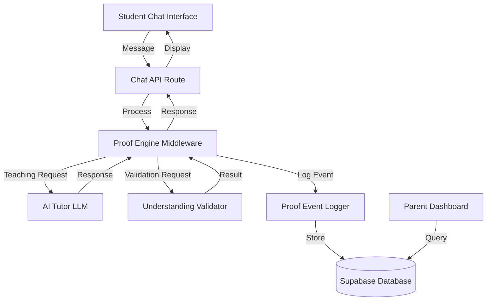

# Design Document: Proof Engine

## Overview

The Proof Engine is an AI-powered middleware layer that sits between the student's chat interface and the AI tutor, monitoring conversation flow and injecting understanding checks at adaptive intervals. The system validates student explanations using a multi-stage AI analysis pipeline, makes adaptive decisions about learning progression, and logs proof events for parent visibility and analytics.

The design prioritizes three core principles:
1. **Non-disruptive integration**: Checkpoints feel natural within the tutoring conversation
2. **Rigorous validation**: Understanding is assessed through genuine comprehension, not keyword matching
3. **Adaptive support**: Checkpoint frequency and feedback adapt to student performance

## Architecture

### High-Level Components



### Component Responsibilities

**Proof Engine Middleware**
- Tracks teaching exchange count per conversation
- Determines when to trigger checkpoints based on adaptive frequency rules
- Generates explain-back prompts using AI with conversation context
- Coordinates validation and adaptive response logic
- Manages conversation state (checkpoint mode vs teaching mode)

**Understanding Validator**
- Analyzes student proof attempts using multi-stage AI pipeline
- Detects insufficient responses (parroting, keyword stuffing, vague acknowledgments)
- Assesses comprehension depth appropriate to grade level
- Returns classification: pass, partial, or retry

**Proof Event Logger**
- Creates structured proof event records
- Persists events to database with full context
- Associates events with chat sessions and student profiles
- Provides query interface for parent dashboard

**Adaptive Response Generator**
- Generates appropriate tutor responses based on validation results
- Creates reteaching content using different pedagogical approaches
- Provides targeted hints for partial understanding
- Celebrates achievements and provides encouragement

## Components and Interfaces

### 1. Proof Engine Middleware

**Location**: `src/lib/proof-engine/middleware.ts`

**State Management**:
```typescript
interface ConversationState {
  chatId: string;
  studentId: string;
  gradeLevel: number;
  teachingExchangeCount: number;
  nextCheckpointTarget: number;
  lastThreeValidationResults: ValidationResult[];
  currentCheckpointConcept: string | null;
  isInCheckpointMode: boolean;
  conceptsProvenThisSession: string[];
}
```

**Teaching Exchange Classification**:
```typescript
// Determines if an assistant message counts as a teaching exchange
function isTeachingExchange(message: AssistantMessage): boolean {
  // Only count messages that advance understanding:
  // - Introduce or explain concepts
  // - Provide worked examples
  // - Give structured hints that advance learning
  
  // Do NOT count:
  // - Checkpoint prompts (isProofCheckpoint metadata)
  // - Validation feedback
  // - Celebration/encouragement only
  // - Logistics ("let's move on")
  
  if (message.metadata?.isProofCheckpoint) return false;
  if (message.metadata?.isValidationFeedback) return false;
  if (message.metadata?.isCelebration) return false;
  
  // Use AI to classify if message teaches content
  return classifyAsTeaching(message.content);
}

async function classifyAsTeaching(content: string): Promise<boolean> {
  const prompt = `
Does this message teach or explain new content?

Message: ${content}

Return true if it:
- Introduces or explains concepts
- Provides worked examples
- Gives structured hints that advance understanding

Return false if it only:
- Celebrates or encourages
- Provides logistics
- Asks checkpoint questions
- Gives validation feedback

Return JSON: { "isTeaching": boolean }
`;
  
  const result = await callAI(prompt);
  return JSON.parse(result).isTeaching;
}
```

**Core Methods**:
```typescript
class ProofEngineMiddleware {
  // Main entry point for processing messages
  async processMessage(
    message: string,
    conversationState: ConversationState
  ): Promise<ProcessedResponse>
  
  // Determine if checkpoint should trigger
  shouldTriggerCheckpoint(state: ConversationState): boolean
  
  // Calculate adaptive frequency based on performance
  getCheckpointFrequency(
    validationHistory: ValidationResult[]
  ): { min: number; max: number }
  
  // Generate explain-back prompt
  async generateExplainBackPrompt(
    recentExchanges: Message[],
    gradeLevel: number
  ): Promise<string>
  
  // Route to appropriate handler
  async handleTeachingMode(
    message: string,
    state: ConversationState
  ): Promise<ProcessedResponse>
  
  async handleCheckpointMode(
    message: string,
    state: ConversationState
  ): Promise<ProcessedResponse>
}
```

**Checkpoint Triggering Logic**:
```typescript
function shouldTriggerCheckpoint(state: ConversationState): boolean {
  // Don't trigger in introductory phase
  if (state.teachingExchangeCount < 2) return false;
  
  // Don't trigger if already in checkpoint mode
  if (state.isInCheckpointMode) return false;
  
  // Trigger when count reaches target
  return state.teachingExchangeCount >= state.nextCheckpointTarget;
}

function calculateNextCheckpointTarget(
  validationHistory: ValidationResult[]
): number {
  // Check last 2 attempts
  const recentAttempts = validationHistory.slice(-2);
  
  // Confident students: more frequent checkpoints (2-3 exchanges)
  if (recentAttempts.every(r => r.classification === 'pass')) {
    return randomInt(2, 3);
  }
  
  // Struggling students: less frequent checkpoints (4-5 exchanges)
  if (recentAttempts.some(r => r.classification === 'retry')) {
    return randomInt(4, 5);
  }
  
  // Default: mixed performance (3-4 exchanges)
  return randomInt(3, 4);
}

// Called after checkpoint completes or validation result changes
function updateCheckpointTarget(state: ConversationState): void {
  state.nextCheckpointTarget = calculateNextCheckpointTarget(
    state.lastThreeValidationResults
  );
}
```

### 2. Understanding Validator

**Location**: `src/lib/proof-engine/validator.ts`

**Validation Pipeline**:
```typescript
interface ValidationRequest {
  studentResponse: string;
  teachingContext: Message[];
  explainBackPrompt: string;
  gradeLevel: number;
}

interface ValidationResult {
  classification: 'pass' | 'partial' | 'retry';
  reasoning: string;
  detectedIssues: string[];
  suggestedGuidance: string | null;
}

class UnderstandingValidator {
  // Main validation entry point
  async validate(request: ValidationRequest): Promise<ValidationResult>
  
  // Stage 1: Detect insufficient responses
  async detectInsufficientResponse(
    response: string,
    teachingContext: Message[]
  ): Promise<InsufficientResponseCheck>
  
  // Stage 2: Assess comprehension depth
  async assessComprehension(
    response: string,
    teachingContext: Message[],
    gradeLevel: number
  ): Promise<ComprehensionAssessment>
  
  // Stage 3: Classify and generate guidance
  classifyAndGuide(
    insufficientCheck: InsufficientResponseCheck,
    comprehension: ComprehensionAssessment
  ): ValidationResult
}
```

**Insufficient Response Detection**:
```typescript
interface InsufficientResponseCheck {
  isParroting: boolean;
  isKeywordStuffing: boolean;
  isVagueAcknowledgment: boolean;
  textSimilarityScore: number;
}

async function detectInsufficientResponse(
  response: string,
  teachingContext: Message[]
): Promise<InsufficientResponseCheck> {
  // Use AI to analyze response quality
  const prompt = `
Analyze this student response for insufficient explanation:

Teaching Context:
${teachingContext.map(m => m.content).join('\n')}

Student Response:
${response}

Detect:
1. Parroting: Does the response closely match teaching text?
2. Keyword Stuffing: Are keywords listed without coherent explanation?
3. Vague Acknowledgment: Is it just "I understand" without substance?

Return JSON with boolean flags and text similarity score (0-1).
`;

  const result = await callAI(prompt);
  return JSON.parse(result);
}
```

**Comprehension Assessment**:
```typescript
interface ComprehensionAssessment {
  keyConceptsPresent: string[];
  keyConceptsMissing: string[];
  relationshipsCorrect: boolean;
  criticalMisconceptions: string[];
  depthAppropriate: boolean;
}

async function assessComprehension(
  response: string,
  teachingContext: Message[],
  gradeLevel: number
): Promise<ComprehensionAssessment> {
  const depthExpectation = gradeLevel <= 8 
    ? "basic concept connections and simple explanations"
    : "deeper analysis with sophisticated reasoning";
  
  const prompt = `
Assess student understanding:

Teaching Context:
${teachingContext.map(m => m.content).join('\n')}

Student Explanation:
${response}

Grade Level: ${gradeLevel}
Expected Depth: ${depthExpectation}

Evaluate:
1. Which key concepts are present in the explanation?
2. Which key concepts are missing?
3. Are relationships between concepts correct?
4. Are there critical misconceptions (fundamentally wrong understanding)?
5. Is the depth appropriate for grade level?

Return JSON with assessment.
`;

  const result = await callAI(prompt);
  return JSON.parse(result);
}
```

**Classification Logic**:
```typescript
function classifyAndGuide(
  insufficientCheck: InsufficientResponseCheck,
  comprehension: ComprehensionAssessment
): ValidationResult {
  const detectedIssues: string[] = [];
  
  // Check for insufficient response patterns
  if (insufficientCheck.isParroting) {
    detectedIssues.push('response_too_similar_to_teaching');
  }
  if (insufficientCheck.isKeywordStuffing) {
    detectedIssues.push('keywords_without_explanation');
  }
  if (insufficientCheck.isVagueAcknowledgment) {
    detectedIssues.push('vague_acknowledgment');
  }
  
  // Classify based on issues and comprehension
  if (detectedIssues.length > 0) {
    return {
      classification: 'retry',
      reasoning: 'Insufficient explanation detected',
      detectedIssues,
      suggestedGuidance: 'I need to hear this in your words so I know how to help you.'
    };
  }
  
  // Check for critical misconceptions (unsafe to hint forward)
  if (comprehension.criticalMisconceptions.length > 0) {
    return {
      classification: 'retry',
      reasoning: 'Critical misconceptions detected',
      detectedIssues: comprehension.criticalMisconceptions.map(m => `misconception:${m}`),
      suggestedGuidance: 'Let me clarify this concept - there\'s a common misunderstanding here.'
    };
  }
  
  // Check comprehension depth
  const missingCriticalConcepts = comprehension.keyConceptsMissing.length > 0;
  const incorrectRelationships = !comprehension.relationshipsCorrect;
  const insufficientDepth = !comprehension.depthAppropriate;
  
  if (missingCriticalConcepts || incorrectRelationships) {
    return {
      classification: 'partial',
      reasoning: 'Some understanding but gaps remain',
      detectedIssues: [
        ...comprehension.keyConceptsMissing.map(c => `missing_concept:${c}`),
        ...(incorrectRelationships ? ['incorrect_relationships'] : [])
      ],
      suggestedGuidance: `You're on the right track! Let's clarify: ${comprehension.keyConceptsMissing.join(', ')}`
    };
  }
  
  if (insufficientDepth) {
    return {
      classification: 'partial',
      reasoning: 'Understanding present but needs more depth',
      detectedIssues: ['insufficient_depth'],
      suggestedGuidance: 'Can you explain more about how these concepts connect?'
    };
  }
  
  // Pass: all checks passed
  return {
    classification: 'pass',
    reasoning: 'Demonstrates genuine understanding',
    detectedIssues: [],
    suggestedGuidance: null
  };
}
```

### 3. Adaptive Response Generator

**Location**: `src/lib/proof-engine/adaptive-response.ts`

**Response Generation**:
```typescript
interface AdaptiveResponseRequest {
  validationResult: ValidationResult;
  conversationState: ConversationState;
  teachingContext: Message[];
}

class AdaptiveResponseGenerator {
  async generateResponse(
    request: AdaptiveResponseRequest
  ): Promise<string>
  
  async generatePassResponse(
    state: ConversationState
  ): Promise<string>
  
  async generatePartialResponse(
    validationResult: ValidationResult,
    teachingContext: Message[]
  ): Promise<string>
  
  async generateRetryResponse(
    validationResult: ValidationResult,
    teachingContext: Message[],
    gradeLevel: number
  ): Promise<string>
}
```

**Pass Response**:
```typescript
async function generatePassResponse(
  state: ConversationState
): Promise<string> {
  const conceptCount = state.conceptsProvenThisSession.length;
  
  const prompt = `
Generate a celebratory response for a student who successfully explained a concept.

Context:
- Concepts proven this session: ${conceptCount}
- Current concept: ${state.currentCheckpointConcept}

Requirements:
- Celebrate the achievement warmly
- Mention progress: "You've proven ${conceptCount} concepts today"
- Indicate readiness to move forward
- Keep tone encouraging but not over-the-top

Generate the response:
`;

  return await callAI(prompt);
}
```

**Retry Response (Reteaching)**:
```typescript
async function generateRetryResponse(
  validationResult: ValidationResult,
  teachingContext: Message[],
  gradeLevel: number
): Promise<string> {
  const prompt = `
Generate a reteaching response for a student who needs another attempt.

Previous Teaching:
${teachingContext.map(m => m.content).join('\n')}

Issues Detected:
${validationResult.detectedIssues.join(', ')}

Suggested Guidance:
${validationResult.suggestedGuidance}

Grade Level: ${gradeLevel}

Requirements:
- Use supportive, encouraging tone
- Reteach using DIFFERENT approach than original (new examples, analogies)
- Include the guidance: "${validationResult.suggestedGuidance}"
- End with a new explain-back prompt
- Keep it concise

Generate the reteaching response:
`;

  return await callAI(prompt);
}
```

### 4. Proof Event Logger

**Location**: `src/lib/proof-engine/logger.ts`

**Database Schema**:
```sql
CREATE TABLE proof_events (
  id UUID PRIMARY KEY DEFAULT uuid_generate_v4(),
  chat_id UUID NOT NULL REFERENCES chats(id),
  student_id UUID NOT NULL REFERENCES users(id),
  concept TEXT NOT NULL,
  prompt TEXT NOT NULL,
  student_response TEXT NOT NULL,
  student_response_excerpt TEXT NOT NULL,
  response_hash TEXT NOT NULL,
  validation_result JSONB NOT NULL,
  classification TEXT NOT NULL CHECK (classification IN ('pass', 'partial', 'retry')),
  created_at TIMESTAMP WITH TIME ZONE DEFAULT NOW()
);

CREATE INDEX idx_proof_events_student ON proof_events(student_id, created_at DESC);
CREATE INDEX idx_proof_events_chat ON proof_events(chat_id);
CREATE INDEX idx_proof_events_classification ON proof_events(classification);
CREATE INDEX idx_proof_events_hash ON proof_events(response_hash);

COMMENT ON COLUMN proof_events.student_response IS 'Full response stored for analysis, never shown to parents by default';
COMMENT ON COLUMN proof_events.student_response_excerpt IS 'First 200 chars, sanitized, safe for parent display';
COMMENT ON COLUMN proof_events.response_hash IS 'SHA-256 hash for deduplication and idempotency';
```

**Privacy Boundary**:
- `student_response`: Full text stored for system analysis and debugging
- `student_response_excerpt`: Sanitized first 200 characters, safe for parent dashboard
- Parent dashboard NEVER shows full `student_response` by default
- Future feature: Optional parent toggle to view full responses (with clear privacy notice)

**Logger Interface**:
```typescript
interface ProofEvent {
  chatId: string;
  studentId: string;
  concept: string;
  prompt: string;
  studentResponse: string;
  validationResult: ValidationResult;
  classification: 'pass' | 'partial' | 'retry';
  createdAt: Date;
}

class ProofEventLogger {
  async logEvent(event: ProofEvent): Promise<void>
  
  async getStudentProofHistory(
    studentId: string,
    limit?: number
  ): Promise<ProofEvent[]>
  
  async getChatProofEvents(
    chatId: string
  ): Promise<ProofEvent[]>
  
  async getProofStats(
    studentId: string,
    timeRange?: { start: Date; end: Date }
  ): Promise<ProofStats>
}

interface ProofStats {
  totalAttempts: number;
  passCount: number;
  partialCount: number;
  retryCount: number;
  passRate: number;
  conceptsProven: string[];
}
```

## Data Models

### Conversation State

Stored in memory during active chat session, persisted to chat metadata on session end:

```typescript
interface ConversationState {
  chatId: string;
  studentId: string;
  gradeLevel: number;
  teachingExchangeCount: number;
  nextCheckpointTarget: number;
  lastThreeValidationResults: ValidationResult[];
  currentCheckpointConcept: string | null;
  isInCheckpointMode: boolean;
  conceptsProvenThisSession: string[];
  sessionStartTime: Date;
}
```

### Message Metadata

Extended message schema to track proof-related information:

```typescript
interface Message {
  id: string;
  chatId: string;
  role: 'user' | 'assistant';
  content: string;
  createdAt: Date;
  metadata: {
    isTeachingExchange?: boolean;
    isProofCheckpoint?: boolean;
    isProofAttempt?: boolean;
    isValidationFeedback?: boolean;
    isCelebration?: boolean;
    proofEventId?: string;
    conceptTaught?: string;
  };
}
```

### Proof Event

Complete record of a proof attempt:

```typescript
interface ProofEvent {
  id: string;
  chatId: string;
  studentId: string;
  concept: string;
  prompt: string;
  studentResponse: string;
  validationResult: {
    classification: 'pass' | 'partial' | 'retry';
    reasoning: string;
    detectedIssues: string[];
    suggestedGuidance: string | null;
  };
  classification: 'pass' | 'partial' | 'retry';
  createdAt: Date;
}
```

## Correctness Properties

*A property is a characteristic or behavior that should hold true across all valid executions of a system—essentially, a formal statement about what the system should do. Properties serve as the bridge between human-readable specifications and machine-verifiable correctness guarantees.*


### Property 1: Teaching Exchange Counter State Machine

*For any* sequence of teaching exchanges and checkpoint triggers, the counter should increment on each teaching exchange, reset to zero when a checkpoint triggers, and remain unchanged during reteaching after failed attempts.

**Validates: Requirements 1.1, 1.5, 1.6**

### Property 2: Adaptive Checkpoint Frequency

*For any* validation history, the checkpoint frequency should adapt correctly: 2-3 exchanges after two consecutive passes, 4-5 exchanges after a recent retry, and 3-4 exchanges for mixed performance.

**Validates: Requirements 1.2, 1.3, 1.4**

### Property 3: Explain-Back Prompt Quality

*For any* teaching context and grade level, generated explain-back prompts should be open-ended questions (not yes/no), reference specific concepts from the last 3-4 exchanges, and explicitly request explanation in the student's own words.

**Validates: Requirements 2.1, 2.2, 2.4, 2.5**

### Property 4: Validation Classification Completeness

*For any* proof attempt, the Understanding_Validator should return exactly one classification from the set {pass, partial, retry} and include analysis of key concepts, concept relationships, and parroting detection.

**Validates: Requirements 3.1, 3.2, 3.3, 3.5**

### Property 5: Adaptive Response Routing

*For any* validation result, the Proof_Engine should route to the correct adaptive response: pass results trigger advancement and celebration, retry results trigger reteaching with encouragement, and partial results trigger targeted hints.

**Validates: Requirements 4.1, 4.2, 4.3, 10.2, 10.3**

### Property 6: Pass Event Logging

*For any* proof attempt classified as pass, a proof event should be logged to the database with the achievement recorded for parent visibility.

**Validates: Requirements 4.5**

### Property 7: Proof Event Persistence Completeness

*For any* proof attempt (pass, partial, or retry), a complete proof event record should be immediately persisted to the database with all required fields (concept, attempt text, validation result, timestamp, chat association) and be queryable by parent dashboard.

**Validates: Requirements 5.1, 5.2, 5.3, 5.4, 5.5**

### Property 8: Insufficient Response Detection

*For any* student response that exhibits parroting (high text similarity to teaching content), keyword stuffing (keywords without coherent explanation), or vague acknowledgment ("I understand" without substance), the Understanding_Validator should detect the issue and classify the attempt as retry with instructional guidance.

**Validates: Requirements 6.1, 6.2, 6.3, 6.4**

### Property 9: Grade Level Retrieval

*For any* validation request, the Proof_Engine should retrieve the student's grade level from the user profile before performing validation.

**Validates: Requirements 7.4**

### Property 10: Milestone Notification Trigger

*For any* student who reaches a proof milestone threshold (e.g., 5 concepts proven), the system should trigger a parent notification.

**Validates: Requirements 8.3**

### Property 11: Proof Event Display Formatting

*For any* list of proof events displayed in the parent dashboard, all required fields (concept name, date, validation result) should be shown, different classifications (pass/partial/retry) should be visually distinguished, and events should be ordered by timestamp in descending order.

**Validates: Requirements 8.2, 8.4, 8.5**

### Property 12: Learning Receipt Content Completeness

*For any* tutoring session, the generated learning receipt should include a section listing all concepts proven during the session with timestamps and validation results, plus summary statistics (total attempts and pass rate).

**Validates: Requirements 9.1, 9.2, 9.4**

### Property 13: Checkpoint Timing Boundary Respect

*For any* teaching sequence, proof checkpoints should only trigger at concept boundaries (after teaching points are complete), never interrupting mid-concept explanations.

**Validates: Requirements 10.4, 10.5**

### Property 14: Session Progress Display

*For any* student who passes a proof checkpoint, the response should display the number of concepts proven in the current session.

**Validates: Requirements 11.1**

### Property 15: Topic Completion Acknowledgment

*For any* student who completes a topic (proves understanding of all concepts in the topic), the Proof_Engine should acknowledge that the topic is now solid for them.

**Validates: Requirements 11.2**

## Error Handling

### Validation Timeout

**Scenario**: Understanding_Validator exceeds 3-second timeout

**Handling**:
- Log timeout error with full context
- Return default classification: 'partial' with guidance "Let me think about that differently..."
- Continue conversation flow (don't block student)
- Alert monitoring system for investigation
- Next checkpoint proceeds normally

**Note**: Background retry is NOT implemented in MVP. If background job infrastructure is added later, implement with:
- Job queue mechanism (e.g., Supabase Edge Function, server worker)
- Idempotency key using response_hash
- Storage of pending job status

### AI Service Failure

**Scenario**: OpenAI API returns error or is unavailable

**Handling**:
- Catch API errors gracefully
- Return fallback response: "I'm having trouble processing that right now. Let's continue with the lesson."
- Log error with request context
- Skip checkpoint for this cycle (don't penalize student)
- Retry on next checkpoint opportunity

### Database Write Failure

**Scenario**: Proof event cannot be persisted to database

**Handling**:
- Log error with full event data
- Queue event for retry (in-memory buffer with 5-minute TTL)
- Continue conversation flow (don't block student)
- Alert monitoring system if retry fails
- Ensure parent dashboard shows "data syncing" indicator

### Invalid Grade Level

**Scenario**: Student profile missing or has invalid grade level

**Handling**:
- Default to grade 8 (middle school) for validation depth
- Log warning with student ID
- Prompt parent to complete profile on next dashboard visit
- Continue with default validation rules

### Malformed Validation Response

**Scenario**: AI returns unparseable JSON or missing required fields

**Handling**:
- Log malformed response for debugging
- Apply heuristic fallback:
  - Check text similarity score manually
  - Count concept keywords
  - Default to 'partial' classification if uncertain
- Continue conversation with fallback guidance

### Concurrent Checkpoint Trigger

**Scenario**: Race condition causes multiple checkpoints to trigger simultaneously

**Handling**:
- Use conversation state locking (optimistic concurrency)
- First checkpoint wins, subsequent triggers ignored
- Reset counter only once
- Log race condition for monitoring

## Testing Strategy

The Proof Engine requires comprehensive testing across two complementary approaches:

### Property-Based Testing

Property-based tests validate universal correctness properties across randomized inputs. Each property test should:
- Run minimum 100 iterations with randomized inputs
- Reference the design document property number
- Use tag format: **Feature: proof-engine, Property {N}: {property_text}**

**Property Test Coverage**:
- **Property 1**: Generate random sequences of teaching exchanges, checkpoints, and failed attempts; verify counter state transitions
- **Property 2**: Generate random validation histories; verify frequency calculations match expected ranges
- **Property 3**: Generate random teaching contexts; verify prompt structure and content requirements
- **Property 4**: Generate random proof attempts; verify classification is always in valid set and includes required analysis
- **Property 5**: Generate random validation results; verify routing to correct response type
- **Property 6**: Generate random pass events; verify database records created
- **Property 7**: Generate random proof attempts of all types; verify complete persistence
- **Property 8**: Generate responses with known insufficient patterns; verify detection
- **Property 9**: Generate random validation requests; verify grade level retrieval
- **Property 10**: Generate random proof sequences; verify milestone detection at thresholds
- **Property 11**: Generate random proof event lists; verify display formatting
- **Property 12**: Generate random sessions; verify receipt completeness
- **Property 13**: Generate random teaching sequences; verify checkpoint timing
- **Property 14**: Generate random pass events; verify progress display
- **Property 15**: Generate random topic completions; verify acknowledgment

**Recommended Library**: fast-check (TypeScript/JavaScript property-based testing)

### Unit Testing

Unit tests validate specific examples, edge cases, and integration points:

**Edge Cases**:
- Introductory phase (< 2 exchanges): verify no checkpoints trigger
- Empty session: verify learning receipt indicates no concepts proven
- First proof attempt: verify proper initialization of validation history
- Maximum validation history: verify only last 3 results are considered

**Integration Tests**:
- End-to-end checkpoint flow: teaching → checkpoint trigger → prompt generation → validation → adaptive response → logging
- Parent dashboard query: create proof events → query by student ID → verify correct data returned
- Learning receipt generation: complete session with mixed results → generate receipt → verify all sections present
- Grade level adaptation: same response with different grade levels → verify different validation outcomes

**Error Condition Tests**:
- Validation timeout: mock slow AI response → verify fallback behavior
- Database failure: mock DB error → verify retry queue and error handling
- Invalid grade level: missing profile data → verify default behavior
- Malformed AI response: invalid JSON → verify heuristic fallback

**Mock Strategy**:
- Mock OpenAI API calls for deterministic testing
- Mock database layer for isolation
- Use test fixtures for conversation states and validation results
- Seed random generators for reproducible property tests

### Test Organization

```
tests/
├── unit/
│   ├── proof-engine-middleware.test.ts
│   ├── understanding-validator.test.ts
│   ├── adaptive-response.test.ts
│   └── proof-event-logger.test.ts
├── integration/
│   ├── checkpoint-flow.test.ts
│   ├── parent-dashboard.test.ts
│   └── learning-receipt.test.ts
├── properties/
│   ├── counter-state-machine.property.test.ts
│   ├── adaptive-frequency.property.test.ts
│   ├── prompt-quality.property.test.ts
│   ├── validation-completeness.property.test.ts
│   ├── adaptive-routing.property.test.ts
│   ├── event-persistence.property.test.ts
│   ├── insufficient-detection.property.test.ts
│   └── display-formatting.property.test.ts
└── fixtures/
    ├── conversation-states.ts
    ├── validation-results.ts
    └── teaching-contexts.ts
```

### Performance Testing

- Validate that Understanding_Validator completes within 3-second SLA
- Test with varying response lengths (50-500 words)
- Measure database write latency for proof events
- Test concurrent checkpoint handling under load

### Acceptance Testing

- Manual testing with real student responses across grade levels
- Validate that adaptive frequency feels natural (not too frequent/infrequent)
- Verify parent dashboard displays proof events clearly
- Confirm learning receipts provide meaningful summaries
- Test that insufficient response feedback is supportive, not accusatory
