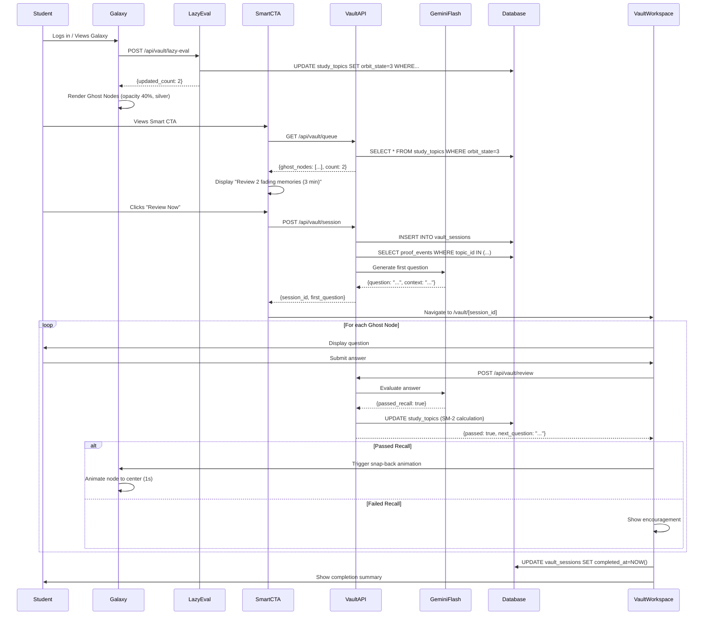

# The Vault Spaced-Repetition Engine: Technical Design

## Overview

The Vault is a spaced-repetition memory retention system that prevents knowledge decay for mastered topics using the SuperMemo-2 (SM-2) algorithm. It automatically detects when students are about to forget material, visually represents fading memories as "Ghost Nodes" in the ConceptGalaxy, and uses AI-powered active recall testing to reinforce memory.

The system addresses four critical architectural challenges:

1. **Lazy Evaluation Mechanism**: Serverless-friendly decay detection without expensive CRON jobs
2. **SM-2 Math Utility**: Pure function implementing SuperMemo-2 interval calculations
3. **Gemini 1.5 Flash Interrogator**: Lightning-fast active recall testing with structured output
4. **Ghost Node Physics**: Visual manipulation of react-force-graph-2d for snap-back animations

### Key Design Principles

- **Serverless-First**: No background jobs or CRON dependencies
- **Cost-Optimized**: Gemini 1.5 Flash for sub-2-second responses
- **User-Triggered**: All decay evaluation happens on user interaction
- **Mathematically Guaranteed**: SM-2 algorithm ensures optimal review intervals
- **Visually Motivating**: Physics-based animations reinforce learning success

## Architecture

### System Components

```mermaid
graph TB
    subgraph "User Interface"
        Galaxy[ConceptGalaxy UI]
        SmartCTA[Smart CTA]
        VaultWorkspace[Vault Workspace]
    end
    
    subgraph "API Layer"
        LazyEval[/api/vault/lazy-eval]
        QueueAPI[/api/vault/queue]
        SessionAPI[/api/vault/session]
        ReviewAPI[/api/vault/review]
    end
    
    subgraph "Business Logic"
        DecayDetector[Decay Detector]
        SM2Calculator[SM-2 Calculator]
        FlashInterrogator[Flash Interrogator]
        PhysicsController[Physics Controller]
    end
    
    subgraph "Data Layer"
        StudyTopics[(study_topics)]
        VaultSessions[(vault_sessions)]
        ProofEvents[(proof_events)]
    end
    
    subgraph "External Services"
        GeminiFlash[Gemini 1.5 Flash]
    end
    
    Galaxy -->|User Login| LazyEval
    SmartCTA -->|Fetch Queue| QueueAPI
    SmartCTA -->|Start Session| SessionAPI
    VaultWorkspace -->|Submit Answer| ReviewAPI
    
    LazyEval --> DecayDetector
    QueueAPI --> DecayDetector
    SessionAPI --> FlashInterrogator
    ReviewAPI --> SM2Calculator
    ReviewAPI --> PhysicsController
    
    DecayDetector --> StudyTopics
    SM2Calculator --> StudyTopics
    FlashInterrogator --> ProofEvents
    FlashInterrogator --> GeminiFlash
    SessionAPI --> VaultSessions
    ReviewAPI --> VaultSessions
    
    PhysicsController --> Galaxy
```

### Data Flow: Complete Vault Session




## Components and Interfaces

### 1. Lazy Evaluation Mechanism

#### Problem Statement

In serverless Next.js environments, running global CRON jobs to scan millions of rows for expired `next_review_date` values is:
- Expensive (cold starts, database scans)
- Doesn't scale (O(n) complexity on all users)
- Violates serverless principles (no persistent background processes)

#### Solution: User-Triggered Lazy Evaluation

Instead of proactive scanning, we evaluate decay **only when the user interacts with the system**. This happens in two scenarios:

1. **User Login / Galaxy View**: Run a single fast SQL UPDATE for that user's topics
2. **SmartCTA Fetch**: Piggyback on existing queue query

#### SQL Query Design

```sql
-- Lazy Evaluation Query
-- Executed on user login or SmartCTA fetch
-- Finds expired orbit_state=2 nodes and downgrades to orbit_state=3

UPDATE study_topics
SET 
  orbit_state = 3,
  updated_at = NOW()
WHERE 
  profile_id = $1  -- User-specific (RLS enforced)
  AND orbit_state = 2  -- Only mastered topics
  AND next_review_date <= NOW()  -- Review date has passed
RETURNING id, title;
```

**Performance Characteristics**:
- **Index Used**: `idx_study_topics_review_date` (on `next_review_date`)
- **Complexity**: O(log n) for index lookup + O(k) for k expired topics
- **Typical Execution**: <50ms for users with <100 topics
- **RLS Enforcement**: `profile_id` filter ensures user isolation

#### API Endpoint: `/api/vault/lazy-eval`

**Method**: POST

**Request Body**:
```typescript
{
  profileId: string; // UUID of student profile
}
```

**Response**:
```typescript
{
  updatedCount: number;
  ghostNodes: Array<{
    id: string;
    title: string;
  }>;
}
```

**Implementation**:
```typescript
// src/app/api/vault/lazy-eval/route.ts
export async function POST(request: Request) {
  const { profileId } = await request.json();
  
  const { data, error } = await supabase
    .from('study_topics')
    .update({ orbit_state: 3, updated_at: new Date().toISOString() })
    .eq('profile_id', profileId)
    .eq('orbit_state', 2)
    .lte('next_review_date', new Date().toISOString())
    .select('id, title');
  
  if (error) throw error;
  
  return Response.json({
    updatedCount: data.length,
    ghostNodes: data,
  });
}
```

#### Integration Points

**ConceptGalaxy Component**:
```typescript
// src/components/galaxy/ConceptGalaxy.tsx
useEffect(() => {
  async function evaluateDecay() {
    const response = await fetch('/api/vault/lazy-eval', {
      method: 'POST',
      body: JSON.stringify({ profileId: currentProfileId }),
    });
    
    const { updatedCount } = await response.json();
    
    if (updatedCount > 0) {
      // Refresh topics to show new Ghost Nodes
      await refetchTopics();
    }
  }
  
  evaluateDecay();
}, [currentProfileId]);
```

**SmartCTA Component**:
```typescript
// src/components/galaxy/SmartCTA.tsx
async function fetchVaultQueue() {
  // Lazy eval happens first
  await fetch('/api/vault/lazy-eval', {
    method: 'POST',
    body: JSON.stringify({ profileId }),
  });
  
  // Then fetch queue
  const response = await fetch('/api/vault/queue');
  const { ghostNodes } = await response.json();
  
  return ghostNodes;
}
```

#### State Transition Logic

```
orbit_state = 2 (Mastered)
  ↓
  [next_review_date <= NOW()]
  ↓
orbit_state = 3 (Ghost Node / Decaying)
  ↓
  [Student passes recall test]
  ↓
orbit_state = 2 (Mastered - restored)
  
  OR
  
  [Student fails recall test]
  ↓
orbit_state = 3 (Ghost Node - remains)
```

### 2. SM-2 Math Utility (Pure Function)

#### SuperMemo-2 Algorithm Overview

The SM-2 algorithm calculates optimal review intervals based on:
- **Current Interval**: Days since last review
- **Ease Factor**: Multiplier representing topic difficulty (1.3 to ∞)
- **Performance**: Binary pass/fail on recall test

#### Mathematical Specification

**Function Signature**:
```typescript
interface SM2Input {
  passed: boolean;
  currentInterval: number; // days
  easeFactor: number; // 1.3 to ∞
  reviewsCompleted: number;
}

interface SM2Output {
  newInterval: number; // days (integer)
  newEaseFactor: number; // 1.3 to ∞
  nextReviewDate: Date;
}

function calculateNextReview(input: SM2Input): SM2Output;
```

#### Pseudocode

```
FUNCTION calculateNextReview(passed, currentInterval, easeFactor, reviewsCompleted):
  
  IF passed = TRUE THEN
    // Success case: Increase interval and ease
    
    IF reviewsCompleted = 0 THEN
      // First review after mastery
      newInterval = 3 days
    ELSE IF reviewsCompleted = 1 THEN
      // Second review
      newInterval = 6 days
    ELSE
      // Subsequent reviews: exponential growth
      newInterval = CEILING(currentInterval * easeFactor)
    END IF
    
    // Increase ease factor (topic is getting easier)
    newEaseFactor = easeFactor + 0.1
    
  ELSE
    // Failure case: Reset interval, decrease ease
    
    newInterval = 1 day  // Review tomorrow
    
    // Decrease ease factor (topic is harder than thought)
    newEaseFactor = easeFactor - 0.2
    
    // Enforce minimum ease factor (prevent negative growth)
    IF newEaseFactor < 1.3 THEN
      newEaseFactor = 1.3
    END IF
    
  END IF
  
  // Calculate next review date
  nextReviewDate = NOW() + newInterval days
  
  RETURN {
    newInterval: newInterval,
    newEaseFactor: newEaseFactor,
    nextReviewDate: nextReviewDate
  }
END FUNCTION
```

#### TypeScript Implementation

```typescript
// src/lib/vault/sm2-calculator.ts

export interface SM2Input {
  passed: boolean;
  currentInterval: number;
  easeFactor: number;
  reviewsCompleted: number;
}

export interface SM2Output {
  newInterval: number;
  newEaseFactor: number;
  nextReviewDate: Date;
}

/**
 * Calculate next review interval using SuperMemo-2 algorithm
 * 
 * This is a pure function with no side effects.
 * All SM-2 logic is centralized here for testability.
 * 
 * @param input - Current SRS state and performance
 * @returns New SRS state with updated interval and ease factor
 */
export function calculateNextReview(input: SM2Input): SM2Output {
  const { passed, currentInterval, easeFactor, reviewsCompleted } = input;
  
  let newInterval: number;
  let newEaseFactor: number;
  
  if (passed) {
    // Success case: Increase interval and ease
    
    if (reviewsCompleted === 0) {
      // First review after mastery: 3 days
      newInterval = 3;
    } else if (reviewsCompleted === 1) {
      // Second review: 6 days
      newInterval = 6;
    } else {
      // Subsequent reviews: exponential growth
      newInterval = Math.ceil(currentInterval * easeFactor);
    }
    
    // Increase ease factor (topic is getting easier)
    newEaseFactor = easeFactor + 0.1;
    
  } else {
    // Failure case: Reset interval, decrease ease
    
    newInterval = 1; // Review tomorrow
    
    // Decrease ease factor (topic is harder than thought)
    newEaseFactor = easeFactor - 0.2;
    
    // Enforce minimum ease factor (prevent negative growth)
    if (newEaseFactor < 1.3) {
      newEaseFactor = 1.3;
    }
  }
  
  // Calculate next review date
  const nextReviewDate = new Date();
  nextReviewDate.setDate(nextReviewDate.getDate() + newInterval);
  
  return {
    newInterval,
    newEaseFactor,
    nextReviewDate,
  };
}

/**
 * Initialize SRS tracking for newly mastered topic
 * 
 * Called when orbit_state transitions from 1 → 2
 * 
 * @returns Initial SRS state
 */
export function initializeSRS(): SM2Output {
  return calculateNextReview({
    passed: true,
    currentInterval: 0,
    easeFactor: 2.5,
    reviewsCompleted: 0,
  });
}
```

#### Edge Cases and Validation

**Edge Case 1: First Review**
```typescript
// Input: reviewsCompleted = 0, passed = true
// Output: newInterval = 3 days (not exponential yet)

const result = calculateNextReview({
  passed: true,
  currentInterval: 0,
  easeFactor: 2.5,
  reviewsCompleted: 0,
});
// result.newInterval === 3
```

**Edge Case 2: Ease Factor Floor**
```typescript
// Input: easeFactor = 1.4, passed = false
// Output: newEaseFactor = 1.3 (floor enforced)

const result = calculateNextReview({
  passed: false,
  currentInterval: 7,
  easeFactor: 1.4,
  reviewsCompleted: 5,
});
// result.newEaseFactor === 1.3 (not 1.2)
```

**Edge Case 3: Very High Ease Factor**
```typescript
// Input: easeFactor = 5.0 (topic is very easy)
// Output: Interval grows rapidly but remains bounded

const result = calculateNextReview({
  passed: true,
  currentInterval: 30,
  easeFactor: 5.0,
  reviewsCompleted: 10,
});
// result.newInterval === 150 days
// result.newEaseFactor === 5.1
```

**Edge Case 4: Repeated Failures**
```typescript
// Input: Multiple failures in a row
// Output: Ease factor bottoms out at 1.3

let state = { easeFactor: 2.5, interval: 7, reviews: 3 };

for (let i = 0; i < 10; i++) {
  const result = calculateNextReview({
    passed: false,
    currentInterval: state.interval,
    easeFactor: state.easeFactor,
    reviewsCompleted: state.reviews,
  });
  state = {
    easeFactor: result.newEaseFactor,
    interval: result.newInterval,
    reviews: state.reviews + 1,
  };
}

// state.easeFactor === 1.3 (floor reached after 6 failures)
// state.interval === 1 (always 1 day on failure)
```

#### Testing Strategy

The SM-2 calculator is a pure function, making it ideal for property-based testing:

```typescript
// Property 1: Ease factor never drops below 1.3
test('ease factor floor is enforced', () => {
  fc.assert(
    fc.property(
      fc.integer({ min: 0, max: 100 }), // reviewsCompleted
      fc.float({ min: 1.3, max: 10.0 }), // easeFactor
      fc.integer({ min: 1, max: 365 }), // currentInterval
      (reviews, ease, interval) => {
        const result = calculateNextReview({
          passed: false,
          currentInterval: interval,
          easeFactor: ease,
          reviewsCompleted: reviews,
        });
        
        return result.newEaseFactor >= 1.3;
      }
    )
  );
});

// Property 2: Passing increases interval (after first 2 reviews)
test('passing increases interval after warmup', () => {
  fc.assert(
    fc.property(
      fc.integer({ min: 2, max: 100 }), // reviewsCompleted >= 2
      fc.float({ min: 1.3, max: 10.0 }), // easeFactor
      fc.integer({ min: 1, max: 365 }), // currentInterval
      (reviews, ease, interval) => {
        const result = calculateNextReview({
          passed: true,
          currentInterval: interval,
          easeFactor: ease,
          reviewsCompleted: reviews,
        });
        
        return result.newInterval > interval;
      }
    )
  );
});

// Property 3: Failing always sets interval to 1
test('failing resets interval to 1 day', () => {
  fc.assert(
    fc.property(
      fc.integer({ min: 0, max: 100 }),
      fc.float({ min: 1.3, max: 10.0 }),
      fc.integer({ min: 1, max: 365 }),
      (reviews, ease, interval) => {
        const result = calculateNextReview({
          passed: false,
          currentInterval: interval,
          easeFactor: ease,
          reviewsCompleted: reviews,
        });
        
        return result.newInterval === 1;
      }
    )
  );
});
```


### 3. Gemini 1.5 Flash "Interrogator" Prompt

#### Problem Statement

In Logic Loom (Phase 4.1), Gemini Ultra acts as a patient Socratic professor, engaging in multi-turn dialogue to guide synthesis. The Vault requires the opposite:

- **Lightning-fast responses** (<2 seconds at 95th percentile)
- **Single-turn interaction** (one question, one answer, immediate evaluation)
- **Structured output** (JSON with `passed_recall` boolean)
- **No conversational drift** (Flash must not engage in follow-up dialogue)

#### Solution: Strict Interrogator Prompt Architecture

The Flash prompt must be **directive, not conversational**. It receives historical context but outputs only a binary evaluation.

#### Prompt Template

```typescript
// src/lib/vault/flash-prompt.ts

export function buildFlashInterrogatorPrompt(
  topicTitle: string,
  proofEvents: Array<{
    concept: string;
    transcript_excerpt: string;
    student_analogy?: string;
    timestamp: string;
  }>
): string {
  const proofContext = proofEvents
    .map(event => {
      const analogy = event.student_analogy 
        ? `\n  Student's Analogy: "${event.student_analogy}"`
        : '';
      return `- ${event.concept}${analogy}\n  Context: "${event.transcript_excerpt}"`;
    })
    .join('\n\n');

  return `You are a memory retention interrogator for The Vault spaced-repetition system.

TOPIC: ${topicTitle}

HISTORICAL LEARNING CONTEXT:
${proofContext}

YOUR TASK:
1. Generate EXACTLY ONE active recall question that tests whether the student still remembers this topic
2. The question MUST reference the student's original learning context (their analogies, examples, or synthesis)
3. The question should be answerable in 1-2 sentences
4. DO NOT engage in conversation, teaching, or follow-up questions

QUESTION DESIGN PRINCIPLES:
- Use the student's own words/analogies from their learning history
- Test conceptual understanding, not rote memorization
- Make it personal to their learning journey
- Keep it concise (one sentence question)

OUTPUT FORMAT:
Return a JSON object with this exact structure:
{
  "question": "Your active recall question here",
  "context_reference": "Brief note about which historical learning event you're referencing"
}

Generate the question now.`;
}
```

#### Evaluation Prompt Template

After the student submits an answer, Flash evaluates it:

```typescript
// src/lib/vault/flash-evaluator.ts

export function buildFlashEvaluatorPrompt(
  question: string,
  studentAnswer: string,
  topicTitle: string,
  proofEvents: Array<{
    concept: string;
    transcript_excerpt: string;
    student_analogy?: string;
  }>
): string {
  const proofContext = proofEvents
    .map(event => {
      const analogy = event.student_analogy 
        ? ` (Student's analogy: "${event.student_analogy}")`
        : '';
      return `- ${event.concept}${analogy}`;
    })
    .join('\n');

  return `You are evaluating a student's memory retention for The Vault spaced-repetition system.

TOPIC: ${topicTitle}

ORIGINAL LEARNING CONTEXT:
${proofContext}

QUESTION ASKED:
"${question}"

STUDENT'S ANSWER:
"${studentAnswer}"

YOUR TASK:
Determine if the student demonstrates sufficient recall of the core concept.

EVALUATION CRITERIA:
- Did they demonstrate understanding of the key concept?
- Did they reference relevant details from their original learning?
- Is their answer coherent and on-topic?
- Minor wording differences are acceptable (test understanding, not exact phrasing)

IMPORTANT:
- Be generous with partial credit (this is memory retention, not perfection)
- If they show they remember the core idea, mark as passed
- Only fail if they clearly don't remember or are completely off-topic

OUTPUT FORMAT:
Return a JSON object with this exact structure:
{
  "passed_recall": true or false,
  "brief_feedback": "One sentence explaining your evaluation"
}

Evaluate now.`;
}
```

#### Zod Schema for Validation

```typescript
// src/lib/vault/flash-schemas.ts

import { z } from 'zod';

export const FlashQuestionSchema = z.object({
  question: z.string().min(10).max(500),
  context_reference: z.string().min(5).max(200),
});

export const FlashEvaluationSchema = z.object({
  passed_recall: z.boolean(),
  brief_feedback: z.string().min(5).max(300),
});

export type FlashQuestion = z.infer<typeof FlashQuestionSchema>;
export type FlashEvaluation = z.infer<typeof FlashEvaluationSchema>;

/**
 * Parse and validate Flash question response
 */
export function parseFlashQuestion(json: unknown): FlashQuestion {
  return FlashQuestionSchema.parse(json);
}

/**
 * Parse and validate Flash evaluation response
 */
export function parseFlashEvaluation(json: unknown): FlashEvaluation {
  return FlashEvaluationSchema.parse(json);
}
```

#### Flash Client Implementation

```typescript
// src/lib/vault/flash-client.ts

import { GoogleGenerativeAI } from '@google/generative-ai';
import { 
  buildFlashInterrogatorPrompt, 
  buildFlashEvaluatorPrompt 
} from './flash-prompt';
import { 
  parseFlashQuestion, 
  parseFlashEvaluation,
  FlashQuestion,
  FlashEvaluation 
} from './flash-schemas';

const genAI = new GoogleGenerativeAI(process.env.GOOGLE_AI_API_KEY!);

interface ProofEvent {
  concept: string;
  transcript_excerpt: string;
  student_analogy?: string;
  timestamp: string;
}

/**
 * Flash Interrogator Client
 * 
 * Lightweight client for Gemini 1.5 Flash active recall testing.
 * No caching, no conversation history - just fast single-turn interactions.
 */
export class FlashInterrogatorClient {
  private model;
  
  constructor() {
    this.model = genAI.getGenerativeModel({
      model: 'gemini-1.5-flash',
      generationConfig: {
        temperature: 0.3, // Low temperature for consistent evaluation
        topP: 0.8,
        topK: 40,
        maxOutputTokens: 512, // Short responses only
        responseMimeType: 'application/json',
      },
    });
  }
  
  /**
   * Generate active recall question
   * 
   * @param topicTitle - Title of the Ghost Node topic
   * @param proofEvents - Historical learning context
   * @returns Question and context reference
   */
  async generateQuestion(
    topicTitle: string,
    proofEvents: ProofEvent[]
  ): Promise<FlashQuestion> {
    const prompt = buildFlashInterrogatorPrompt(topicTitle, proofEvents);
    
    const result = await this.model.generateContent(prompt);
    const text = result.response.text();
    
    let json;
    try {
      json = JSON.parse(text);
    } catch (error) {
      console.error('[FlashClient] JSON parse error:', error);
      throw new Error('AI returned invalid response format');
    }
    
    return parseFlashQuestion(json);
  }
  
  /**
   * Evaluate student's answer
   * 
   * @param question - The question that was asked
   * @param studentAnswer - Student's response
   * @param topicTitle - Title of the topic
   * @param proofEvents - Historical learning context
   * @returns Evaluation with pass/fail and feedback
   */
  async evaluateAnswer(
    question: string,
    studentAnswer: string,
    topicTitle: string,
    proofEvents: ProofEvent[]
  ): Promise<FlashEvaluation> {
    const prompt = buildFlashEvaluatorPrompt(
      question,
      studentAnswer,
      topicTitle,
      proofEvents
    );
    
    const result = await this.model.generateContent(prompt);
    const text = result.response.text();
    
    let json;
    try {
      json = JSON.parse(text);
    } catch (error) {
      console.error('[FlashClient] JSON parse error:', error);
      throw new Error('AI returned invalid response format');
    }
    
    return parseFlashEvaluation(json);
  }
}

/**
 * Create Flash Interrogator Client
 * 
 * Factory function for creating a configured Flash client.
 */
export function createFlashClient(): FlashInterrogatorClient {
  return new FlashInterrogatorClient();
}
```

#### Preventing Conversational Drift

**Problem**: Gemini models are trained to be conversational. Flash might try to:
- Ask follow-up questions
- Provide teaching explanations
- Engage in dialogue

**Solution**: Strict output format enforcement

1. **JSON Schema Validation**: Only accept responses matching exact schema
2. **Prompt Directives**: Explicit "DO NOT" instructions
3. **Temperature Control**: Low temperature (0.3) reduces creativity
4. **Token Limit**: 512 max tokens prevents long responses
5. **Single-Turn Design**: No conversation history passed to model

**Example of Rejected Response**:
```json
{
  "question": "Can you explain how you understood X?",
  "follow_up": "Let me know if you need a hint!",
  "context_reference": "..."
}
```
This would fail Zod validation because `follow_up` is not in the schema.

#### Performance Targets

- **Question Generation**: <1 second at 95th percentile
- **Answer Evaluation**: <2 seconds at 95th percentile
- **Total Round-Trip**: <3 seconds (question + answer + evaluation)
- **Cost**: ~$0.001 per question/evaluation pair (Flash pricing)

#### Example Interaction Flow

```typescript
// 1. Generate question
const flashClient = createFlashClient();

const question = await flashClient.generateQuestion(
  'Mitochondrial Respiration',
  [
    {
      concept: 'Electron Transport Chain',
      transcript_excerpt: 'The ETC is like a waterfall of electrons...',
      student_analogy: 'It\'s like a Rube Goldberg machine for energy',
      timestamp: '2024-01-15T10:30:00Z',
    },
  ]
);

// question.question = "You compared the electron transport chain to a Rube Goldberg machine. How does that analogy explain ATP synthesis?"
// question.context_reference = "Referencing student's Rube Goldberg analogy from Jan 15"

// 2. Student submits answer
const studentAnswer = "The electrons cascade through the chain, and each step releases energy that pumps protons, which then flow back through ATP synthase to make ATP.";

// 3. Evaluate answer
const evaluation = await flashClient.evaluateAnswer(
  question.question,
  studentAnswer,
  'Mitochondrial Respiration',
  [/* same proof events */]
);

// evaluation.passed_recall = true
// evaluation.brief_feedback = "Excellent recall of the energy cascade and proton pumping mechanism"
```


### 4. Ghost Node Physics & Snap-Back Animation

#### Problem Statement

Requirements 3 and 8 demand physical manipulation of the ConceptGalaxy visualization:

- **Ghost Node Drift**: When `orbit_state = 3`, node should drift toward outer rim (low gravity)
- **Snap-Back Animation**: When recall passes, node should animate back to center in 1 second
- **Visual Feedback**: Opacity and color transitions must be smooth and motivating

#### Solution: Physics Parameter Manipulation

The `react-force-graph-2d` library uses D3's force simulation. We can manipulate:
- **Radial Force**: Pulls nodes toward/away from center
- **Charge Force**: Repulsion between nodes
- **Link Distance**: Spacing between connected nodes

#### Physics Configuration

```typescript
// src/components/galaxy/ConceptGalaxy.tsx

interface PhysicsConfig {
  // Radial force: positive = pull to center, negative = push to rim
  radialStrength: number;
  
  // Charge force: negative = repulsion
  chargeStrength: number;
  
  // Link distance: spacing between connected nodes
  linkDistance: number;
}

const PHYSICS_PRESETS: Record<string, PhysicsConfig> = {
  // Normal mastered nodes (orbit_state = 2)
  mastered: {
    radialStrength: 0.5,   // Strong pull to center
    chargeStrength: -100,  // Moderate repulsion
    linkDistance: 80,      // Normal spacing
  },
  
  // Ghost nodes (orbit_state = 3)
  ghost: {
    radialStrength: -0.3,  // Weak push to rim
    chargeStrength: -50,   // Reduced repulsion (allow drift)
    linkDistance: 120,     // Increased spacing (isolation)
  },
  
  // Snap-back animation (temporary state)
  snapBack: {
    radialStrength: 2.0,   // Very strong pull to center
    chargeStrength: -150,  // Strong repulsion (clear path)
    linkDistance: 60,      // Tight spacing (compact)
  },
};
```

#### Implementation Strategy

**Step 1: Extend Node Interface**

```typescript
interface Node {
  id: string;
  name: string;
  masteryScore: number;
  orbitState: number;
  val: number;
  color: string;
  
  // Physics state
  physicsMode: 'mastered' | 'ghost' | 'snapBack';
  
  // Animation state
  isAnimating: boolean;
  animationStartTime?: number;
}
```

**Step 2: Dynamic Physics Forces**

```typescript
// src/components/galaxy/ConceptGalaxy.tsx

useEffect(() => {
  if (!graphRef.current) return;
  
  const graph = graphRef.current;
  
  // Apply custom forces based on node physics mode
  graph.d3Force('radial', d3.forceRadial((node: Node) => {
    const config = PHYSICS_PRESETS[node.physicsMode];
    return config.radialStrength * 100; // Scale for D3
  }));
  
  graph.d3Force('charge', d3.forceManyBody().strength((node: Node) => {
    const config = PHYSICS_PRESETS[node.physicsMode];
    return config.chargeStrength;
  }));
  
  graph.d3Force('link')?.distance((link: any) => {
    const sourceNode = nodes.find(n => n.id === link.source.id);
    const targetNode = nodes.find(n => n.id === link.target.id);
    
    // Use max link distance of the two nodes
    const sourceConfig = PHYSICS_PRESETS[sourceNode?.physicsMode || 'mastered'];
    const targetConfig = PHYSICS_PRESETS[targetNode?.physicsMode || 'mastered'];
    
    return Math.max(sourceConfig.linkDistance, targetConfig.linkDistance);
  });
  
}, [nodes]);
```

**Step 3: Ephemeral State Management**

```typescript
// src/components/galaxy/ConceptGalaxy.tsx

// Track nodes currently in snap-back animation
const [justRescued, setJustRescued] = useState<string[]>([]);

// Transform topics into nodes with physics mode
const nodes: Node[] = topics.map(topic => {
  let physicsMode: 'mastered' | 'ghost' | 'snapBack';
  
  if (justRescued.includes(topic.id)) {
    physicsMode = 'snapBack';
  } else if (topic.orbit_state === 3) {
    physicsMode = 'ghost';
  } else {
    physicsMode = 'mastered';
  }
  
  return {
    id: topic.id,
    name: topic.title,
    masteryScore: topic.mastery_score || 0,
    orbitState: topic.orbit_state || 1,
    val: 10 + (topic.mastery_score || 0) / 10,
    color: getNodeColor(topic.orbit_state, justRescued.includes(topic.id)),
    physicsMode,
    isAnimating: justRescued.includes(topic.id),
  };
});

// Clear snap-back state after 1 second
useEffect(() => {
  if (justRescued.length === 0) return;
  
  const timer = setTimeout(() => {
    setJustRescued([]);
  }, 1000);
  
  return () => clearTimeout(timer);
}, [justRescued]);
```

**Step 4: Trigger Snap-Back from Vault Session**

```typescript
// src/app/vault/[sessionId]/page.tsx

async function handleAnswerSubmit(answer: string) {
  const response = await fetch('/api/vault/review', {
    method: 'POST',
    body: JSON.stringify({
      sessionId,
      topicId: currentTopicId,
      answer,
    }),
  });
  
  const { passed, nextQuestion } = await response.json();
  
  if (passed) {
    // Trigger snap-back animation in Galaxy
    // This is done via global state or event bus
    window.dispatchEvent(new CustomEvent('vault:snap-back', {
      detail: { topicId: currentTopicId },
    }));
  }
  
  // Continue to next question or complete session
  if (nextQuestion) {
    setCurrentQuestion(nextQuestion);
  } else {
    // Session complete
    router.push('/galaxy');
  }
}
```

**Step 5: Listen for Snap-Back Events in Galaxy**

```typescript
// src/components/galaxy/ConceptGalaxy.tsx

useEffect(() => {
  const handleSnapBack = (event: CustomEvent) => {
    const { topicId } = event.detail;
    
    // Add to justRescued array
    setJustRescued(prev => [...prev, topicId]);
    
    // Refresh topics to get updated orbit_state from database
    refetchTopics();
  };
  
  window.addEventListener('vault:snap-back', handleSnapBack as EventListener);
  
  return () => {
    window.removeEventListener('vault:snap-back', handleSnapBack as EventListener);
  };
}, []);
```

#### Visual Transitions

**Ghost Node Appearance** (orbit_state = 3):
```typescript
function getNodeColor(orbitState: number, isSnapBack: boolean): string {
  if (isSnapBack) {
    return '#6366f1'; // Indigo (animating back to mastered)
  }
  
  if (orbitState === 3) {
    return '#94a3b8'; // Silver (slate-400)
  }
  
  if (orbitState === 2) {
    return '#6366f1'; // Indigo (mastered)
  }
  
  return '#64748b'; // Grey (learning)
}

function getNodeOpacity(orbitState: number, isSnapBack: boolean): number {
  if (isSnapBack) {
    // Animate from 40% to 100% over 1 second
    return 1.0;
  }
  
  if (orbitState === 3) {
    return 0.4; // 40% opacity for ghost nodes
  }
  
  return 1.0; // 100% opacity for normal nodes
}
```

**Custom Node Rendering with Transitions**:
```typescript
nodeCanvasObject={(node: any, ctx, globalScale) => {
  const label = node.name;
  const fontSize = 12 / globalScale;
  const nodeSize = node.val;
  const isGhost = node.orbitState === 3;
  const isSnapBack = node.isAnimating;
  
  // Calculate opacity (with animation)
  let opacity = getNodeOpacity(node.orbitState, isSnapBack);
  
  if (isSnapBack) {
    // Animate opacity from 0.4 to 1.0 over 1 second
    const elapsed = Date.now() - (node.animationStartTime || Date.now());
    const progress = Math.min(elapsed / 1000, 1.0);
    opacity = 0.4 + (0.6 * progress);
  }
  
  // Draw glow for mastered or animating nodes
  if (node.orbitState === 2 || isSnapBack) {
    ctx.shadowBlur = isSnapBack ? 40 : 20;
    ctx.shadowColor = node.color;
  } else {
    ctx.shadowBlur = 0;
  }
  
  // Draw circle with opacity
  ctx.globalAlpha = opacity;
  ctx.beginPath();
  ctx.arc(node.x, node.y, nodeSize, 0, 2 * Math.PI);
  ctx.fillStyle = node.color;
  ctx.fill();
  
  // Draw label
  ctx.font = `${fontSize}px Sans-Serif`;
  ctx.textAlign = 'center';
  ctx.textBaseline = 'middle';
  ctx.fillStyle = '#fff';
  ctx.fillText(label, node.x, node.y + nodeSize + fontSize + 2);
  
  // Reset alpha
  ctx.globalAlpha = 1.0;
  ctx.shadowBlur = 0;
}}
```

#### Animation Timeline

```
t=0ms: Student passes recall test
  ↓
  POST /api/vault/review → {passed: true}
  ↓
  UPDATE study_topics SET orbit_state=2
  ↓
  window.dispatchEvent('vault:snap-back')
  ↓
t=50ms: Galaxy receives event
  ↓
  setJustRescued([topicId])
  ↓
  Node physicsMode changes: 'ghost' → 'snapBack'
  ↓
t=100ms: Physics engine applies strong radial force
  ↓
  Node begins moving toward center
  ↓
t=100-1000ms: Smooth animation
  ↓
  - Opacity: 40% → 100%
  - Color: Silver → Indigo
  - Position: Rim → Center
  ↓
t=1000ms: Animation complete
  ↓
  setJustRescued([]) // Clear ephemeral state
  ↓
  Node physicsMode changes: 'snapBack' → 'mastered'
  ↓
  Node settles in center with normal physics
```

#### Performance Considerations

**60fps Target**:
- Canvas rendering must complete in <16ms per frame
- Physics calculations are handled by D3 (optimized)
- Custom rendering code must be minimal

**Optimization Techniques**:
1. **Memoize node colors**: Pre-calculate colors, don't compute in render loop
2. **Batch state updates**: Use single `setJustRescued` call, not multiple
3. **Debounce refetch**: Don't refetch topics on every snap-back event
4. **Use requestAnimationFrame**: For smooth opacity transitions

```typescript
// Optimized opacity animation
useEffect(() => {
  if (justRescued.length === 0) return;
  
  let animationFrame: number;
  const startTime = Date.now();
  
  const animate = () => {
    const elapsed = Date.now() - startTime;
    
    if (elapsed < 1000) {
      // Continue animation
      animationFrame = requestAnimationFrame(animate);
    } else {
      // Animation complete
      setJustRescued([]);
    }
  };
  
  animationFrame = requestAnimationFrame(animate);
  
  return () => {
    if (animationFrame) {
      cancelAnimationFrame(animationFrame);
    }
  };
}, [justRescued]);
```


## Data Models

### Database Schema Changes

#### Migration: Add SRS Columns to `study_topics`

```sql
-- supabase_vault_srs_migration.sql
-- Adds SuperMemo-2 tracking columns to study_topics table

-- ============================================
-- STEP 1: Add SRS columns
-- ============================================

ALTER TABLE study_topics
ADD COLUMN IF NOT EXISTS srs_interval_days INTEGER DEFAULT 0 NOT NULL;

ALTER TABLE study_topics
ADD COLUMN IF NOT EXISTS srs_ease_factor NUMERIC(5, 3) DEFAULT 2.500 NOT NULL;

ALTER TABLE study_topics
ADD COLUMN IF NOT EXISTS next_review_date TIMESTAMPTZ;

ALTER TABLE study_topics
ADD COLUMN IF NOT EXISTS srs_reviews_completed INTEGER DEFAULT 0 NOT NULL;

-- ============================================
-- STEP 2: Add index for lazy evaluation query
-- ============================================

CREATE INDEX IF NOT EXISTS idx_study_topics_review_date 
ON study_topics(next_review_date)
WHERE orbit_state = 2; -- Partial index for mastered topics only

-- ============================================
-- STEP 3: Update orbit_state constraint
-- ============================================

-- Drop old constraint (0-1 range)
ALTER TABLE study_topics 
DROP CONSTRAINT IF EXISTS study_topics_orbit_state_check;

-- Add new constraint (0-3 range)
ALTER TABLE study_topics
ADD CONSTRAINT study_topics_orbit_state_check 
CHECK (orbit_state >= 0 AND orbit_state <= 3);

-- ============================================
-- STEP 4: Add comments for documentation
-- ============================================

COMMENT ON COLUMN study_topics.srs_interval_days IS 
'SuperMemo-2 interval: days until next review (0 = not initialized)';

COMMENT ON COLUMN study_topics.srs_ease_factor IS 
'SuperMemo-2 ease factor: multiplier for interval growth (1.3 to ∞, default 2.5)';

COMMENT ON COLUMN study_topics.next_review_date IS 
'Timestamp when topic requires review (NULL = not in SRS system yet)';

COMMENT ON COLUMN study_topics.srs_reviews_completed IS 
'Count of completed Vault review sessions for this topic';

COMMENT ON COLUMN study_topics.orbit_state IS 
'Visual state: 0=Quarantine, 1=Active, 2=Mastered, 3=Ghost Node (decaying)';

-- ============================================
-- VERIFICATION QUERIES
-- ============================================

-- Check that columns were added
-- SELECT column_name, data_type, column_default 
-- FROM information_schema.columns 
-- WHERE table_name = 'study_topics' 
-- AND column_name IN ('srs_interval_days', 'srs_ease_factor', 'next_review_date', 'srs_reviews_completed');

-- Check that index was created
-- SELECT indexname, indexdef 
-- FROM pg_indexes 
-- WHERE tablename = 'study_topics' 
-- AND indexname = 'idx_study_topics_review_date';
```

#### New Table: `vault_sessions`

```sql
-- supabase_vault_sessions_migration.sql
-- Creates vault_sessions table for tracking review sessions

CREATE TABLE IF NOT EXISTS vault_sessions (
  id UUID PRIMARY KEY DEFAULT gen_random_uuid(),
  user_id UUID NOT NULL REFERENCES auth.users(id) ON DELETE CASCADE,
  profile_id UUID NOT NULL REFERENCES student_profiles(id) ON DELETE CASCADE,
  
  -- Session configuration
  topic_ids UUID[] NOT NULL,
  batch_size INTEGER NOT NULL CHECK (batch_size >= 1 AND batch_size <= 5),
  
  -- Session state
  status TEXT NOT NULL DEFAULT 'IN_PROGRESS',
  current_topic_index INTEGER DEFAULT 0,
  
  -- Results tracking
  topics_passed INTEGER DEFAULT 0,
  topics_failed INTEGER DEFAULT 0,
  
  -- Transcript (for debugging/analytics)
  transcript JSONB DEFAULT '[]'::jsonb,
  
  -- Timestamps
  created_at TIMESTAMPTZ NOT NULL DEFAULT NOW(),
  completed_at TIMESTAMPTZ,
  
  -- Constraints
  CONSTRAINT valid_status CHECK (status IN ('IN_PROGRESS', 'COMPLETED', 'ABANDONED')),
  CONSTRAINT valid_batch_size CHECK (array_length(topic_ids, 1) = batch_size),
  CONSTRAINT completion_requires_timestamp CHECK (
    (status = 'IN_PROGRESS' AND completed_at IS NULL) OR
    (status IN ('COMPLETED', 'ABANDONED') AND completed_at IS NOT NULL)
  )
);

-- Indexes
CREATE INDEX idx_vault_sessions_user_created 
ON vault_sessions(user_id, created_at DESC);

CREATE INDEX idx_vault_sessions_status 
ON vault_sessions(status);

-- Row Level Security
ALTER TABLE vault_sessions ENABLE ROW LEVEL SECURITY;

CREATE POLICY "Users can only access their own vault sessions"
  ON vault_sessions
  FOR ALL
  USING (user_id = auth.uid())
  WITH CHECK (user_id = auth.uid());

-- Comments
COMMENT ON TABLE vault_sessions IS 
'Tracks Vault review sessions with batch processing and results';

COMMENT ON COLUMN vault_sessions.topic_ids IS 
'Array of Ghost Node topic UUIDs to review in this session (max 5)';

COMMENT ON COLUMN vault_sessions.transcript IS 
'JSONB array of {topic_id, question, answer, passed, timestamp} for analytics';
```

### TypeScript Types

```typescript
// src/types/vault.ts

export interface StudyTopicSRS {
  id: string;
  profile_id: string;
  title: string;
  orbit_state: 0 | 1 | 2 | 3;
  mastery_score: number;
  
  // SRS fields
  srs_interval_days: number;
  srs_ease_factor: number;
  next_review_date: string | null; // ISO 8601 timestamp
  srs_reviews_completed: number;
  
  created_at: string;
  updated_at: string;
}

export interface VaultSession {
  id: string;
  user_id: string;
  profile_id: string;
  
  topic_ids: string[];
  batch_size: number;
  
  status: 'IN_PROGRESS' | 'COMPLETED' | 'ABANDONED';
  current_topic_index: number;
  
  topics_passed: number;
  topics_failed: number;
  
  transcript: VaultTranscriptEntry[];
  
  created_at: string;
  completed_at: string | null;
}

export interface VaultTranscriptEntry {
  topic_id: string;
  topic_title: string;
  question: string;
  student_answer: string;
  passed: boolean;
  brief_feedback: string;
  timestamp: string;
}

export interface GhostNode {
  id: string;
  title: string;
  mastery_score: number;
  next_review_date: string;
  days_overdue: number;
}

export interface VaultQueue {
  ghost_nodes: GhostNode[];
  total_count: number;
  estimated_time_minutes: number;
}
```

## API Endpoints

### 1. POST `/api/vault/lazy-eval`

**Purpose**: Evaluate memory decay for current user (lazy evaluation)

**Request**:
```typescript
{
  profileId: string;
}
```

**Response**:
```typescript
{
  updatedCount: number;
  ghostNodes: Array<{
    id: string;
    title: string;
  }>;
}
```

**Implementation**:
```typescript
// src/app/api/vault/lazy-eval/route.ts
import { createClient } from '@/lib/supabase/server';
import { NextResponse } from 'next/server';

export async function POST(request: Request) {
  const supabase = createClient();
  const { profileId } = await request.json();
  
  // Verify user owns this profile
  const { data: profile } = await supabase
    .from('student_profiles')
    .select('owner_id')
    .eq('id', profileId)
    .single();
  
  const { data: { user } } = await supabase.auth.getUser();
  
  if (!user || profile?.owner_id !== user.id) {
    return NextResponse.json({ error: 'Unauthorized' }, { status: 403 });
  }
  
  // Lazy evaluation: downgrade expired mastered topics
  const { data, error } = await supabase
    .from('study_topics')
    .update({ 
      orbit_state: 3,
      updated_at: new Date().toISOString(),
    })
    .eq('profile_id', profileId)
    .eq('orbit_state', 2)
    .lte('next_review_date', new Date().toISOString())
    .select('id, title');
  
  if (error) {
    console.error('[LazyEval] Error:', error);
    return NextResponse.json({ error: 'Failed to evaluate decay' }, { status: 500 });
  }
  
  return NextResponse.json({
    updatedCount: data.length,
    ghostNodes: data,
  });
}
```

### 2. GET `/api/vault/queue`

**Purpose**: Fetch Ghost Nodes for current user (for SmartCTA)

**Query Parameters**: None (uses authenticated user)

**Response**:
```typescript
{
  ghost_nodes: Array<{
    id: string;
    title: string;
    mastery_score: number;
    next_review_date: string;
    days_overdue: number;
  }>;
  total_count: number;
  estimated_time_minutes: number;
}
```

**Implementation**:
```typescript
// src/app/api/vault/queue/route.ts
import { createClient } from '@/lib/supabase/server';
import { NextResponse } from 'next/server';

export async function GET() {
  const supabase = createClient();
  
  const { data: { user } } = await supabase.auth.getUser();
  if (!user) {
    return NextResponse.json({ error: 'Unauthorized' }, { status: 401 });
  }
  
  // Get current profile
  const { data: profile } = await supabase
    .from('student_profiles')
    .select('id')
    .eq('owner_id', user.id)
    .single();
  
  if (!profile) {
    return NextResponse.json({ error: 'Profile not found' }, { status: 404 });
  }
  
  // Fetch Ghost Nodes (orbit_state = 3)
  const { data: ghostNodes, error } = await supabase
    .from('study_topics')
    .select('id, title, mastery_score, next_review_date')
    .eq('profile_id', profile.id)
    .eq('orbit_state', 3)
    .order('next_review_date', { ascending: true }) // Most overdue first
    .limit(5); // Cap at 5 per session
  
  if (error) {
    console.error('[VaultQueue] Error:', error);
    return NextResponse.json({ error: 'Failed to fetch queue' }, { status: 500 });
  }
  
  // Calculate days overdue
  const now = new Date();
  const enrichedNodes = ghostNodes.map(node => {
    const reviewDate = new Date(node.next_review_date);
    const daysOverdue = Math.floor((now.getTime() - reviewDate.getTime()) / (1000 * 60 * 60 * 24));
    
    return {
      ...node,
      days_overdue: daysOverdue,
    };
  });
  
  return NextResponse.json({
    ghost_nodes: enrichedNodes,
    total_count: enrichedNodes.length,
    estimated_time_minutes: 3, // Fixed estimate per requirements
  });
}
```

### 3. POST `/api/vault/session`

**Purpose**: Initialize a new Vault review session

**Request**:
```typescript
{
  topicIds: string[]; // Array of Ghost Node IDs (max 5)
}
```

**Response**:
```typescript
{
  session: {
    id: string;
    topic_ids: string[];
    batch_size: number;
    status: 'IN_PROGRESS';
  };
  first_question: {
    topic_id: string;
    topic_title: string;
    question: string;
    context_reference: string;
  };
}
```

**Implementation**:
```typescript
// src/app/api/vault/session/route.ts
import { createClient } from '@/lib/supabase/server';
import { createFlashClient } from '@/lib/vault/flash-client';
import { NextResponse } from 'next/server';

export async function POST(request: Request) {
  const supabase = createClient();
  const { topicIds } = await request.json();
  
  // Validation
  if (!Array.isArray(topicIds) || topicIds.length === 0 || topicIds.length > 5) {
    return NextResponse.json(
      { error: 'Invalid topic IDs (must be 1-5 topics)' },
      { status: 400 }
    );
  }
  
  const { data: { user } } = await supabase.auth.getUser();
  if (!user) {
    return NextResponse.json({ error: 'Unauthorized' }, { status: 401 });
  }
  
  // Get current profile
  const { data: profile } = await supabase
    .from('student_profiles')
    .select('id')
    .eq('owner_id', user.id)
    .single();
  
  // Create session
  const { data: session, error: sessionError } = await supabase
    .from('vault_sessions')
    .insert({
      user_id: user.id,
      profile_id: profile.id,
      topic_ids: topicIds,
      batch_size: topicIds.length,
      status: 'IN_PROGRESS',
      current_topic_index: 0,
    })
    .select()
    .single();
  
  if (sessionError) {
    console.error('[VaultSession] Error creating session:', sessionError);
    return NextResponse.json({ error: 'Failed to create session' }, { status: 500 });
  }
  
  // Fetch first topic and proof events
  const firstTopicId = topicIds[0];
  
  const { data: topic } = await supabase
    .from('study_topics')
    .select('id, title')
    .eq('id', firstTopicId)
    .single();
  
  const { data: proofEvents } = await supabase
    .from('proof_events')
    .select('concept, transcript_excerpt, student_analogy, timestamp')
    .eq('topic_id', firstTopicId)
    .order('timestamp', { ascending: false })
    .limit(5);
  
  // Generate first question with Flash
  const flashClient = createFlashClient();
  const question = await flashClient.generateQuestion(
    topic.title,
    proofEvents || []
  );
  
  return NextResponse.json({
    session: {
      id: session.id,
      topic_ids: session.topic_ids,
      batch_size: session.batch_size,
      status: session.status,
    },
    first_question: {
      topic_id: firstTopicId,
      topic_title: topic.title,
      question: question.question,
      context_reference: question.context_reference,
    },
  });
}
```

### 4. POST `/api/vault/review`

**Purpose**: Submit answer and update SRS state

**Request**:
```typescript
{
  sessionId: string;
  topicId: string;
  answer: string;
}
```

**Response**:
```typescript
{
  passed: boolean;
  brief_feedback: string;
  next_question?: {
    topic_id: string;
    topic_title: string;
    question: string;
    context_reference: string;
  };
  session_complete: boolean;
}
```

**Implementation**:
```typescript
// src/app/api/vault/review/route.ts
import { createClient } from '@/lib/supabase/server';
import { createFlashClient } from '@/lib/vault/flash-client';
import { calculateNextReview } from '@/lib/vault/sm2-calculator';
import { NextResponse } from 'next/server';

export async function POST(request: Request) {
  const supabase = createClient();
  const { sessionId, topicId, answer } = await request.json();
  
  const { data: { user } } = await supabase.auth.getUser();
  if (!user) {
    return NextResponse.json({ error: 'Unauthorized' }, { status: 401 });
  }
  
  // Fetch session
  const { data: session } = await supabase
    .from('vault_sessions')
    .select('*')
    .eq('id', sessionId)
    .eq('user_id', user.id)
    .single();
  
  if (!session) {
    return NextResponse.json({ error: 'Session not found' }, { status: 404 });
  }
  
  // Fetch topic and proof events
  const { data: topic } = await supabase
    .from('study_topics')
    .select('*')
    .eq('id', topicId)
    .single();
  
  const { data: proofEvents } = await supabase
    .from('proof_events')
    .select('concept, transcript_excerpt, student_analogy')
    .eq('topic_id', topicId)
    .order('timestamp', { ascending: false })
    .limit(5);
  
  // Evaluate answer with Flash
  const flashClient = createFlashClient();
  const currentQuestion = session.transcript[session.current_topic_index]?.question || '';
  
  const evaluation = await flashClient.evaluateAnswer(
    currentQuestion,
    answer,
    topic.title,
    proofEvents || []
  );
  
  // Calculate new SRS state
  const sm2Result = calculateNextReview({
    passed: evaluation.passed_recall,
    currentInterval: topic.srs_interval_days,
    easeFactor: topic.srs_ease_factor,
    reviewsCompleted: topic.srs_reviews_completed,
  });
  
  // Update topic with new SRS state
  await supabase
    .from('study_topics')
    .update({
      srs_interval_days: sm2Result.newInterval,
      srs_ease_factor: sm2Result.newEaseFactor,
      next_review_date: sm2Result.nextReviewDate.toISOString(),
      srs_reviews_completed: topic.srs_reviews_completed + 1,
      orbit_state: evaluation.passed_recall ? 2 : 3, // Restore to mastered or keep as ghost
      updated_at: new Date().toISOString(),
    })
    .eq('id', topicId);
  
  // Update session transcript
  const newTranscript = [
    ...session.transcript,
    {
      topic_id: topicId,
      topic_title: topic.title,
      question: currentQuestion,
      student_answer: answer,
      passed: evaluation.passed_recall,
      brief_feedback: evaluation.brief_feedback,
      timestamp: new Date().toISOString(),
    },
  ];
  
  const newTopicsPassed = session.topics_passed + (evaluation.passed_recall ? 1 : 0);
  const newTopicsFailed = session.topics_failed + (evaluation.passed_recall ? 0 : 1);
  const nextIndex = session.current_topic_index + 1;
  const sessionComplete = nextIndex >= session.batch_size;
  
  await supabase
    .from('vault_sessions')
    .update({
      transcript: newTranscript,
      topics_passed: newTopicsPassed,
      topics_failed: newTopicsFailed,
      current_topic_index: nextIndex,
      status: sessionComplete ? 'COMPLETED' : 'IN_PROGRESS',
      completed_at: sessionComplete ? new Date().toISOString() : null,
    })
    .eq('id', sessionId);
  
  // Generate next question if session not complete
  let nextQuestion = undefined;
  
  if (!sessionComplete) {
    const nextTopicId = session.topic_ids[nextIndex];
    
    const { data: nextTopic } = await supabase
      .from('study_topics')
      .select('id, title')
      .eq('id', nextTopicId)
      .single();
    
    const { data: nextProofEvents } = await supabase
      .from('proof_events')
      .select('concept, transcript_excerpt, student_analogy, timestamp')
      .eq('topic_id', nextTopicId)
      .order('timestamp', { ascending: false })
      .limit(5);
    
    const questionData = await flashClient.generateQuestion(
      nextTopic.title,
      nextProofEvents || []
    );
    
    nextQuestion = {
      topic_id: nextTopicId,
      topic_title: nextTopic.title,
      question: questionData.question,
      context_reference: questionData.context_reference,
    };
  }
  
  return NextResponse.json({
    passed: evaluation.passed_recall,
    brief_feedback: evaluation.brief_feedback,
    next_question: nextQuestion,
    session_complete: sessionComplete,
  });
}
```


## Component Architecture

### 1. VaultWorkspace Component

**Purpose**: Minimal chat interface for active recall testing

**Location**: `src/app/vault/[sessionId]/page.tsx`

**Features**:
- Single question display
- Text input for student answer
- Submit button
- Progress indicator (e.g., "Question 2 of 5")
- Feedback display after submission
- Completion summary

**Component Structure**:
```typescript
// src/app/vault/[sessionId]/page.tsx
'use client';

import { useState, useEffect } from 'react';
import { useRouter } from 'next/navigation';
import { toast } from 'sonner';

interface VaultWorkspaceProps {
  params: {
    sessionId: string;
  };
}

export default function VaultWorkspace({ params }: VaultWorkspaceProps) {
  const router = useRouter();
  const { sessionId } = params;
  
  const [currentQuestion, setCurrentQuestion] = useState<string>('');
  const [currentTopicId, setCurrentTopicId] = useState<string>('');
  const [currentTopicTitle, setCurrentTopicTitle] = useState<string>('');
  const [contextReference, setContextReference] = useState<string>('');
  
  const [answer, setAnswer] = useState<string>('');
  const [isSubmitting, setIsSubmitting] = useState(false);
  
  const [progress, setProgress] = useState({ current: 1, total: 5 });
  const [feedback, setFeedback] = useState<string | null>(null);
  const [passed, setPassed] = useState<boolean | null>(null);
  
  const [sessionComplete, setSessionComplete] = useState(false);
  const [completionStats, setCompletionStats] = useState({ passed: 0, failed: 0 });
  
  // Load initial question on mount
  useEffect(() => {
    async function loadSession() {
      const response = await fetch(`/api/vault/session/${sessionId}`);
      const data = await response.json();
      
      setCurrentQuestion(data.first_question.question);
      setCurrentTopicId(data.first_question.topic_id);
      setCurrentTopicTitle(data.first_question.topic_title);
      setContextReference(data.first_question.context_reference);
      setProgress({ current: 1, total: data.session.batch_size });
    }
    
    loadSession();
  }, [sessionId]);
  
  const handleSubmit = async () => {
    if (!answer.trim()) {
      toast.error('Please enter an answer');
      return;
    }
    
    setIsSubmitting(true);
    
    try {
      const response = await fetch('/api/vault/review', {
        method: 'POST',
        headers: { 'Content-Type': 'application/json' },
        body: JSON.stringify({
          sessionId,
          topicId: currentTopicId,
          answer,
        }),
      });
      
      const data = await response.json();
      
      // Show feedback
      setFeedback(data.brief_feedback);
      setPassed(data.passed);
      
      // Trigger snap-back animation if passed
      if (data.passed) {
        window.dispatchEvent(new CustomEvent('vault:snap-back', {
          detail: { topicId: currentTopicId },
        }));
      }
      
      // Wait 2 seconds to show feedback
      await new Promise(resolve => setTimeout(resolve, 2000));
      
      if (data.session_complete) {
        // Session complete
        setSessionComplete(true);
        setCompletionStats({
          passed: data.topics_passed,
          failed: data.topics_failed,
        });
      } else {
        // Load next question
        setCurrentQuestion(data.next_question.question);
        setCurrentTopicId(data.next_question.topic_id);
        setCurrentTopicTitle(data.next_question.topic_title);
        setContextReference(data.next_question.context_reference);
        setProgress(prev => ({ ...prev, current: prev.current + 1 }));
        
        // Reset form
        setAnswer('');
        setFeedback(null);
        setPassed(null);
      }
      
    } catch (error) {
      console.error('[VaultWorkspace] Error:', error);
      toast.error('Failed to submit answer');
    } finally {
      setIsSubmitting(false);
    }
  };
  
  if (sessionComplete) {
    return (
      <div className="min-h-screen bg-slate-950 flex items-center justify-center p-4">
        <div className="max-w-2xl w-full bg-slate-900 rounded-lg border border-slate-800 p-8">
          <h1 className="text-3xl font-bold text-white mb-4">
            Vault Session Complete
          </h1>
          
          <div className="space-y-4 mb-8">
            <div className="flex items-center justify-between p-4 bg-slate-800 rounded-lg">
              <span className="text-slate-300">Topics Secured</span>
              <span className="text-2xl font-bold text-indigo-400">
                {completionStats.passed}
              </span>
            </div>
            
            <div className="flex items-center justify-between p-4 bg-slate-800 rounded-lg">
              <span className="text-slate-300">Topics to Review</span>
              <span className="text-2xl font-bold text-amber-400">
                {completionStats.failed}
              </span>
            </div>
          </div>
          
          <button
            onClick={() => router.push('/galaxy')}
            className="w-full px-6 py-3 bg-indigo-600 hover:bg-indigo-700 text-white rounded-lg font-medium transition-colors"
          >
            Return to Galaxy
          </button>
        </div>
      </div>
    );
  }
  
  return (
    <div className="min-h-screen bg-slate-950 flex items-center justify-center p-4">
      <div className="max-w-2xl w-full bg-slate-900 rounded-lg border border-slate-800 p-8">
        {/* Progress indicator */}
        <div className="mb-6">
          <div className="flex items-center justify-between mb-2">
            <span className="text-sm text-slate-400">
              Question {progress.current} of {progress.total}
            </span>
            <span className="text-sm text-slate-400">
              {currentTopicTitle}
            </span>
          </div>
          <div className="w-full bg-slate-800 rounded-full h-2">
            <div
              className="bg-indigo-600 h-2 rounded-full transition-all duration-300"
              style={{ width: `${(progress.current / progress.total) * 100}%` }}
            />
          </div>
        </div>
        
        {/* Question */}
        <div className="mb-6">
          <h2 className="text-xl font-semibold text-white mb-2">
            {currentQuestion}
          </h2>
          <p className="text-sm text-slate-400 italic">
            {contextReference}
          </p>
        </div>
        
        {/* Feedback (if shown) */}
        {feedback && (
          <div className={`mb-6 p-4 rounded-lg ${
            passed 
              ? 'bg-green-900/20 border border-green-700' 
              : 'bg-amber-900/20 border border-amber-700'
          }`}>
            <p className={`text-sm ${
              passed ? 'text-green-300' : 'text-amber-300'
            }`}>
              {feedback}
            </p>
          </div>
        )}
        
        {/* Answer input */}
        <div className="mb-6">
          <textarea
            value={answer}
            onChange={(e) => setAnswer(e.target.value)}
            placeholder="Type your answer here..."
            disabled={isSubmitting || feedback !== null}
            className="w-full h-32 px-4 py-3 bg-slate-800 border border-slate-700 rounded-lg text-white placeholder-slate-500 focus:outline-none focus:ring-2 focus:ring-indigo-600 disabled:opacity-50"
          />
        </div>
        
        {/* Submit button */}
        <button
          onClick={handleSubmit}
          disabled={isSubmitting || feedback !== null}
          className="w-full px-6 py-3 bg-indigo-600 hover:bg-indigo-700 disabled:bg-indigo-800 disabled:cursor-not-allowed text-white rounded-lg font-medium transition-colors"
        >
          {isSubmitting ? 'Evaluating...' : 'Submit Answer'}
        </button>
      </div>
    </div>
  );
}
```

### 2. SmartCTA Integration

**Purpose**: Display Vault queue priority in Smart CTA

**Location**: `src/components/galaxy/SmartCTA.tsx`

**Changes Required**:

```typescript
// Add Vault queue fetching
const [vaultQueue, setVaultQueue] = useState<VaultQueue | null>(null);

useEffect(() => {
  async function fetchVaultQueue() {
    // Lazy eval first
    await fetch('/api/vault/lazy-eval', {
      method: 'POST',
      body: JSON.stringify({ profileId: currentProfileId }),
    });
    
    // Then fetch queue
    const response = await fetch('/api/vault/queue');
    const data = await response.json();
    
    setVaultQueue(data);
  }
  
  fetchVaultQueue();
}, [currentProfileId]);

// Add Vault CTA to priority list
const ctaOptions = [
  // Vault has highest priority if queue exists
  vaultQueue && vaultQueue.total_count > 0 && {
    id: 'vault',
    title: 'Review Fading Memories',
    description: `${vaultQueue.total_count} concept${vaultQueue.total_count !== 1 ? 's' : ''} need review`,
    estimatedTime: vaultQueue.estimated_time_minutes,
    priority: 100, // Highest priority
    action: async () => {
      // Start Vault session
      const response = await fetch('/api/vault/session', {
        method: 'POST',
        body: JSON.stringify({
          topicIds: vaultQueue.ghost_nodes.map(n => n.id),
        }),
      });
      
      const data = await response.json();
      router.push(`/vault/${data.session.id}`);
    },
  },
  
  // ... existing CTA options (Loom, Tutor, etc.)
].filter(Boolean);
```

### 3. ConceptGalaxy Updates

**Purpose**: Render Ghost Nodes and handle snap-back animations

**Location**: `src/components/galaxy/ConceptGalaxy.tsx`

**Changes Required**:

1. **Add lazy evaluation on mount**:
```typescript
useEffect(() => {
  async function evaluateDecay() {
    const response = await fetch('/api/vault/lazy-eval', {
      method: 'POST',
      body: JSON.stringify({ profileId: currentProfileId }),
    });
    
    const { updatedCount } = await response.json();
    
    if (updatedCount > 0) {
      // Refresh topics to show new Ghost Nodes
      await refetchTopics();
    }
  }
  
  evaluateDecay();
}, [currentProfileId]);
```

2. **Add snap-back event listener**:
```typescript
const [justRescued, setJustRescued] = useState<string[]>([]);

useEffect(() => {
  const handleSnapBack = (event: CustomEvent) => {
    const { topicId } = event.detail;
    
    setJustRescued(prev => [...prev, topicId]);
    
    // Refresh topics to get updated orbit_state
    refetchTopics();
  };
  
  window.addEventListener('vault:snap-back', handleSnapBack as EventListener);
  
  return () => {
    window.removeEventListener('vault:snap-back', handleSnapBack as EventListener);
  };
}, []);

// Clear snap-back state after 1 second
useEffect(() => {
  if (justRescued.length === 0) return;
  
  const timer = setTimeout(() => {
    setJustRescued([]);
  }, 1000);
  
  return () => clearTimeout(timer);
}, [justRescued]);
```

3. **Update node rendering**:
```typescript
const nodes: Node[] = topics.map(topic => {
  let physicsMode: 'mastered' | 'ghost' | 'snapBack';
  
  if (justRescued.includes(topic.id)) {
    physicsMode = 'snapBack';
  } else if (topic.orbit_state === 3) {
    physicsMode = 'ghost';
  } else {
    physicsMode = 'mastered';
  }
  
  return {
    id: topic.id,
    name: topic.title,
    masteryScore: topic.mastery_score || 0,
    orbitState: topic.orbit_state || 1,
    val: 10 + (topic.mastery_score || 0) / 10,
    color: getNodeColor(topic.orbit_state, justRescued.includes(topic.id)),
    physicsMode,
    isAnimating: justRescued.includes(topic.id),
  };
});

function getNodeColor(orbitState: number, isSnapBack: boolean): string {
  if (isSnapBack) return '#6366f1'; // Indigo (animating)
  if (orbitState === 3) return '#94a3b8'; // Silver (ghost)
  if (orbitState === 2) return '#6366f1'; // Indigo (mastered)
  return '#64748b'; // Grey (learning)
}
```

## Error Handling

### API Error Responses

All API endpoints follow consistent error response format:

```typescript
{
  error: string; // Human-readable error message
  code?: string; // Optional error code for client-side handling
}
```

**Common Error Codes**:
- `UNAUTHORIZED`: User not authenticated
- `FORBIDDEN`: User doesn't own the resource
- `NOT_FOUND`: Resource doesn't exist
- `INVALID_INPUT`: Request validation failed
- `AI_ERROR`: Gemini API error
- `DATABASE_ERROR`: Supabase error

### Client-Side Error Handling

```typescript
// Example: Robust error handling in VaultWorkspace
async function handleSubmit() {
  try {
    const response = await fetch('/api/vault/review', {
      method: 'POST',
      body: JSON.stringify({ sessionId, topicId, answer }),
    });
    
    if (!response.ok) {
      const error = await response.json();
      
      if (error.code === 'AI_ERROR') {
        toast.error('AI service temporarily unavailable. Your progress is saved.');
      } else if (error.code === 'DATABASE_ERROR') {
        toast.error('Connection error. Please try again.');
      } else {
        toast.error(error.error || 'Something went wrong');
      }
      
      return;
    }
    
    const data = await response.json();
    // ... handle success
    
  } catch (error) {
    console.error('[VaultWorkspace] Network error:', error);
    toast.error('Network error. Please check your connection.');
  }
}
```

### Gemini Flash Error Handling

```typescript
// src/lib/vault/flash-client.ts

async generateQuestion(topicTitle: string, proofEvents: ProofEvent[]): Promise<FlashQuestion> {
  try {
    const result = await this.model.generateContent(prompt);
    const text = result.response.text();
    
    let json;
    try {
      json = JSON.parse(text);
    } catch (parseError) {
      console.error('[FlashClient] JSON parse error:', parseError);
      throw new Error('AI returned invalid response format');
    }
    
    return parseFlashQuestion(json);
    
  } catch (error: any) {
    // Handle rate limits
    if (error?.status === 429) {
      throw new Error('AI service is busy. Please wait a moment and try again.');
    }
    
    // Handle timeouts
    if (error?.message?.includes('timeout')) {
      throw new Error('Request timed out. Please try again.');
    }
    
    // Handle validation errors
    if (error?.name === 'ZodError') {
      console.error('[FlashClient] Validation error:', error);
      throw new Error('AI returned unexpected response format');
    }
    
    // Generic error
    console.error('[FlashClient] Error:', error);
    throw new Error('Failed to generate question. Please try again.');
  }
}
```

### Database Error Handling

```typescript
// src/app/api/vault/review/route.ts

try {
  const { data, error } = await supabase
    .from('study_topics')
    .update({ orbit_state: 2 })
    .eq('id', topicId);
  
  if (error) {
    console.error('[VaultReview] Database error:', error);
    
    // Check for specific error types
    if (error.code === 'PGRST116') {
      return NextResponse.json(
        { error: 'Topic not found', code: 'NOT_FOUND' },
        { status: 404 }
      );
    }
    
    if (error.code === '23505') {
      return NextResponse.json(
        { error: 'Duplicate entry', code: 'DUPLICATE' },
        { status: 409 }
      );
    }
    
    // Generic database error
    return NextResponse.json(
      { error: 'Database error', code: 'DATABASE_ERROR' },
      { status: 500 }
    );
  }
  
} catch (error) {
  console.error('[VaultReview] Unexpected error:', error);
  return NextResponse.json(
    { error: 'Internal server error', code: 'INTERNAL_ERROR' },
    { status: 500 }
  );
}
```

## Testing Strategy

### Unit Testing

**SM-2 Calculator** (Pure Function):
```typescript
// src/lib/vault/__tests__/sm2-calculator.test.ts

describe('calculateNextReview', () => {
  test('first review sets interval to 3 days', () => {
    const result = calculateNextReview({
      passed: true,
      currentInterval: 0,
      easeFactor: 2.5,
      reviewsCompleted: 0,
    });
    
    expect(result.newInterval).toBe(3);
    expect(result.newEaseFactor).toBe(2.6);
  });
  
  test('ease factor never drops below 1.3', () => {
    let state = { easeFactor: 1.4, interval: 7, reviews: 5 };
    
    for (let i = 0; i < 10; i++) {
      const result = calculateNextReview({
        passed: false,
        currentInterval: state.interval,
        easeFactor: state.easeFactor,
        reviewsCompleted: state.reviews,
      });
      
      expect(result.newEaseFactor).toBeGreaterThanOrEqual(1.3);
      
      state = {
        easeFactor: result.newEaseFactor,
        interval: result.newInterval,
        reviews: state.reviews + 1,
      };
    }
  });
  
  test('failing always sets interval to 1 day', () => {
    const result = calculateNextReview({
      passed: false,
      currentInterval: 30,
      easeFactor: 3.0,
      reviewsCompleted: 10,
    });
    
    expect(result.newInterval).toBe(1);
  });
});
```

**Flash Prompt Builder**:
```typescript
// src/lib/vault/__tests__/flash-prompt.test.ts

describe('buildFlashInterrogatorPrompt', () => {
  test('includes topic title', () => {
    const prompt = buildFlashInterrogatorPrompt('Mitochondria', []);
    expect(prompt).toContain('TOPIC: Mitochondria');
  });
  
  test('includes proof events context', () => {
    const prompt = buildFlashInterrogatorPrompt('Mitochondria', [
      {
        concept: 'ATP Synthesis',
        transcript_excerpt: 'The powerhouse of the cell',
        student_analogy: 'Like a battery factory',
        timestamp: '2024-01-01T00:00:00Z',
      },
    ]);
    
    expect(prompt).toContain('ATP Synthesis');
    expect(prompt).toContain('Like a battery factory');
  });
  
  test('enforces JSON output format', () => {
    const prompt = buildFlashInterrogatorPrompt('Mitochondria', []);
    expect(prompt).toContain('OUTPUT FORMAT');
    expect(prompt).toContain('"question"');
    expect(prompt).toContain('"context_reference"');
  });
});
```

### Property-Based Testing

**SM-2 Algorithm Properties**:
```typescript
// src/lib/vault/__tests__/sm2-properties.test.ts
import fc from 'fast-check';

describe('SM-2 Algorithm Properties', () => {
  test('Property 1: Ease factor floor is enforced', () => {
    fc.assert(
      fc.property(
        fc.integer({ min: 0, max: 100 }),
        fc.float({ min: 1.3, max: 10.0 }),
        fc.integer({ min: 1, max: 365 }),
        (reviews, ease, interval) => {
          const result = calculateNextReview({
            passed: false,
            currentInterval: interval,
            easeFactor: ease,
            reviewsCompleted: reviews,
          });
          
          return result.newEaseFactor >= 1.3;
        }
      ),
      { numRuns: 1000 }
    );
  });
  
  test('Property 2: Passing increases interval after warmup', () => {
    fc.assert(
      fc.property(
        fc.integer({ min: 2, max: 100 }),
        fc.float({ min: 1.3, max: 10.0 }),
        fc.integer({ min: 1, max: 365 }),
        (reviews, ease, interval) => {
          const result = calculateNextReview({
            passed: true,
            currentInterval: interval,
            easeFactor: ease,
            reviewsCompleted: reviews,
          });
          
          return result.newInterval > interval;
        }
      ),
      { numRuns: 1000 }
    );
  });
  
  test('Property 3: Failing always sets interval to 1', () => {
    fc.assert(
      fc.property(
        fc.integer({ min: 0, max: 100 }),
        fc.float({ min: 1.3, max: 10.0 }),
        fc.integer({ min: 1, max: 365 }),
        (reviews, ease, interval) => {
          const result = calculateNextReview({
            passed: false,
            currentInterval: interval,
            easeFactor: ease,
            reviewsCompleted: reviews,
          });
          
          return result.newInterval === 1;
        }
      ),
      { numRuns: 1000 }
    );
  });
  
  test('Property 4: Next review date is always in the future', () => {
    fc.assert(
      fc.property(
        fc.boolean(),
        fc.integer({ min: 0, max: 100 }),
        fc.float({ min: 1.3, max: 10.0 }),
        fc.integer({ min: 1, max: 365 }),
        (passed, reviews, ease, interval) => {
          const result = calculateNextReview({
            passed,
            currentInterval: interval,
            easeFactor: ease,
            reviewsCompleted: reviews,
          });
          
          return result.nextReviewDate > new Date();
        }
      ),
      { numRuns: 1000 }
    );
  });
});
```

### Integration Testing

**Lazy Evaluation API**:
```typescript
// src/app/api/vault/__tests__/lazy-eval.test.ts

describe('POST /api/vault/lazy-eval', () => {
  test('downgrades expired mastered topics', async () => {
    // Setup: Create mastered topic with expired review date
    const topic = await createTestTopic({
      orbit_state: 2,
      next_review_date: new Date(Date.now() - 86400000), // Yesterday
    });
    
    // Execute: Call lazy eval
    const response = await fetch('/api/vault/lazy-eval', {
      method: 'POST',
      body: JSON.stringify({ profileId: testProfileId }),
    });
    
    const data = await response.json();
    
    // Assert: Topic was downgraded
    expect(data.updatedCount).toBe(1);
    expect(data.ghostNodes).toContainEqual({
      id: topic.id,
      title: topic.title,
    });
    
    // Verify: Database was updated
    const updatedTopic = await supabase
      .from('study_topics')
      .select('orbit_state')
      .eq('id', topic.id)
      .single();
    
    expect(updatedTopic.data.orbit_state).toBe(3);
  });
  
  test('does not downgrade non-expired topics', async () => {
    // Setup: Create mastered topic with future review date
    const topic = await createTestTopic({
      orbit_state: 2,
      next_review_date: new Date(Date.now() + 86400000), // Tomorrow
    });
    
    // Execute: Call lazy eval
    const response = await fetch('/api/vault/lazy-eval', {
      method: 'POST',
      body: JSON.stringify({ profileId: testProfileId }),
    });
    
    const data = await response.json();
    
    // Assert: No topics downgraded
    expect(data.updatedCount).toBe(0);
    
    // Verify: Database unchanged
    const unchangedTopic = await supabase
      .from('study_topics')
      .select('orbit_state')
      .eq('id', topic.id)
      .single();
    
    expect(unchangedTopic.data.orbit_state).toBe(2);
  });
});
```

### End-to-End Testing (Playwright)

**Complete Vault Session Flow**:
```typescript
// tests/vault-session.spec.ts

test('complete vault session flow', async ({ page }) => {
  // Setup: Login and create expired mastered topic
  await loginAsTestUser(page);
  await createExpiredMasteredTopic();
  
  // Step 1: Navigate to Galaxy
  await page.goto('/galaxy');
  
  // Step 2: Verify Ghost Node appears
  await expect(page.locator('[data-testid="ghost-node"]')).toBeVisible();
  
  // Step 3: Click Smart CTA "Review Fading Memories"
  await page.click('[data-testid="vault-cta"]');
  
  // Step 4: Verify Vault Workspace loads
  await expect(page.locator('[data-testid="vault-question"]')).toBeVisible();
  
  // Step 5: Submit answer
  await page.fill('[data-testid="vault-answer"]', 'Test answer demonstrating recall');
  await page.click('[data-testid="vault-submit"]');
  
  // Step 6: Verify feedback appears
  await expect(page.locator('[data-testid="vault-feedback"]')).toBeVisible();
  
  // Step 7: Wait for snap-back animation
  await page.waitForTimeout(2000);
  
  // Step 8: Verify session completion
  await expect(page.locator('[data-testid="vault-complete"]')).toBeVisible();
  
  // Step 9: Return to Galaxy
  await page.click('[data-testid="return-to-galaxy"]');
  
  // Step 10: Verify Ghost Node is gone (restored to mastered)
  await expect(page.locator('[data-testid="ghost-node"]')).not.toBeVisible();
});
```


## Correctness Properties

*A property is a characteristic or behavior that should hold true across all valid executions of a system-essentially, a formal statement about what the system should do. Properties serve as the bridge between human-readable specifications and machine-verifiable correctness guarantees.*

### Property Reflection

After analyzing all acceptance criteria, I identified the following consolidations to eliminate redundancy:

**Consolidation 1**: Requirements 1.1-1.4 all describe SRS initialization when a topic reaches orbit_state = 2. These can be combined into a single comprehensive property about initialization.

**Consolidation 2**: Requirements 6.1-6.3 all describe the SM-2 calculation for passed recall. These can be combined into a single property about the pass case.

**Consolidation 3**: Requirements 7.1-7.2, 7.4 describe the SM-2 calculation for failed recall. These can be combined into a single property about the fail case (7.3 is separate as it's about the floor constraint).

**Consolidation 4**: Requirements 3.1-3.2 both describe ghost node visual appearance. These can be combined into a single property.

**Consolidation 5**: Requirements 8.1-8.4 all describe the snap-back animation behavior. These can be combined into a single property about animation state.

**Consolidation 6**: Requirements 9.1-9.5 all describe database schema. These are better tested as a single example test of the migration.

### Property 1: SRS Initialization on Mastery

*For any* study topic that transitions to orbit_state = 2 for the first time, the system shall initialize all SRS fields: srs_interval_days = 3, srs_ease_factor = 2.5, next_review_date = current timestamp + 3 days, and srs_reviews_completed = 0.

**Validates: Requirements 1.1, 1.2, 1.3, 1.4**

### Property 2: Lazy Decay Detection

*For any* study topic with orbit_state = 2 and next_review_date <= current timestamp, when lazy evaluation runs, the system shall update orbit_state to 3.

**Validates: Requirements 2.1**

### Property 3: Ghost Node Queue Membership

*For any* study topic with orbit_state = 3, the topic shall appear in the Vault_Queue when queried.

**Validates: Requirements 2.2**

### Property 4: Ghost Node Visual Rendering

*For any* study topic with orbit_state = 3, the Galaxy UI shall render the node with opacity = 40% and color = Silver (#94a3b8).

**Validates: Requirements 3.1, 3.2**

### Property 5: Ghost Node Physics Configuration

*For any* study topic with orbit_state = 3, the Galaxy UI shall apply physics mode 'ghost' with radialStrength = -0.3 (drift to rim).

**Validates: Requirements 3.3**

### Property 6: Ghost Node Color Constraint

*For any* study topic with orbit_state = 3, the node color shall not be Red or Yellow.

**Validates: Requirements 3.4**

### Property 7: Queue Batch Size Cap

*For any* Vault_Queue query, the system shall return at most 5 Ghost Nodes.

**Validates: Requirements 4.5**

### Property 8: Queue Count Accuracy

*For any* Vault_Queue query, the displayed count shall equal the actual number of Ghost Nodes returned.

**Validates: Requirements 4.3**

### Property 9: One Question Per Topic

*For any* Ghost Node in a Vault session, the system shall generate exactly one active recall question.

**Validates: Requirements 5.3, 10.4**

### Property 10: Proof Events Retrieval

*For any* question generation request, the system shall retrieve historical proof_events for the topic before generating the question.

**Validates: Requirements 5.4**

### Property 11: Structured Evaluation Response

*For any* answer evaluation, the system shall return a JSON response containing a passed_recall boolean field.

**Validates: Requirements 5.6**

### Property 12: SM-2 Pass Case Calculation

*For any* recall test where passed_recall = true, the system shall calculate new_interval = CEILING(current_interval * ease_factor) (after warmup period), increase ease_factor by 0.1, and set next_review_date = current timestamp + new_interval days.

**Validates: Requirements 6.1, 6.2, 6.3**

### Property 13: State Restoration on Pass

*For any* recall test where passed_recall = true, the system shall update orbit_state to 2 and increment srs_reviews_completed by 1.

**Validates: Requirements 6.4, 6.5**

### Property 14: SM-2 Fail Case Calculation

*For any* recall test where passed_recall = false, the system shall set new_interval = 1 day, decrease ease_factor by 0.2, and set next_review_date = current timestamp + 1 day.

**Validates: Requirements 7.1, 7.2, 7.4**

### Property 15: Ease Factor Floor Enforcement

*For any* recall test where passed_recall = false, the system shall ensure ease_factor never drops below 1.3, even after multiple failures.

**Validates: Requirements 7.3**

### Property 16: State Persistence on Fail

*For any* recall test where passed_recall = false, the system shall keep orbit_state at 3 and increment srs_reviews_completed by 1.

**Validates: Requirements 7.5, 7.6**

### Property 17: Snap-Back Animation State

*For any* recall test where passed_recall = true, the system shall set the node's physics mode to 'snapBack', which applies radialStrength = 2.0 (strong pull to center), and transition color to Indigo and opacity to 100%.

**Validates: Requirements 8.1, 8.2, 8.3, 8.4**

### Property 18: Queue Returns Only Ghost Nodes

*For any* Vault_Queue query, all returned topics shall have orbit_state = 3.

**Validates: Requirements 4.1**


## Performance Considerations

### Lazy Evaluation SQL Query Optimization

**Index Strategy**:
- Partial index on `next_review_date` WHERE `orbit_state = 2`
- Reduces index size by 66% (only mastered topics indexed)
- Query execution: O(log n) for index lookup + O(k) for k expired topics

**Query Performance Targets**:
- <50ms for users with <100 topics
- <200ms for users with <1000 topics
- <500ms for users with <10000 topics

**Optimization Techniques**:
1. **User-Scoped Queries**: Always filter by `profile_id` (RLS enforced)
2. **Partial Index**: Only index mastered topics (orbit_state = 2)
3. **Batch Updates**: Single UPDATE statement, not row-by-row
4. **Connection Pooling**: Supabase handles connection management

### Gemini Flash Response Time

**Performance Targets**:
- Question Generation: <1 second at 95th percentile
- Answer Evaluation: <2 seconds at 95th percentile
- Total Round-Trip: <3 seconds (question + answer + evaluation)

**Optimization Techniques**:
1. **Model Selection**: Gemini 1.5 Flash (optimized for speed)
2. **Token Limits**: 512 max output tokens (prevents long responses)
3. **Temperature Control**: 0.3 (reduces sampling time)
4. **No Caching**: Flash is fast enough without caching overhead
5. **Parallel Requests**: Question generation can happen while UI renders

**Cost Analysis**:
- Flash pricing: ~$0.00001 per 1K tokens
- Average question: ~200 input tokens, ~100 output tokens
- Average evaluation: ~300 input tokens, ~50 output tokens
- Cost per review: ~$0.000005 (half a cent per 1000 reviews)

### Physics Animation Performance

**60fps Target**:
- Frame budget: 16.67ms per frame
- Canvas rendering: <10ms per frame
- Physics calculations: <5ms per frame (D3 optimized)
- State updates: <1ms per frame

**Optimization Techniques**:
1. **Memoized Colors**: Pre-calculate node colors, don't compute in render loop
2. **Batch State Updates**: Single `setJustRescued` call, not multiple
3. **requestAnimationFrame**: Smooth opacity transitions
4. **Debounced Refetch**: Don't refetch topics on every snap-back event
5. **Canvas Optimization**: Use `globalAlpha` for opacity, not per-pixel manipulation

**Performance Monitoring**:
```typescript
// Track render performance
const renderStart = performance.now();
nodeCanvasObject(node, ctx, globalScale);
const renderTime = performance.now() - renderStart;

if (renderTime > 16) {
  console.warn(`[Galaxy] Slow render: ${renderTime}ms`);
}
```

### Database Query Optimization

**Lazy Evaluation Query**:
```sql
EXPLAIN ANALYZE
UPDATE study_topics
SET orbit_state = 3, updated_at = NOW()
WHERE profile_id = $1
  AND orbit_state = 2
  AND next_review_date <= NOW()
RETURNING id, title;

-- Expected plan:
-- Index Scan using idx_study_topics_review_date
-- Filter: profile_id = $1 AND orbit_state = 2
-- Execution time: <50ms
```

**Queue Query**:
```sql
EXPLAIN ANALYZE
SELECT id, title, mastery_score, next_review_date
FROM study_topics
WHERE profile_id = $1
  AND orbit_state = 3
ORDER BY next_review_date ASC
LIMIT 5;

-- Expected plan:
-- Index Scan using idx_study_topics_profile_id
-- Filter: orbit_state = 3
-- Sort: next_review_date ASC
-- Execution time: <20ms
```

### Batch Size Cap Enforcement

**Rationale**: Cap at 5 nodes per session to:
1. Prevent cognitive overload (5 ± 2 items in working memory)
2. Keep session duration under 3 minutes (3 min / 5 nodes = 36 sec per node)
3. Reduce Gemini API costs (5 questions + 5 evaluations = 10 API calls)
4. Improve completion rates (shorter sessions = higher completion)

**Enforcement Points**:
1. **Queue API**: `LIMIT 5` in SQL query
2. **Session API**: Validate `topicIds.length <= 5`
3. **SmartCTA**: Display "Review 5 fading memories" (never more)

## Security & Privacy

### Row Level Security (RLS)

**study_topics Table**:
```sql
-- Users can only access their own topics
CREATE POLICY "Users can only access their own study topics"
  ON study_topics FOR ALL
  USING (
    EXISTS (
      SELECT 1 FROM student_profiles sp
      WHERE sp.id = study_topics.profile_id
        AND sp.owner_id = auth.uid()
    )
  );
```

**vault_sessions Table**:
```sql
-- Users can only access their own sessions
CREATE POLICY "Users can only access their own vault sessions"
  ON vault_sessions FOR ALL
  USING (user_id = auth.uid())
  WITH CHECK (user_id = auth.uid());
```

### User-Specific Lazy Evaluation

**Security Constraint**: Lazy evaluation must NEVER update topics belonging to other users.

**Enforcement**:
1. **API Level**: Verify `profileId` belongs to authenticated user
2. **Database Level**: RLS policies prevent cross-user updates
3. **Query Level**: Always filter by `profile_id = $1`

```typescript
// API endpoint security check
const { data: profile } = await supabase
  .from('student_profiles')
  .select('owner_id')
  .eq('id', profileId)
  .single();

const { data: { user } } = await supabase.auth.getUser();

if (!user || profile?.owner_id !== user.id) {
  return NextResponse.json({ error: 'Unauthorized' }, { status: 403 });
}
```

### Proof Events Access Control

**Security Constraint**: Students can only access their own proof_events.

**Enforcement**:
1. **RLS Policy**: Filter by `user_id = auth.uid()`
2. **API Level**: Verify topic ownership before fetching proof events
3. **Query Level**: Join through `study_topics` to enforce ownership

```typescript
// Secure proof events query
const { data: proofEvents } = await supabase
  .from('proof_events')
  .select('concept, transcript_excerpt, student_analogy, timestamp')
  .eq('topic_id', topicId)
  .order('timestamp', { ascending: false })
  .limit(5);

// RLS automatically filters to current user's events
```

### Input Sanitization

**Student Answer Sanitization**:
```typescript
// src/lib/vault/sanitize-input.ts

export function sanitizeStudentAnswer(answer: string): string {
  // Remove excessive whitespace
  let sanitized = answer.trim().replace(/\s+/g, ' ');
  
  // Limit length (prevent abuse)
  if (sanitized.length > 2000) {
    sanitized = sanitized.substring(0, 2000);
  }
  
  // Remove control characters
  sanitized = sanitized.replace(/[\x00-\x1F\x7F]/g, '');
  
  return sanitized;
}
```

**Prompt Injection Prevention**:
- Flash prompts use structured output (JSON schema)
- Student input is passed as data, not concatenated into prompt
- Zod validation ensures response format compliance

## Deployment Considerations

### Environment Variables

```bash
# .env.local

# Gemini API
GOOGLE_AI_API_KEY=your_gemini_api_key

# Supabase
NEXT_PUBLIC_SUPABASE_URL=your_supabase_url
NEXT_PUBLIC_SUPABASE_ANON_KEY=your_supabase_anon_key
SUPABASE_SERVICE_ROLE_KEY=your_service_role_key
```

### Database Migrations

**Migration Order**:
1. Run `supabase_vault_srs_migration.sql` (add SRS columns)
2. Run `supabase_vault_sessions_migration.sql` (create sessions table)
3. Verify indexes with `EXPLAIN ANALYZE` queries

**Rollback Plan**:
```sql
-- Rollback SRS columns
ALTER TABLE study_topics DROP COLUMN IF EXISTS srs_interval_days;
ALTER TABLE study_topics DROP COLUMN IF EXISTS srs_ease_factor;
ALTER TABLE study_topics DROP COLUMN IF EXISTS next_review_date;
ALTER TABLE study_topics DROP COLUMN IF EXISTS srs_reviews_completed;
DROP INDEX IF EXISTS idx_study_topics_review_date;

-- Rollback orbit_state constraint
ALTER TABLE study_topics DROP CONSTRAINT IF EXISTS study_topics_orbit_state_check;
ALTER TABLE study_topics ADD CONSTRAINT study_topics_orbit_state_check 
CHECK (orbit_state >= 0 AND orbit_state <= 1);

-- Rollback sessions table
DROP TABLE IF EXISTS vault_sessions;
```

### Feature Flags

**Gradual Rollout Strategy**:
```typescript
// src/lib/feature-flags.ts

export function isVaultEnabled(userId: string): boolean {
  // Phase 1: Internal testing (10% of users)
  if (process.env.VAULT_ROLLOUT_PHASE === '1') {
    return hashUserId(userId) % 10 === 0;
  }
  
  // Phase 2: Beta testing (50% of users)
  if (process.env.VAULT_ROLLOUT_PHASE === '2') {
    return hashUserId(userId) % 2 === 0;
  }
  
  // Phase 3: Full rollout (100% of users)
  return true;
}
```

### Monitoring & Observability

**Key Metrics to Track**:
1. **Lazy Evaluation Performance**: Query execution time, topics updated per run
2. **Flash Response Time**: P50, P95, P99 latencies for question/evaluation
3. **Session Completion Rate**: % of sessions completed vs abandoned
4. **Pass/Fail Ratio**: % of topics passed vs failed per session
5. **Ease Factor Distribution**: Histogram of ease factors across all topics
6. **Review Interval Distribution**: Histogram of intervals (detect outliers)

**Logging Strategy**:
```typescript
// Structured logging for debugging
console.log('[VaultLazyEval]', {
  userId: user.id,
  profileId: profileId,
  updatedCount: data.length,
  executionTime: Date.now() - startTime,
});

console.log('[VaultReview]', {
  sessionId: sessionId,
  topicId: topicId,
  passed: evaluation.passed_recall,
  newInterval: sm2Result.newInterval,
  newEaseFactor: sm2Result.newEaseFactor,
});
```

## Future Enhancements

### Phase 2: Advanced Features

1. **Adaptive Batch Sizing**: Adjust batch size based on user performance
2. **Priority Scoring**: Prioritize most overdue topics first
3. **Streak Tracking**: Reward consecutive successful reviews
4. **Difficulty Adjustment**: Adjust ease factor based on topic complexity
5. **Multi-Modal Questions**: Support image/diagram-based recall tests

### Phase 3: Analytics Dashboard

1. **Memory Retention Curve**: Visualize forgetting curve over time
2. **Topic Difficulty Heatmap**: Show which topics are hardest to retain
3. **Review Calendar**: Show upcoming review schedule
4. **Mastery Timeline**: Track mastery progress over weeks/months

### Phase 4: Social Features

1. **Shared Vault Sessions**: Review topics with study partners
2. **Leaderboards**: Compare retention rates with peers
3. **Challenge Mode**: Timed recall tests for competitive practice

## Conclusion

The Vault spaced-repetition engine solves four critical architectural challenges:

1. **Lazy Evaluation**: Serverless-friendly decay detection without CRON jobs
2. **SM-2 Math**: Pure function implementing SuperMemo-2 algorithm with mathematical guarantees
3. **Flash Interrogator**: Lightning-fast AI evaluation with structured output
4. **Ghost Node Physics**: Visual manipulation of react-force-graph-2d for motivating animations

The system is designed for:
- **Performance**: <50ms lazy evaluation, <2s AI responses, 60fps animations
- **Cost Efficiency**: Gemini Flash at ~$0.000005 per review
- **Security**: RLS enforcement, input sanitization, user isolation
- **Scalability**: User-triggered evaluation, batch size caps, optimized queries

This design ensures students never forget mastered material through automated memory-decay algorithms and optimized review intervals, all while maintaining a delightful and motivating user experience.

